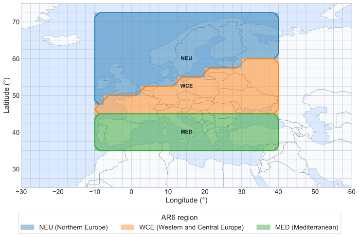
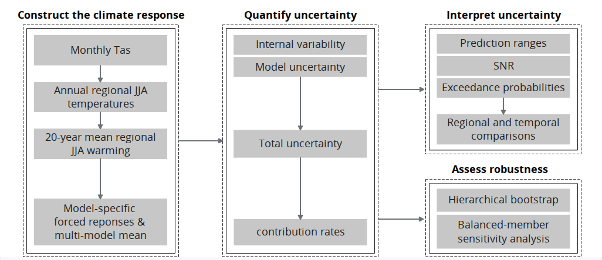

---
output:
  pdf_document: default
  html_document: default
---

```{r message=FALSE, warning=FALSE, include=FALSE}
library(bookdown)
library(svglite)
library(kableExtra)
```

# Melting Perspectives on Uncertainty in Climate {#unc}

*Author: Shuangying Xu*

*Supervisor: Henri Funk*

*Degree: Bachelor*

## Abstract

## Introduction

Uncertainty is a central feature of climate projections and can arise from different sources, providing multiple perspectives on how future climate should be interpreted [@HawkinsSutton2009]. Understanding these different dimensions of uncertainty is important because projected climate change cannot be fully described by a single expected value. This seminar work examines these issues in the context of projected regional summer temperature change.

### Background and Motivation: Uncertainty in Regional Climate Projections

At regional scales, climate projections are better understood as a range of possible outcomes than as a single estimate of future change. Different simulations can follow different climate trajectories, while different climate models can also produce different responses to external forcing. Ensemble projections therefore provide information not only about the expected climate response, but also about the spread around that response [@TebaldiKnutti2007; @HawkinsSutton2009].

This spread is particularly relevant for regional climate change. The importance of different sources of uncertainty depends on the region, projection horizon, and spatial and temporal averaging scale [@HawkinsSutton2009]. Natural climate variability is generally more visible at regional and shorter time scales and may temporarily strengthen or weaken the underlying climate-change signal [@DeserEtAl2020; @GruberFunkEtAl2026]. Temporal averaging can reduce the influence of shorter-term fluctuations, so the magnitude of uncertainty also depends on how the projection target is defined [@HawkinsSutton2009].

Regional summer temperature is especially relevant for climate-impact assessment. In Europe, increasing temperature and extreme heat are associated with risks to human health, agricultural production, ecosystems, infrastructure, and energy demand, while the severity of these impacts differs across regions [@IPCC2022Europe]. Regional June--July--August (JJA) temperature therefore provides a useful indicator for examining both the magnitude of future warming and the uncertainty surrounding it.

A multi-model mean alone cannot fully describe these different perspectives on a projection. It does not show the variation among simulations, the disagreement among model responses, or the overall width of the projected warming distribution. A distribution-based interpretation can therefore complement the mean by describing both the magnitude and structure of projection uncertainty. These considerations motivate examining regional warming in terms of how large the projected change is, how uncertain it is, where that uncertainty comes from, and how the resulting distribution can be interpreted. To address these questions consistently, the next section introduces the statistical concepts of uncertainty and connects them to the structure of climate-model ensembles.

### Conceptual and Literature Framework

The sources of projection uncertainty can be viewed through both statistical and climate-specific perspectives [@GruberEtAl2025; @HawkinsSutton2009]. These perspectives are related, but their correspondence is interpretive rather than exact, especially when applied to complex climate-model ensembles. This section develops that connection and uses it to organize the large-ensemble, fixed-scenario, and distribution-based framework adopted in the analysis.

#### Statistical Concepts of Uncertainty

A common statistical distinction is between aleatoric and epistemic uncertainty.

**Aleatoric uncertainty** refers to stochastic variation that remains under a given information set. In probabilistic terms, it can be represented by the conditional distribution of an outcome $Y$ given available information $X=x$, with its magnitude often summarized by the conditional variance,

$$
\operatorname{Var}(Y \mid X=x).
$$

If this conditional distribution is not concentrated at a single value, the outcome cannot be predicted exactly even when the underlying relationship is known [@GruberEtAl2025].

**Epistemic uncertainty**, in contrast, arises from incomplete knowledge about the process being represented. It may reflect imperfect model structure, missing information, omitted processes, or simplifying assumptions, and may in principle be reduced as knowledge, observations, or models improve [@GruberEtAl2025]. The distinction between aleatoric and epistemic uncertainty is nevertheless context-dependent. Variation that appears irreducible under one information set may become partly explainable when additional information is available. The classification therefore depends on the model, the data, and the information being conditioned on.

The aleatoric--epistemic distinction is useful for organizing sources of uncertainty, but it does not imply that all sources can be separated cleanly or combined through a general additive decomposition [@GruberEtAl2025]. More generally, uncertainty can be represented through probability distributions and summarized using measures such as variance, standard deviation, intervals, and probabilities. The following section relates these statistical concepts to the main uncertainty sources in climate projections.

#### Climate-Specific Uncertainty and Its Statistical Interpretation

Climate projections are commonly affected by three broad sources of uncertainty: internal variability, model uncertainty, and scenario uncertainty [@HawkinsSutton2009]. These sources arise from different parts of the climate-projection process and can be related, with appropriate qualifications, to the statistical concepts introduced above.

**Internal variability** refers to fluctuations generated by the inherently chaotic dynamics of the climate system. Under the same model structure and external forcing, small differences in initial conditions can lead to different climate trajectories. In a single-model initial-condition large ensemble, the resulting spread among ensemble members therefore represents variability that remains when model structure and forcing are held fixed [@GruberFunkEtAl2026]. In this conditional sense, internal variability has an aleatoric-like interpretation because it represents stochastic variation within the modeled climate system. This interpretation is not exact, however, because it depends on how well the climate model represents the underlying stochastic dynamics of the real climate system [@GruberFunkEtAl2026]. The magnitude of this member-to-member variability also depends on the spatial and temporal scale of the climate quantity being analyzed [@HawkinsSutton2009].

**Model uncertainty** describes differences in the simulated forced response across climate models exposed to comparable external forcing [@HawkinsSutton2009]. These differences may arise from model structure, parameterizations, representations of physical processes, and climate feedbacks. From a statistical perspective, model uncertainty has an epistemic-like interpretation because it reflects incomplete knowledge about how the climate system should be represented [@GruberEtAl2025]. In a multi-model large ensemble, differences among model-specific responses can therefore provide an empirical representation of model uncertainty. However, the spread among a finite set of climate models should not be interpreted as the full epistemic uncertainty associated with the real climate system.

**Scenario uncertainty** arises from differences among possible future forcing pathways. Future emissions, land use, and other external drivers are not known in advance, and alternative pathways can therefore produce different climate responses [@HawkinsSutton2009]. Unlike internal variability, scenario uncertainty does not describe stochastic variation among realizations under the same forcing. It is more appropriately interpreted as uncertainty associated with alternative conditioning pathways. Because the present analysis later conditions on a single forcing pathway, scenario uncertainty is outside the empirical decomposition considered in this study.

The relationship between statistical and climate-specific uncertainty can therefore be summarized as follows:

| Climate uncertainty source | Statistical interpretation | Role in this study            |
|:----------------------|:----------------------|:-------------------------|
| Internal variability       | Aleatoric-like             | Within-model member variation |
| Model uncertainty          | Epistemic-like             | Spread among model responses  |
| Scenario uncertainty       | Conditional pathway        | Held fixed in the analysis    |

: (#tab:uncertainty-category) Conceptual relationship between climate-specific and statistical uncertainty.

These correspondences provide a useful framework for organizing the analysis, but they should not be treated as strict identities. Whether a source is interpreted as aleatoric or epistemic depends on the model, available information, and conditioning assumptions [@GruberEtAl2025]. The next section translates these concepts into the hierarchical structure of multi-model large ensembles and defines the climate quantity to which the uncertainty is attached.

#### Hierarchical Large-Ensemble Framework

The structure of a multi-model large ensemble provides a natural way to distinguish within-model from between-model variation. For regional summer warming, this structure can be represented conceptually as

```{=tex}
\begin{equation}
Y_{m,r,R,P}
=
\mu_{R,P}
+
a_{m,R,P}
+
\varepsilon_{m,r,R,P},
(\#eq:hierarchical-framework)
\end{equation}
```
where $Y_{m,r,R,P}$ denotes period-mean regional JJA warming for model $m$, ensemble member $r$, region $R$, and future period $P$. The term $\mu_{R,P}$ represents the multi-model mean forced response, $a_{m,R,P}$ represents the model-specific deviation from this mean, and $\varepsilon_{m,r,R,P}$ represents the member-specific deviation associated with internal variability. Equation \@ref(eq:hierarchical-framework) therefore separates variation across model responses from variation among members of the same model.

Within a single-model initial-condition large ensemble, members share the same model formulation and external forcing but follow different trajectories because of small differences in initial conditions. Member-to-member variation can therefore be used to characterize internal variability, while averaging across members reduces the influence of individual internal fluctuations and provides an estimate of the model-specific forced response [@GruberFunkEtAl2026; @DeserEtAl2020]. Because the ensemble is finite, the ensemble mean remains an estimate rather than the exact forced response.

Extending this structure across several climate models introduces a second level of variation. Differences among model-specific ensemble means represent differences in simulated forced responses, while variation around each model mean represents within-model internal variability. Multiple large ensembles therefore separate these two levels more clearly than collections of single realizations, where internal fluctuations and differences in forced responses can be difficult to distinguish [@LehnerEtAl2020].

Because the models contain different numbers of ensemble members, model-level and member-level information should be treated separately rather than pooling all members with equal influence across models. The equal-model weighting design is described in Section 2.4, while the corresponding estimators are introduced in the Methods section.

#### Fixed-Scenario and Distributional Interpretation

When the analysis is conditioned on a single future forcing pathway, differences among alternative scenarios fall outside the quantities being estimated. The resulting uncertainty should therefore be interpreted as conditional on that pathway rather than as the complete uncertainty associated with future climate projections [@HawkinsSutton2009].

Within this conditional setting, the analysis focuses on two sources of variation identified above: internal variability within climate models and differences in forced responses across models. The variance decomposition used later provides an operational way to quantify the magnitude and relative contribution of these components. It is specific to the climate-ensemble framework adopted in this study and should not be interpreted as a general additive decomposition of aleatoric and epistemic uncertainty.

Variance decomposition alone, however, does not fully describe the projected warming distribution. A distributional perspective complements source-based decomposition by considering both the location and spread of possible warming outcomes [@TebaldiKnutti2007]. Prediction ranges describe the absolute spread of the distribution, signal-to-noise ratios compare the warming signal with uncertainty, and threshold exceedance probabilities describe the position of the distribution relative to specified warming levels [@HawkinsSutton2009].

These diagnostics provide complementary views of the same regional warming distribution: how uncertain it is, how clearly the warming signal emerges relative to that uncertainty, and where the projected outcomes lie relative to selected thresholds. Their specific definitions and estimators are introduced in the Methods section.

### Study Aim and Research Questions

Building on the conceptual framework above, this section defines the focus of the seminar work and translates it into research questions on regional summer warming and its uncertainty.

**Study Aim**

This seminar work aims to quantify, decompose, and interpret fixed-scenario uncertainty in projected regional JJA temperature change across selected European IPCC AR6 reference regions. The study applies established large-ensemble methods to distinguish internal variability from differences among model responses and to interpret the resulting warming distribution.

**Study Scope**

The study uses monthly near-surface air temperature (`tas`) from five CMIP6 large-ensemble models in MMLEAv2, comprising 166 ensemble members under SSP370. The analysis covers Northern Europe (NEU), Western and Central Europe (WCE), and the Mediterranean (MED), with warming calculated relative to the 1995--2014 baseline for three 20-year future periods: 2021--2040, 2041--2060, and 2081--2100. The analysis focuses on internal variability and model uncertainty and complements their decomposition with prediction ranges, internal and total signal-to-noise ratios, and exceedance probabilities for $2^\circ\mathrm{C}$ and $3^\circ\mathrm{C}$ warming.

**Research Questions**

The study is guided by three research questions:

**RQ1: Warming magnitude.** How much does regional JJA temperature increase relative to the 1995--2014 baseline across the selected regions and future periods?

**RQ2: Uncertainty magnitude and source.** How large are internal variability, model uncertainty, and total fixed-scenario projection uncertainty in 20-year mean warming, and how do their relative contributions vary across regions and periods?

**RQ3: Interpretation of projection uncertainty.** How can the projected regional warming distribution be interpreted through prediction ranges, signal-to-noise ratios, and threshold exceedance probabilities?

**Analytical Approach**

The analysis follows a consistent workflow from climate-model output to uncertainty interpretation. Monthly gridded `tas` is first aggregated to regional annual JJA temperature and then expressed as future-period warming relative to the 1995--2014 baseline. Ensemble information is used to distinguish model-specific forced responses, within-model internal variability, and between-model differences in forced responses. Multi-model quantities are constructed with equal model influence, while the resulting warming distribution is interpreted using prediction ranges, signal-to-noise ratios, and threshold exceedance probabilities. Robustness is assessed through hierarchical bootstrap and balanced 20-member subsampling.

## Data and Study Design

This chapter describes the data and study design used to define the regional climate projections analyzed in this work. It introduces the ensemble dataset, model and member selection, spatial and temporal domains, and the conditioning and weighting choices that determine the scope of the subsequent uncertainty analysis.

### MMLEAv2 Dataset and Climate Variable

The analysis uses the Multi-Model Large Ensemble Archive Version 2 (MMLEAv2), an updated collection of initial-condition large ensembles designed to facilitate comparison across climate models [@MaherEtAl2025]. The archive contains multiple climate models and ensemble members on a common $2.5^\circ \times 2.5^\circ$ horizontal grid and provides a range of monthly climate variables [@MaherEtAl2025]. The variable used in this study is monthly near-surface air temperature (`tas`).

For the selected model ensemble, historical simulations are used to establish the reference-period climate, while SSP370 simulations provide the data for the future periods. The original gridded data are organized hierarchically by climate model, ensemble member, year, month, and grid cell. This structure preserves both repeated realizations within individual models and differences across models.

MMLEAv2 is therefore well suited to the uncertainty framework developed in Section 1.2. Multiple members within the same model provide information on within-model variability, whereas the availability of multiple large ensembles allows differences among model responses to be examined [@MaherEtAl2025]. The statistical inference in this study is conditional on the selected subset of MMLEAv2 models and simulations, which is described in the following section.

### Model and Ensemble-Member Selection

Five CMIP6 large ensembles from MMLEAv2 were selected for the main analysis, giving a total of 166 ensemble members. The selected models and ensemble sizes are summarized in Table \@ref(tab:model-members).

| Model         | Members used |
|:--------------|:-------------|
| ACCESS-ESM1-5 | 40           |
| CanESM5       | 25           |
| CESM2 (CMIP6) | 50           |
| E3SMv2        | 21           |
| MPI-ESM1-2-LR | 30           |

: (#tab:model-members) Selected climate models and ensemble-member counts used in the main analysis.

Thus,

$$
M=5,
\qquad
N=166.
$$

Member selection was based on the availability of the historical and SSP370 simulations required for the analysis, with additional consistency rules for CESM2 and CanESM5. For CESM2, the large ensemble contains two groups of 50 members that differ in their treatment of biomass-burning forcing. The present study uses the 50 members following the original CMIP6 biomass-burning forcing protocol, thereby avoiding the combination of the two forcing configurations within a single model ensemble [@RodgersEtAl2021]. For CanESM5, one consistent group of 25 `p1` members is used. The `p1` and `p2` ensembles differ in the remapping of wind-stress fields, so restricting the analysis to one variant avoids treating this configuration difference as internal variability [@SwartEtAl2019]. For ACCESS-ESM1-5, E3SMv2, and MPI-ESM1-2-LR, the available members with the required historical and SSP370 data are retained.

The ensemble sizes therefore differ considerably across models. Directly pooling all 166 members with equal member weight would give greater influence to models with larger ensembles, particularly CESM2 and ACCESS-ESM1-5. Multi-model quantities are instead constructed so that each climate model receives the same total analytical weight. The formal weighting scheme is described in Section 2.4.

### Study Regions and Time Periods

The analysis focuses on three European reference regions from the IPCC AR6 regional framework: Northern Europe (NEU), Western and Central Europe (WCE), and the Mediterranean (MED) [@IturbideEtAl2020]. These standardized regions provide a consistent basis for comparing regional climate-model output and allow differences in projected warming and uncertainty to be examined across northern, central, and southern Europe. The spatial extent of the three study regions is shown in Figure \@ref(fig:study-region-map).

```{r study-region-map, echo=FALSE, fig.cap="Study regions used in the analysis: NEU, WCE, and MED.", out.width="100%", fig.align="center"}

```

The baseline period is defined as

$$
P_0 = 1995\text{--}2014.
$$

Projected warming is evaluated for three 20-year future periods,

$$
P_1 = 2021\text{--}2040,
\qquad
P_2 = 2041\text{--}2060,
\qquad
P_3 = 2081\text{--}2100.
$$

These periods represent the near-term, mid-term, and late-century projection windows used in this study and are consistent with the time-slice framework used in the IPCC AR6 assessment [@IPCC2021WGI]. All temperature changes are calculated relative to the 1995--2014 baseline.

The $2^\circ\mathrm{C}$ and $3^\circ\mathrm{C}$ thresholds considered later in the analysis refer specifically to regional JJA warming relative to 1995--2014. They should therefore not be interpreted as global warming levels relative to the pre-industrial period.

### Fixed-Scenario Design and Equal Model Weighting

All future simulations in this study follow the SSP3-7.0 forcing pathway, identified as `ssp370` in CMIP6. SSP3-7.0 is part of the ScenarioMIP design for CMIP6 and represents a relatively high-forcing future pathway [@ONeillEtAl2016]. Because only one forcing pathway is considered, differences among alternative future scenarios are not sampled in the present analysis. Scenario uncertainty is therefore outside the uncertainty decomposition used in this study [@HawkinsSutton2009].

The resulting uncertainty estimates are interpreted as **total fixed-scenario projection uncertainty**. They describe uncertainty associated with internal variability and differences among the selected model responses under the same forcing pathway, rather than the full uncertainty across alternative future scenarios. The formal variance decomposition is introduced later in the Methods section.

Because the five models contain different numbers of ensemble members, the analysis gives each model equal total influence in multi-model summaries rather than pooling all members with equal weight across models. Model-level information is therefore combined using equal model weighting, while members within each model contribute within that model's share. This prevents models with larger ensembles from receiving greater influence solely because they contain more members, but it does not imply that the five models are equally accurate [@TebaldiKnutti2007].

The resulting inference is conditional on the SSP3-7.0 pathway, the five selected climate models, JJA temperature, and the three European study regions. Together with the spatial and temporal domains defined above, these conditions specify the scope within which the subsequent uncertainty estimates and distributional diagnostics are interpreted.

## Methods

Building on the data and study design described above, this chapter defines the statistical procedures used to construct the regional JJA warming indicator and quantify its uncertainty. The analysis proceeds from temperature aggregation and warming calculation to forced-response estimation, uncertainty decomposition, distribution-based diagnostics, and robustness assessment.

### Analytical Framework and Statistical Targets

The analysis is organized around the hierarchical structure of the multi-model large ensemble. Let $m$ denote the climate model, $r$ the ensemble member, $R$ the study region, and $P$ the future period. The indices $y$ and $g$ are used below for year and grid cell, respectively.

The core response variable is

$$
Y_{m,r,R,P},
$$

which represents the 20-year mean regional JJA warming for model $m$, member $r$, region $R$, and period $P$, relative to the 1995--2014 baseline. The detailed construction of this quantity from monthly gridded `tas` is given in Section 3.2. Importantly, the uncertainty analyzed below therefore concerns member-to-member variation in 20-year mean warming rather than year-to-year JJA temperature variability.

The main statistical targets are the model-specific forced response $\overline{Y}_{m,R,P}$, the equal-model-weighted multi-model response $\overline{Y}_{\cdot,R,P}$, and the internal, model, and total fixed-scenario uncertainty components $U_{\mathrm{internal},R,P}$, $U_{\mathrm{model},R,P}$, and $U_{\mathrm{total},R,P}$. Their relative contributions are evaluated using variance contribution rates. The same model-member warming values are then used to characterize the projection distribution through prediction quantiles, signal-to-noise ratios, and threshold exceedance probabilities.

The overall analytical workflow is summarized in Figure \@ref(fig:workflow).

```{r workflow, echo=FALSE, fig.cap="Analytical Sequence", out.width="100%", fig.align="center"}

```

### Construction of the Regional Summer Warming Indicator

The core response variable is constructed from monthly gridded `tas` in two stages. First, monthly temperature is aggregated to annual regional JJA mean temperature using seasonal and spatial weighting; second, temperature anomalies relative to the 1995--2014 baseline are averaged over each 20-year future period. These steps produce a consistent regional warming indicator for each model and ensemble member.

#### JJA and Spatial Aggregation

Monthly `tas` values were first converted from kelvin to degrees Celsius where necessary,

$$
T(^\circ\mathrm{C})
=
T(\mathrm{K})-273.15.
$$

Because temperature differences have the same numerical magnitude in kelvin and degrees Celsius, this conversion does not affect the later warming anomalies.

For each model, ensemble member, year, and grid cell, summer temperature was calculated from June, July, and August using the number of days in each month. Under the JJA weighting used in this analysis,

$$
T^{\mathrm{JJA}}_{m,r,y,g}
=
\frac{
30T_{m,r,y,6,g}
+
31T_{m,r,y,7,g}
+
31T_{m,r,y,8,g}
}{92},
$$

where $T_{m,r,y,k,g}$ denotes the monthly mean temperature for month $k$ at grid cell $g$.

The gridded JJA values were then aggregated to the study regions using cosine-latitude weights. For grid cell $g$ in region $R$, the normalized spatial weight is

$$
w_g
=
\frac{\cos(\phi_g)}
{\sum_{h\in R}\cos(\phi_h)},
$$

where $\phi_g$ is the latitude of the grid-cell center and the weights satisfy

$$
\sum_{g\in R} w_g = 1.
$$

The annual regional JJA mean temperature is therefore

$$
I_{m,r,y,R}
=
\sum_{g\in R}
w_g T^{\mathrm{JJA}}_{m,r,y,g}.
$$

This procedure produces one regional JJA mean temperature for each model, ensemble member, year, and study region. These annual regional values are used in the next step to calculate baseline-relative anomalies and 20-year period-mean warming.

#### Baseline Anomalies and Period Means

For each model, ensemble member, and region, the reference climate is defined as the mean regional JJA temperature over the 1995--2014 baseline period $P_0$,

$$
I_{m,r,P_0,R}
=
\frac{1}{|P_0|}
\sum_{y\in P_0}
I_{m,r,y,R},
$$

where $|P_0|=20$. Calculating the baseline separately for each model and ensemble member allows the analysis to focus on simulated temperature change rather than differences in absolute climatology.

Annual JJA temperature anomalies are then calculated relative to the corresponding baseline,

$$
\Delta I_{m,r,y,R}
=
I_{m,r,y,R}
-
I_{m,r,P_0,R}.
$$

For each future period $P$, the core response variable is defined as the mean anomaly over the 20 years in that period:

```{=tex}
\begin{equation}
Y_{m,r,R,P}
=
\frac{1}{|P|}
\sum_{y\in P}
\Delta I_{m,r,y,R},
\qquad |P|=20.
(\#eq:period-mean-warming)
\end{equation}
```
Thus, $Y_{m,r,R,P}$ represents the 20-year mean regional JJA warming for one model and ensemble member relative to 1995--2014. All subsequent forced-response estimates, uncertainty components, and distributional diagnostics are calculated from these period-mean warming values.

### Estimation of Forced Responses and Uncertainty Components

Using the 20-year mean warming values $Y_{m,r,R,P}$, the analysis next separates the projected response into model-specific forced responses and uncertainty components. Ensemble means are used to estimate forced warming, while within-model member variation and between-model differences are used to quantify internal variability and model uncertainty. These components are then combined to characterize total fixed-scenario uncertainty and their relative contributions.

#### Model-Specific and Multi-Model Forced Responses

For each climate model, the model-specific forced response is estimated by averaging the 20-year mean warming values across its ensemble members,

```{=tex}
\begin{equation}
\overline{Y}_{m,R,P}
=
\frac{1}{n_m}
\sum_{r=1}^{n_m}
Y_{m,r,R,P},
(\#eq:model-forced-response)
\end{equation}
```
where (n_m) is the number of ensemble members available for model (m). Because members of the same model share the same model formulation and external forcing, averaging across members reduces the influence of member-specific internal fluctuations. The resulting ensemble mean is therefore interpreted as an estimate of that model's forced warming response [@DeserEtAl2020; @LehnerEtAl2020]. Internal variability is not assumed to be completely removed, because the ensemble contains a finite number of members.

The multi-model mean forced response is then calculated from the model-specific ensemble means,

```{=tex}
\begin{equation}
\overline{Y}_{\cdot,R,P}
=
\frac{1}{M}
\sum_{m=1}^{M}
\overline{Y}_{m,R,P},
(\#eq:multimodel-forced-response)
\end{equation}
```
where (M=5) is the number of climate models. Equation \@ref(eq:multimodel-forced-response) gives each model the same total weight, regardless of its ensemble size. The calculation therefore averages within models first and then across models, rather than pooling all 166 ensemble members with equal weight.

The resulting multi-model mean provides an equal-model-weighted summary of the forced warming responses represented by the selected models. Differences between the individual model-specific responses and this multi-model mean form the basis for estimating between-model uncertainty in the following section.

#### Within-Model and Between-Model Variance

Internal variability is estimated from the spread of ensemble members around the model-specific forced response. For each model, region, and future period, the within-model variance is calculated as

```{=tex}
\begin{equation}
s^2_{\mathrm{internal},m,R,P}
=
\frac{1}{n_m-1}
\sum_{r=1}^{n_m}
\left(
Y_{m,r,R,P}
-
\overline{Y}_{m,R,P}
\right)^2.
(\#eq:within-model-variance)
\end{equation}
```
Because $Y_{m,r,R,P}$ represents 20-year mean warming, Equation \@ref(eq:within-model-variance) measures member-to-member variability in the 20-year warming response within model $m$, rather than year-to-year temperature variability. This within-model spread provides the operational measure of internal variability used in the analysis [@DeserEtAl2020; @LehnerEtAl2020].

To prevent models with larger ensembles from contributing more strongly to the multi-model estimate, the model-specific variances are averaged with equal model weight,

```{=tex}
\begin{equation}
U_{\mathrm{internal},R,P}
=
\frac{1}{M}
\sum_{m=1}^{M}
s^2_{\mathrm{internal},m,R,P}.
(\#eq:internal-variance)
\end{equation}
```
The corresponding internal standard deviation is

$$
\sigma_{\mathrm{internal},R,P}
=
\sqrt{U_{\mathrm{internal},R,P}}.
$$

Model uncertainty is estimated at the second level of the ensemble hierarchy. It is defined from the spread of the model-specific forced-response estimates around the equal-model-weighted multi-model mean,

```{=tex}
\begin{equation}
U_{\mathrm{model},R,P}
=
\frac{1}{M-1}
\sum_{m=1}^{M}
\left(
\overline{Y}_{m,R,P}
-
\overline{Y}_{\cdot,R,P}
\right)^2.
(\#eq:model-variance)
\end{equation}
```
with the corresponding standard deviation

$$
\sigma_{\mathrm{model},R,P}
=
\sqrt{U_{\mathrm{model},R,P}}.
$$

The two quantities therefore describe different levels of variation in the ensemble: $U_{\mathrm{internal},R,P}$ summarizes within-model member variation, whereas $U_{\mathrm{model},R,P}$ summarizes differences among the forced responses of the selected models. Variances are retained for the subsequent uncertainty decomposition, while the corresponding standard deviations express uncertainty magnitude in the same temperature units as the warming response.

#### Total Uncertainty and Contribution Rates

Under the fixed-scenario framework, total projection uncertainty is defined as the sum of the internal and model variance components,

```{=tex}
\begin{equation}
U_{\mathrm{total},R,P}
=
U_{\mathrm{internal},R,P}
+
U_{\mathrm{model},R,P}.
(\#eq:total-variance)
\end{equation}
```
This quantity represents the total variance considered in the present analysis and is therefore conditional on the SSP3-7.0 pathway and the selected climate-model ensemble. The corresponding total standard deviation is

```{=tex}
\begin{equation}
\sigma_{\mathrm{total},R,P}
=
\sqrt{
U_{\mathrm{internal},R,P}
+
U_{\mathrm{model},R,P}
}.
(\#eq:total-standard-deviation)
\end{equation}
```
Thus, the two variance components are added before taking the square root. Internal and model standard deviations are not added directly.

To describe the relative importance of the two uncertainty sources, their contributions to total variance are calculated as

```{=tex}
\begin{equation}
C_{\mathrm{internal},R,P}
=
\frac{
U_{\mathrm{internal},R,P}
}{
U_{\mathrm{total},R,P}
}.
(\#eq:internal-contribution)
\end{equation}
```
and

```{=tex}
\begin{equation}
C_{\mathrm{model},R,P}
=
\frac{
U_{\mathrm{model},R,P}
}{
U_{\mathrm{total},R,P}
}.
(\#eq:model-contribution)
\end{equation}
```
By construction,

$$
C_{\mathrm{internal},R,P}
+
C_{\mathrm{model},R,P}
=
1.
$$

The contribution rates are relative measures and therefore depend on both variance components. A change in the internal contribution, for example, does not necessarily imply a corresponding change in the absolute magnitude of internal variability. The variance decomposition describes the magnitude and source of fixed-scenario uncertainty; the following section complements it with distribution-based measures of projection spread and interpretation.

### Distribution-Based Interpretation of Projection Uncertainty

Variance decomposition describes the magnitude and sources of projection uncertainty, but it does not fully characterize the distribution of possible warming outcomes. The analysis therefore complements the variance-based measures with prediction ranges, signal-to-noise ratios, and threshold exceedance probabilities, which describe the distributional spread, the clarity of the warming signal, and the position of projected warming relative to specified thresholds.

#### Equal-Model-Weighted Prediction Ranges

To describe the distribution of projected warming directly, the model-member warming values are combined into an equal-model-weighted empirical distribution. For region $R$ and future period $P$, the empirical cumulative distribution function is defined as

```{=tex}
\begin{equation}
F_{R,P}(y)
=
\frac{1}{M}
\sum_{m=1}^{M}
\frac{1}{n_m}
\sum_{r=1}^{n_m}
\mathbf{1}
\left(
Y_{m,r,R,P}\le y
\right),
(\#eq:empirical-mixture)
\end{equation}
```
where $\mathbf{1}(\cdot)$ is the indicator function. This construction assigns each model a total weight of $1/M$, while the members within model $m$ share that weight equally. It therefore preserves equal model influence despite differences in ensemble size.

Weighted quantiles are obtained from Equation \@ref(eq:empirical-mixture) as

$$
Q_{q,R,P}
=
F^{-1}_{R,P}(q),
\qquad
q\in\{0.05,0.50,0.95\}.
$$

Here, $Q_{0.50,R,P}$ is the weighted median, while the 5th and 95th percentiles define the central 90% prediction range,

$$
\mathrm{PI}_{90,R,P}
=
\left[
Q_{0.05,R,P},
Q_{0.95,R,P}
\right].
$$

The width of this range is

$$
W_{90,R,P}
=
Q_{0.95,R,P}
-
Q_{0.05,R,P}.
$$

Because the empirical distribution contains members from all selected models, the prediction range reflects both within-model member variation and differences among model responses. The range and its width are expressed directly in degrees Celsius and provide an absolute measure of projection spread. They are interpreted as descriptive ensemble-based ranges conditional on SSP3-7.0 and the selected model ensemble, rather than as confidence intervals for an unknown population parameter [@TebaldiKnutti2007].

#### Signal-to-Noise Ratios

Signal-to-noise ratios are used to compare the magnitude of projected warming with the uncertainty surrounding that response. For each region and future period, the signal is defined as the absolute equal-model-weighted multi-model mean warming,

$$
\mathrm{Signal}_{R,P}
=
\left|
\overline{Y}_{\cdot,R,P}
\right|.
$$

Two noise scales are considered. The internal signal-to-noise ratio compares the warming signal with the standard deviation associated with within-model internal variability,

```{=tex}
\begin{equation}
\mathrm{SNR}^{\mathrm{internal}}_{R,P}
=
\frac{
\left|
\overline{Y}_{\cdot,R,P}
\right|
}{
\sigma_{\mathrm{internal},R,P}
}.
(\#eq:internal-snr)
\end{equation}
```
Equation \@ref(eq:internal-snr) therefore measures how large the projected 20-year mean warming is relative to member-to-member variability within the climate models. A larger value indicates that the warming signal is more clearly separated from this internal variability.

The total signal-to-noise ratio additionally incorporates differences among model forced responses by using the total fixed-scenario standard deviation,

```{=tex}
\begin{equation}
\mathrm{SNR}^{\mathrm{total}}_{R,P}
=
\frac{
\left|
\overline{Y}_{\cdot,R,P}
\right|
}{
\sigma_{\mathrm{total},R,P}
}.
(\#eq:total-snr)
\end{equation}
```
Equation \@ref(eq:total-snr) measures signal clarity relative to the combined internal and model uncertainty considered in this study. Comparing the two ratios therefore distinguishes signal clarity relative to internal variability from signal clarity after between-model disagreement is also included.

The ratios are interpreted descriptively: values below one indicate that the selected uncertainty scale is larger than the signal, values near one indicate similar magnitudes, and values above one indicate that the signal is larger than the selected uncertainty scale. An SNR greater than one is not a formal significance criterion or hypothesis test.

The definitions used here are standard-deviation-based SNR measures, consistent with large-ensemble applications that compare the magnitude of an ensemble-mean signal with ensemble spread [@McKinnonDeser2018; @McKinnonDeser2021]. They differ from the 90%-uncertainty scaling used in the SNR formulation of Hawkins and Sutton, so numerical SNR values should be interpreted according to the definition applied here [@HawkinsSutton2009].

#### Threshold Exceedance Probabilities

Threshold exceedance probabilities are used to describe the position of the projected warming distribution relative to selected warming levels. The thresholds considered in this analysis are

\[
\theta
\in
\left\{
2^\circ\mathrm{C},
3^\circ\mathrm{C}
\right\}.
\]

As defined in Section 2.3, these thresholds refer to 20-year mean regional JJA warming relative to the 1995--2014 baseline.

For each model, the exceedance probability is estimated as the proportion of ensemble members whose period-mean warming exceeds threshold \(\theta\),

```{=tex}
\begin{equation}
p_{m,R,P}(\theta)
=
\frac{1}{n_m}
\sum_{r=1}^{n_m}
\mathbf{1}
\left(
Y_{m,r,R,P}>\theta
\right),
(\#eq:model-threshold-probability)
\end{equation}
```

where \(\mathbf{1}(\cdot)\) is the indicator function. The multi-model exceedance probability is then obtained by averaging the model-level probabilities with equal model weight,

```{=tex}
\begin{equation}
p_{R,P}(\theta)
=
\frac{1}{M}
\sum_{m=1}^{M}
p_{m,R,P}(\theta).
(\#eq:weighted-threshold-probability)
\end{equation}
```

Equation \@ref(eq:weighted-threshold-probability) ensures that each climate model contributes equally to the final probability, regardless of its number of ensemble members. The resulting value can be interpreted as the fraction of the equal-model-weighted warming distribution lying above the specified threshold.

Threshold exceedance probability depends on both the location and the spread of the warming distribution. It therefore complements the prediction ranges and signal-to-noise ratios by describing how much of the projected distribution lies beyond a specified warming level. These probabilities are empirical, ensemble-based quantities conditional on SSP3-7.0 and the selected five-model ensemble.


### Robustness and Sensitivity Assessment
Two complementary analyses are used to assess the robustness of the main statistical results. A hierarchical bootstrap evaluates the stability of the estimated quantities under resampling of models and ensemble members, while a balanced-member sensitivity analysis examines whether unequal ensemble sizes materially affect the results. Together, these analyses assess whether the main findings are sensitive to the finite model-member sample and the ensemble-size structure of the dataset.

#### Hierarchical Bootstrap

A hierarchical bootstrap is used to assess the stability of the estimated uncertainty measures and distributional diagnostics under the finite model-member sample. The resampling procedure follows the two-level structure of the multi-model large ensemble by treating climate models as the first level and ensemble members within each model as the second level [@SaravananEtAl2020].

For bootstrap replicate \(b\), \(M=5\) models are first sampled with replacement from the five models used in the main analysis,

\[
m^{*(b)}_1,
m^{*(b)}_2,
\ldots,
m^{*(b)}_M.
\]

For each selected model occurrence, ensemble members are then sampled with replacement from that model using its original ensemble size \(n_m\). If the same model is selected more than once at the model level, each occurrence is treated as a separate bootstrap draw and its members are resampled independently.

For each bootstrap replicate, the analysis recalculates the internal, model, and total uncertainty components, their contribution rates, the internal and total signal-to-noise ratios, and the threshold exceedance probabilities. This produces bootstrap replicates of each target statistic,

\[
Q^{*(1)},Q^{*(2)},\ldots,Q^{*(B)},
\]

with

\[
B=1000.
\]

For any target statistic \(Q\), a 95% bootstrap percentile interval is obtained from the 2.5th and 97.5th percentiles of its bootstrap distribution [@EfronTibshirani1993],

\[
\mathrm{CI}_{95\%}(Q)
=
\left[
Q^*_{2.5\%},
Q^*_{97.5\%}
\right].
\]

These intervals are used to evaluate whether the main estimates and qualitative patterns remain stable when models and ensemble members are resampled. They are interpreted as resampling-based measures conditional on the selected five-model ensemble and do not represent uncertainty across all possible climate-model structures or forcing scenarios.

#### Balanced-Member Sensitivity Analysis

A balanced-member sensitivity analysis is used to examine whether differences in ensemble size across the five climate models affect the main uncertainty estimates. The full analysis uses 40, 25, 50, 21, and 30 members across the five models, respectively. Although equal model weighting prevents models with larger ensembles from receiving greater total weight, the precision of within-model estimates can still vary with the number of available members. Repeated subsampling therefore provides an additional check on sensitivity to ensemble-size imbalance [@MilinskiEtAl2020; @LehnerEtAl2020].

For each subsampling run, 20 ensemble members are randomly selected without replacement from each model,

\[
n_m^{\mathrm{sub}}=20.
\]

Because all five models contain at least 21 selected members, the same subsample size can be applied to every model. Each balanced run therefore contains

\[
N^{\mathrm{sub}}
=
5\times20
=
100
\]

ensemble members.

The subsampling procedure is repeated

\[
s=1,2,\ldots,S,
\qquad
S=100.
\]

For each run, the same estimators as in the main analysis are recalculated for each region and future period, including

\[
U_{\mathrm{internal},R,P}^{(s)},
\qquad
U_{\mathrm{model},R,P}^{(s)},
\qquad
U_{\mathrm{total},R,P}^{(s)},
\]

\[
C_{\mathrm{internal},R,P}^{(s)},
\qquad
C_{\mathrm{model},R,P}^{(s)},
\]

and

\[
\mathrm{SNR}^{\mathrm{internal},(s)}_{R,P},
\qquad
\mathrm{SNR}^{\mathrm{total},(s)}_{R,P}.
\]

For each statistic \(Q\), the balanced-member estimate is summarized by the mean across the 100 subsampling runs,

\[
\overline{Q}^{\mathrm{sub}}
=
\frac{1}{S}
\sum_{s=1}^{S}
Q^{(s)}.
\]

These balanced-member estimates are compared with the corresponding estimates from the full-member analysis. Absolute differences and full-versus-balanced comparisons are used to assess whether the main results are materially affected by the unequal original ensemble sizes. This analysis is intended specifically as a sensitivity check for ensemble-member imbalance; it does not assess uncertainty associated with model selection, model dependence, or forcing scenarios.

## 4. Results

### 4.1 Projected Warming and Divergence among Model Responses

### 4.2 Changing Structure of Projection Uncertainty

### 4.3 Consequences of Uncertainty for Projection Interpretation

#### 4.3.1 Widening Projection Ranges and Regional Contrasts

#### 4.3.2 Signal Emergence and Total Signal Clarity

#### 4.3.3 Distributional Spread and Threshold Risk

### 4.4 Robustness of the Main Findings

## 5. Discussion

### 5.1 Temporal Averaging and the Dominance of Model Uncertainty

### 5.2 Signal Emergence, Model Disagreement, and Risk Interpretation

### 5.3 Relation to Previous Work and Overall Interpretation

## 6. Conclusion

## References

## Appendices

### A. Additional Formula Details

### B. Model and Member Selection

### C. Complete Result Tables

### D. Supplementary Figures

### E. Bootstrap Diagnostics

### F. Balanced-Member Sensitivity Results
