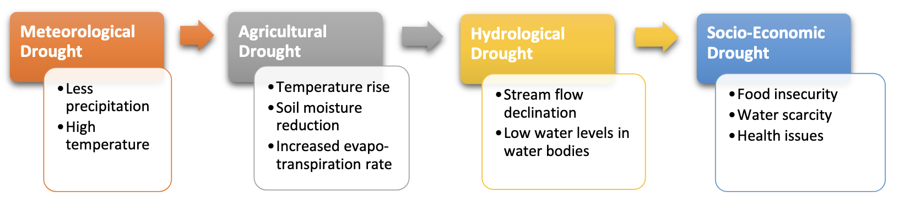

---
output:
  pdf_document: default
  html_document: default
---

```{r message=FALSE, warning=FALSE, include=FALSE}
library(bookdown)
library(svglite)
library(kableExtra)
```

# Long-term drought prediction using deep neural networks based on geospatial weather data {#dp}

*Author: Helena Veit*

*Supervisor: Henri Funk*

*Degree: Master*

## Abstract

Lorem ipsum dolor sit amet, consectetur adipiscing elit. Sed do eiusmod tempor incididunt ut labore et dolore magna aliqua. Ut enim ad minim veniam, quis nostrud exercitation ullamco laboris nisi ut aliquip ex ea commodo consequat. Duis aute irure dolor in reprehenderit in voluptate velit esse cillum dolore eu fugiat nulla pariatur. Excepteur sint occaecat cupidatat non proident, sunt in culpa qui officia deserunt mollit anim id est laborum.

## Introduction

<!-- SKETCH
- Motivation: why long-lead drought forecasting matters (agriculture, water management, planning).
- Problem: predicting SPEI-1 one year ahead over the Alps, made hard by nonstationarity (rising drought frequency across the record).
- Approach in brief: a ConvLSTM predicting SPEI-1 maps from 36 months of history, with variations in the loss and in how global and static features are used.
- State the three research questions at a conceptual level, one motivating line each:
    - RQ1 (loss): does the loss function govern the trade-off between point accuracy (RMSE) and drought detection?
    - RQ2 (global features): does FiLM conditioning on large-scale climate indices outperform naive channel injection?
    - RQ3 (static features): does a learned or seasonal topography encoder help over naive injection?
- Optional one to two sentence preview of the main finding (loss dominates a Pareto trade-off, no single winner).
- Contribution and where the work slots in.
-->

## Droughts - A Working Definition

Drought has no single, universally accepted definition, and which one applies depends on the part of the water cycle and the impacts under consideration [@zargarReviewDroughtIndices2011].
Four types are commonly distinguished, better understood as sequential stages of one process than as independent categories (Figure \@ref(fig:drought-types), from @nandgudeDroughtPredictionComprehensive2023): a precipitation deficit produces a *meteorological* drought, which depletes soil moisture into an *agricultural* drought, lowers streamflow and groundwater into a *hydrological* drought, and finally reaches water-dependent goods as a *socioeconomic* drought.

```{r drought-types, echo=FALSE, fig.cap="The four drought types as a propagating cascade. Figure reproduced from @nandgudeDroughtPredictionComprehensive2023.", out.width="80%", fig.align="center"}

```

This work targets meteorological drought, the first stage and earliest signal, driven by a precipitation deficit together with high evapotranspiration.
It is quantified with standardized indices, of which this work uses the Standardized Precipitation Evapotranspiration Index (SPEI) [@vicente-serranoMultiscalarDroughtIndex2010].
SPEI extends the precipitation-only Standardized Precipitation Index [@mckeeRelationshipDroughtFrequency1993] by using the climatic water balance, so that temperature enters through evapotranspiration and warming is reflected in the index.

The SPEI is built on the monthly climatic water balance,

\begin{center}
$\mathbf{D = P - PET}\begin{cases} > 0 & \text{water surplus} \\ < 0 & \text{water deficit} \end{cases}$
\end{center}
\vspace{0.8em}
\begin{tabular}{ll}
    $\mathbf{P}$ & Precipitation \\[0.5em]
    $\mathbf{PET}$ & Potential Evapotranspiration \\
\end{tabular}

For each grid cell the water balance is accumulated over the chosen timescale, fitted to a distribution, and transformed to a standard normal, so that the resulting SPEI is expressed in standard deviations from the local climatological mean.
It is computed as in @funk2026probabilisticdeeplearningdrought, with a three-parameter gamma fit calibrated over 1990 to 2019.

## Related Work

Beyond simple baselines such as logistic regression and gradient-boosted trees [@marusovLongtermDroughtPrediction2024a], drought prediction has increasingly turned to machine learning and deep learning [@nandgudeDroughtPredictionComprehensive2023]. The drought prediction task poses two intertwined challenges.
It is temporal, since a future drought has to be inferred from a history of past conditions, which calls for models that handle sequential data. 
It is also spatial, since the data are gridded or measured at related locations, so nearby places are not independent. 
How a model treats these two aspects, and how well it handles each, is what mainly separates the approaches below.

One way to handle the temporal side is the LSTM. 
In its basic form it predicts a drought index from a sequence of past features [@wangDroughtPredictionInsights2023]. 
Other designs extend it, for example folding in nearby stations through a temporal-convolution and attention hybrid [@chenSTATLSTMMultivariateSpatiotemporal2025]. 
Either way, these models capture temporal dependencies well but handle space only through the inputs rather than modeling the field jointly.

Other work models space more directly. 
Graph-based approaches treat grid points as nodes and aggregate over neighbors before a recurrent temporal module, for example a GraphSAGE encoder followed by a GRU with self-attention [@yuMultivariateSpatiotemporalModeling2023]. 
Transformer and foundation models bring spatial forecasting over from weather and climate, including EarthFormer [@gaoEarthformerExploringSpaceTime2023], FourCastNet [@pathakFourCastNetGlobalDatadriven2022], and the Vision-Transformer foundation model ClimaX, pretrained on large climate-simulation archives [@nguyenClimaXFoundationModel2023]. 
These are powerful but designed for large-scale, often global data and substantial compute, and their advantage over simpler models is not guaranteed, since a simple linear baseline can match or outperform transformer forecasters on standard time-series benchmarks [@zengAreTransformersEffective2022].

These approaches share some tendencies, at least among the studies considered here.
They mostly forecast at a short lead, typically one month ahead [@wangDroughtPredictionInsights2023; @chenSTATLSTMMultivariateSpatiotemporal2025; @yuMultivariateSpatiotemporalModeling2023],
the exception being a twelve-month horizon reached by treating drought as a binary classification over global regions [@marusovLongtermDroughtPrediction2024a]. 
Their evaluation usually falls on one side of a divide, either a continuous index scored by average error such as RMSE [@wangDroughtPredictionInsights2023; @chenSTATLSTMMultivariateSpatiotemporal2025]
or discrete drought categories scored by typical classification evaluation metrics such as the F1-score [@yuMultivariateSpatiotemporalModeling2023], rather than a continuous field judged for both accuracy and severe-event detection. 
And in these studies the loss function and the handling of input features are left at a single approach rather than compared across different approaches.

This work predicts the continuous SPEI as a spatial field at a twelve-month lead over the Alps, evaluates it for both point accuracy and severe-drought detection,
and, above all, studies how the loss and the conditioning on global and static features shape the trade-off between the two.

## Data and Task

### Domain and source

The study region is the Alpine domain on the EUR-11 CORDEX rotated-pole grid, at monthly resolution from 1971 to 2024 (648 months).
The data are derived from the ERA5-Land reanalysis, regridded to this grid and provided in preprocessed form.
SPEI was supplied already computed, following @funk2026probabilisticdeeplearningdrought.
Topography comes from a EUR-11 CORDEX orography file, and the North Atlantic Oscillation index and Mediterranean sea-surface temperatures are provided as separate monthly series.
A fixed mask marks the valid Alpine cells, and the remaining cells, a little under half the grid, lie outside the domain and are excluded from training and evaluation.

<!-- FIGURE: raw topography of the Alpine domain -->

### Variables

The inputs fall into three groups.

*Dynamic spatial* variables vary in space and time: SPEI, precipitation, near-surface temperature, surface pressure, and the climatic water balance.
SPEI is the target and is also given to the model as history, so it can build on the recent drought state.
Precipitation is the primary water input and the direct driver of a precipitation deficit.
Temperature governs evapotranspiration, the water-loss side of the balance, and its role grows under a warming climate.
The water balance, precipitation minus potential evapotranspiration, is the surplus or deficit that SPEI is built on.
Surface pressure serves as a proxy for the synoptic state, since persistent high pressure suppresses precipitation and favors drought.

*Dynamic global* variables vary in time but not space: the North Atlantic Oscillation index, Mediterranean sea-surface temperatures, and a cyclical encoding of the calendar month.
The NAO is a dominant mode of North Atlantic variability that modulates European precipitation [@nao_TODO].
The Mediterranean is a regional moisture source whose surface temperature influences evaporation and precipitation over the surrounding land [@millotCirculationMediterraneanSea2005; @lionelloMediterraneanClimateOverview2006], and its fourteen basin series are grouped into three regional means: western Mediterranean, eastern Mediterranean, and Black Sea.
The month is encoded as sine and cosine to capture the annual cycle of drought onset and evapotranspiration without a discontinuity between December and January.

*Static spatial* variables vary in space but not time: the topography.
Alpine elevation strongly shapes precipitation and temperature, so a fixed elevation field lets the model condition its predictions on location.

<!-- FIGURE: SPEI for one or a few selected months -->
<!-- FIGURE: grouped Mediterranean SST series and NAO index -->

### Preprocessing

Cells outside the Alpine mask are filled and excluded from all statistics.
All variables, including SPEI, are standardized to zero mean and unit variance using statistics from the training years and valid cells only, so that every input shares a common scale and the normalization draws on no information beyond the training period.
SPEI, supplied on its own 1990 to 2019 reference, is thereby brought onto the same training-period footing as the other variables, which leaves its values almost unchanged since the two references nearly coincide.

### Split and nonstationarity

The data are split chronologically to prevent look-ahead leakage: training on 1971 to 2004, validation on 2005 to 2014, and testing on 2015 to 2024.
Because the split is by time rather than at random, the periods differ in climate.
Severe-drought frequency rises across them, from 0.53 to 0.62 to 1.04 events per cell per year, so the test period is both out of sample and drier than the training period, a deliberately demanding evaluation.

<!-- FIGURE: split-wise severe-drought frequency (Train / Val / Test) -->

### Task

The forecasting task is a continuous, per-cell regression of SPEI.
Given thirty-six months of history, the model predicts a single SPEI map at a twelve-month lead, the field for the month one year after the input window.
The forecast is direct rather than recursive: the target horizon is predicted in one step instead of iterating month by month, which avoids the error accumulation of recursive forecasting.

## Model

<!-- SKETCH
- ConvLSTM (Marusov et al. 2024 variant): convolutions replace the matrix products in the gates, BatchNorm in each gate.
- Bounded regression head: ScaledTanh, prediction = 10 * tanh(1x1 conv).
- Core settings: embedding size 16, hidden size 32, Adam, batch 32, early stopping, single seed (42).
-->

## Research Questions and Experimental Design

<!-- SKETCH
- Formal statement of the three axes: RQ1 loss, RQ2 global encoder (naive vs FiLM), RQ3 static encoder (naive, single, seasonal).
- The 4 x 2 x 3 = 24 configuration grid, naming convention static/global.
- Baselines: persistence, climatology, linear trend.
- Reproducibility: single seed, fixed chronological split.
- (Decide: keep as its own section or fold in as the opening of Methods.)
-->

## Methods

<!-- SKETCH
- Loss families: MSE, hinge-weighted MSE (w = 1 and w = 5), Pinball (tau = 0.2).
- Optional conditioning modules: FiLM on the global scalars, static encoders (naive, single, seasonal).
- Training protocol: max epochs, early stopping on val rmse median, LR scheduler.
- Evaluation metrics: pooled RMSE, drought TPR and F1 at SPEI <= -1.5, per-cell AUROC.
- Baseline definitions and the residual / trend RMSE floor.
- Checkpoint and run selection.
-->

## Results

<!-- SKETCH
- Headline: a Pareto front, no single winner, the loss dominates the trade-off.
- Per loss: MSE gives low RMSE but near-zero detection (regression to the mean), Pinball gives high TPR and is the only loss beating persistence on detection, hinge-weighted MSE sits in between.
- FiLM and static-feature variants shift the RMSE / detection trade-off, mostly helping under Pinball.
- All models sit near the trend RMSE floor at the 12-month lead.
- Figures: frontier plots (TPR, F1), comparison table.
-->

## Interpretability

<!-- SKETCH
- Feature importance (occlusion, no retraining, Pinball, all six architecture conditions): RMSE is essentially unmovable, detection is driven by Mediterranean SST in the naive-static models and by temperature in the encoder models, topography suppresses recall, SPEI history and NAO are weak.
- Mediterranean SST as a domain-wide amplitude gate (~86% of the level variance), with the spatial pattern coming mostly from the local fields.
- FiLM benefits the extremes: RMSE and bias stratified by observed-SPEI bin, naive/naive vs naive/film, the 2022 case study, and the zeroed-global counterfactual confirming genuine conditioning rather than a bias shift.
- Method note: occlusion measures model reliance (Fisher and Rudin 2019), occlude rather than permute for correlated inputs (Hooker et al. 2021), extremes-focused evaluation (Watson 2022). NOTE: these three references are not yet in the .bib.
-->

## Conclusion

<!-- SKETCH
- Summary of the findings against the three research questions.
- The open caveat: whether Pinball's detection gain is genuine skill or a negative prediction bias crossing the threshold.
- Limitations: single seed, single region, single lead time, single index timescale.
- Future work.
-->

