---
output:
  pdf_document: default
  html_document: default
---

```{r message=FALSE, warning=FALSE, include=FALSE}
library(bookdown)
library(svglite)
library(kableExtra)
```

# Long-term drought prediction using deep neural networks based on geospatial weather data {#dp}

*Author: Helena Veit*

*Supervisor: Henri Funk*

*Degree: Master*

```{r dp-table-css, echo=FALSE, results='asis'}
if (knitr::is_html_output()) cat('
<style>
.book-body .page-inner table th,
.book-body .page-inner table td { padding-left: 5px; padding-right: 5px; }
.book-body .page-inner table td:first-child { white-space: nowrap; }
.book-body .page-inner .loss-fig p { text-align: right; margin: 0; }
</style>
')
```

```{r dp-colors, echo=FALSE}
col_mse <- "#3C3C3C"; col_hin <- "#286EA0"; col_pin <- "#C6402A"
dphead <- function(x, color) {
  if (knitr::is_latex_output())
    sprintf("\\textbf{\\textcolor[HTML]{%s}{%s}}", sub("^#", "", color), x)
  else
    sprintf("<strong style='color:%s'>%s</strong>", color, x)
}
```

## Introduction

Drought has no single, universally accepted definition, and which definition applies depends on the part of the water cycle and the impacts under consideration [@zargarReviewDroughtIndices2011].
Four types are commonly distinguished (Figure \@ref(fig:drought-types), adapted from @nandgudeDroughtPredictionComprehensive2023): in a simplified manner a precipitation deficit produces a *meteorological* drought, which depletes soil moisture into an *agricultural* drought, lowers streamflow and groundwater into a *hydrological* drought, and finally reaches water-dependent goods as a *socioeconomic* drought.

```{r drought-types, echo=FALSE, fig.cap="The four drought types as a propagating cascade, adapted from @nandgudeDroughtPredictionComprehensive2023.", out.width="100%", fig.align="center"}

```

This work targets *meteorological drought*, the first stage and earliest signal, driven by a precipitation deficit together with high evapotranspiration.
It can be quantified with various indices, of which this work uses the Standardized Precipitation Evapotranspiration Index (SPEI) [@vicente-serranoMultiscalarDroughtIndex2010].

Predicting such droughts well ahead of time is valuable for agriculture, water management, and planning, where early warning shapes what can be done in response.
It is also difficult, since at a lead of several months to a year the predictable signal is weak, and it is further obscured by the rising drought frequency of the last decades.

This work forecasts SPEI-1 over the Alpine region one year into the future from thirty-six months of history, using a convolutional LSTM (ConvLSTM) that treats spatial and temporal structure jointly.
Rather than search for a single best model, it asks which design choices actually shape performance, comparing training losses and how global and static features are supplied to the network.
Three research questions guide this work:

- **RQ1 (loss):** How does the choice of loss function affect drought detection in a regression setting?
- **RQ2 (global features):** How can dynamic global features be integrated into the ConvLSTM architecture?
- **RQ3 (static features):** How can static spatial features be integrated into the ConvLSTM architecture?

Answering these questions is the main contribution: a controlled comparison of loss and feature-injection choices for long-term drought prediction.

## Related Work

Drought prediction has moved from simple baselines such as logistic regression and gradient-boosted trees (see e.g. @marusovLongtermDroughtPrediction2024a) toward machine and deep learning [@nandgudeDroughtPredictionComprehensive2023].
The task is both temporal, inferring a future drought from past conditions, and spatial, since nearby locations are not independent. Approaches mainly differ in how they handle the two.
Models from the LSTM family capture the temporal side well but treat space only through their inputs or not at all [@wangDroughtPredictionInsights2023; @chenSTATLSTMMultivariateSpatiotemporal2025], whereas graph-based and transformer models represent the spatial field more directly [@yuMultivariateSpatiotemporalModeling2023; @gaoEarthformerExploringSpaceTime2023; @pathakFourCastNetGlobalDatadriven2022; @nguyenClimaXFoundationModel2023], at the cost of model scale and compute, and without a guaranteed performance edge, since simple linear baselines can often rival transformer forecasters [@zengAreTransformersEffective2022].

Across the named studies two factors stand out.
First, they mostly forecast at a short, one-month lead [@wangDroughtPredictionInsights2023; @chenSTATLSTMMultivariateSpatiotemporal2025; @yuMultivariateSpatiotemporalModeling2023], the main exception treating long-lead drought as a binary classification [@marusovLongtermDroughtPrediction2024a].
Second, evaluation usually falls on one side of a divide, a continuous index scored by average error or discrete categories scored by classification metrics.
The loss function and the handling of input features are usually fixed rather than compared accross different options.

This work directly predicts SPEI-1 at a twelve-month lead over the entire Alpine region, evaluates it for both point accuracy and severe-drought detection skill, and studies how the choice of loss and the injection strategies for global and static features shape the trade-off between them.

## Data and Task

### Domain and source

The study region is the Alpine region at a monthly resolution from 1971 to 2024 (648 months).
The data is derived from the ERA5-Land data set, regridded to a 12kmx12km resolution.
A fixed mask marks the valid Alpine cells, shown outlined against the surrounding European topography in Figure \@ref(fig:al-topography).

```{r al-topography, echo=FALSE, fig.cap="Topography over Europe. The red outline marks the Alpine study domain.", out.width="70%", fig.align="center"}
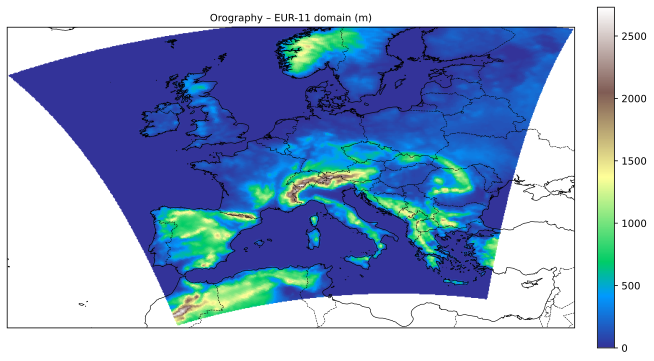
```

### Variables

The inputs fall into three groups.

The *dynamic spatial* variables, which vary in both space and time. They include the SPEI (the target, also supplied as history, also seen in Figure \@ref(fig:spei-snapshots)), precipitation, near-surface temperature, surface pressure, and water balance.

The *dynamic global* variables, which vary in time only and capture the large-scale drivers of European moisture and its seasonality: the North Atlantic Oscillation index [@hurrellNao1995], grouped Mediterranean sea-surface temperatures (SST), and a cyclical month encoding.
The fourteen Mediterranean basins are aggregated into three regional means [@millotCirculationMediterraneanSea2005; @lionelloMediterraneanClimateOverview2006] (Figure \@ref(fig:med-slt)).

And the *static spatial* input, which varies in space only: the topography, whose elevation strongly shapes Alpine precipitation and temperature.

```{r spei-snapshots, echo=FALSE, fig.cap="SPEI over the Alpine domain across 1971.", out.width="100%", fig.align="center"}
knitr::include_graphics("work/02-drought_prediction/figures/raw/al/spei.svg")
```

```{r med-slt, echo=FALSE, fig.cap="Mediterranean SST, 1971--2024, aggregated into three regional groups (western Mediterranean, eastern Mediterranean, Black Sea).", out.width="100%", fig.align="center"}
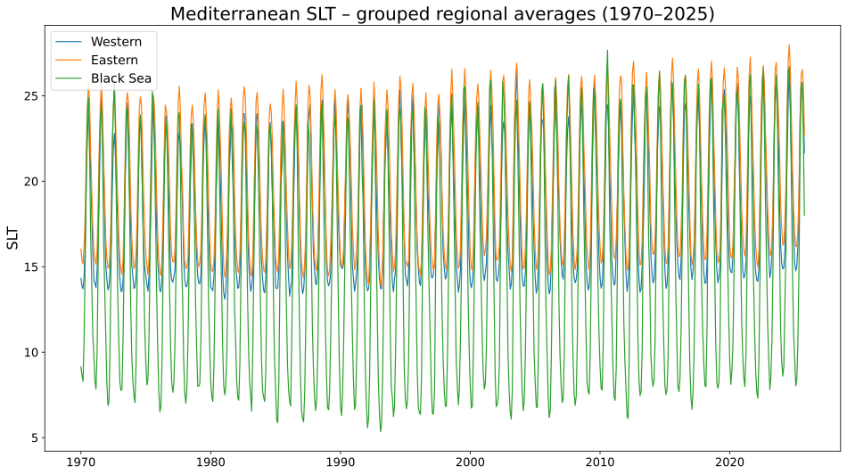
```

### Drought definition: SPEI

The Standardized Precipitation Evapotranspiration Index (SPEI) [@vicente-serranoMultiscalarDroughtIndex2010] extends the precipitation-only Standardized Precipitation Index (SPI) [@mckeeRelationshipDroughtFrequency1993] by using the water balance, so that temperature enters through evapotranspiration, which can better account for rising temperatures under climate change.

The SPEI is built on the water balance,

$$D = P - PET, \qquad \begin{cases} D > 0 & \text{water surplus} \\ D < 0 & \text{water deficit} \end{cases}$$

where $P$ is precipitation and $PET$ is potential evapotranspiration.

SPEI is defined at a chosen timescale $k$: the monthly water balance is summed over a rolling window of the preceding $k$ months, and the accumulated series is fitted to a distribution and standardized.
Common choices are 1, 3, 6, 12, and 24 months.
Short timescales respond to rapid, month-to-month deficits and longer ones to slower, accumulated dryness.
This work uses SPEI-1, so each value uses the water balance of one month expressed in standard deviations from the local mean.
The index is computed as in @funk2026probabilisticdeeplearningdrought, with a three-parameter gamma fit calibrated over 1990 to 2019.

### Preprocessing

Cells outside the Alpine mask are filled and excluded from all statistics.
All variables, including SPEI, are standardized to zero mean and unit variance using training-years statistics over valid cells only.
Because SPEI is also the prediction target, this same training-period standardization sets the units of the target, so predictions, the reported RMSE, and the SPEI $\le -1.5$ detection threshold are all expressed in training-period standardized units.

### Split and nonstationarity

The data is split chronologically: training on 1971 to 2004, validation on 2005 to 2014, and testing on 2015 to 2024.
Because the split is by time rather than at random, the periods differ in climate.
The average severe-drought frequency rises across them, from 0.53 to 0.62 to 1.04 events per cell per year, so the test period is substancially drier than the training period, as shown in Figure \@ref(fig:drought-freq-severe).

```{r drought-freq-severe, echo=FALSE, fig.cap="Severe-drought (SPEI $\\le -1.5$) frequency by split.", out.width="100%", fig.align="center"}
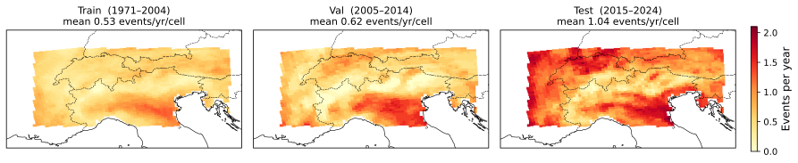
```

### Task & Model

The forecasting task is a continuous, per-cell regression of SPEI-1.
Given thirty-six months of history, the model predicts a single SPEI-1 map at a twelve-month lead.
It is a direct forecast, the horizon is predicted in one step rather than iterated month by month, avoiding recursive error accumulation.

The forecasting model is a Convolutional LSTM (ConvLSTM), following the variant of @marusovLongtermDroughtPrediction2024a.
It replaces the matrix products in the gates of a standard LSTM [@hochreiterLongShorttermMemory1997] with convolutions, so the input $x_t$, hidden state $h_t$, and cell state $c_t$ are three-dimensional feature maps rather than vectors, which preserves spatial structure.
Figure \@ref(fig:convlstm-schematic) shows the resulting cell.

```{r convlstm-schematic, echo=FALSE, fig.cap="ConvLSTM cell by @marusovLongtermDroughtPrediction2024a.", out.width="75%", fig.align="center"}
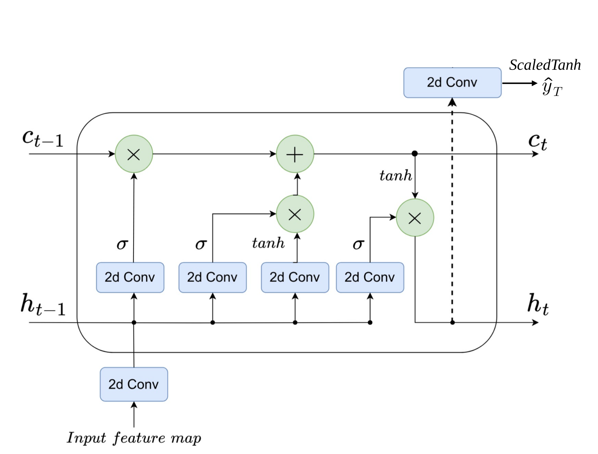
```

Each gate applies a convolution followed by batch normalization, whose affine shift replaces the additive bias,

$$
\begin{aligned}
f_t &= \sigma(\mathrm{BN}(W_f \ast x_t + U_f \ast h_{t-1})), & i_t &= \sigma(\mathrm{BN}(W_i \ast x_t + U_i \ast h_{t-1})), \\
\tilde{c}_t &= \tanh(\mathrm{BN}(W_c \ast x_t + U_c \ast h_{t-1})), & o_t &= \sigma(\mathrm{BN}(W_o \ast x_t + U_o \ast h_{t-1})),
\end{aligned}
$$

and the cell and hidden states are updated as

$$c_t = f_t \odot c_{t-1} + i_t \odot \tilde{c}_t, \qquad h_t = o_t \odot \tanh(c_t),$$

where $\ast$ denotes convolution, $\odot$ the elementwise product, and $\sigma$ the sigmoid.

The final hidden state is mapped to the predicted SPEI map by a bounded regression head,

$$\hat{y}_T = \lambda \tanh(W_{\text{out}} \ast h_T),$$

where the scaled $\tanh$ keeps the output within $[-\lambda, \lambda]$, with $\lambda = 10$.

## Methods

Each of the three research questions is treated as one axis of variation, as defined below.

### RQ1: Loss functions

The loss sets how strongly errors on dry cells are weighted, and how hard the model is pushed to predict droughts.
Three families are compared, each averaged over valid cells, with $y$ the observed and $\hat{y}$ the predicted SPEI.

<div style="display: grid; grid-template-columns: 1fr 400px; align-items: center; gap: 1.5em; border-left: 5px solid #3C3C3C; padding-left: 1em;">
<div style="min-width: 0;">

`r dphead("Mean squared error", col_mse)` is the symmetric baseline,

$$\mathcal{L}_{\text{MSE}} = (\hat{y} - y)^2.$$

</div>
<div class="loss-fig" style="min-width: 0; width: 360px; text-align: right;">
```{r mse-illustration, echo=FALSE, out.width="170px"}
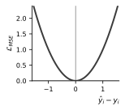
```
</div>
</div>

<div style="display: grid; grid-template-columns: 1fr 400px; align-items: center; gap: 1.5em; border-left: 5px solid #286EA0; padding-left: 1em;">
<div style="min-width: 0;">

`r dphead("Hinge-weighted MSE", col_hin)` keeps the squared error but up-weights cells on the dry side of normal,

$$\begin{aligned}
\mathcal{L}_{\text{hwMSE}} &= w\,(\hat{y} - y)^2, \\
w &= 1 + \alpha \max(0, -y), \quad \alpha \in \{1, 5\},
\end{aligned}$$

so a given error costs more the drier the observed cell.

</div>
<div class="loss-fig" style="min-width: 0; width: 360px; text-align: right;">
```{r hinge-illustration, echo=FALSE, out.width=c("170px","170px"), fig.show="hold"}
knitr::include_graphics(c(
  "work/02-drought_prediction/reports/figures/hinge_weight.svg",
  "work/02-drought_prediction/reports/figures/hinge_loss.svg"
))
```
</div>
</div>

<div style="display: grid; grid-template-columns: 1fr 400px; align-items: center; gap: 1.5em; border-left: 5px solid #C6402A; padding-left: 1em;">
<div style="min-width: 0;">

`r dphead("Pinball (quantile) loss", col_pin)` at $\tau = 0.20$ is asymmetric,

$$\mathcal{L}_{\text{pin}} = \begin{cases} \tau\,(y - \hat{y}) & \hat{y} \le y, \\ (1-\tau)\,(\hat{y} - y) & \hat{y} > y, \end{cases}$$

penalizing over-prediction (too wet, missing a drought) by a factor $\tfrac{1-\tau}{\tau}=4$ over under-prediction, biasing the model toward the dry tail.

</div>
<div class="loss-fig" style="min-width: 0; width: 360px; text-align: right;">
```{r pinball-illustration, echo=FALSE, out.width="170px"}
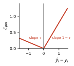
```
</div>
</div>

### RQ2: Dynamic global features
Two ways of feeding the global features into the ConvLSTM are compared (Figure \@ref(fig:naive-vs-film)).
The naive baseline broadcasts each global scalar across the grid as an extra input channel.

```{r naive-vs-film, echo=FALSE, fig.cap="Dynamic global feature injection strategies. Naive injection is on the left and FiLM on the right (The FiLM depiction is by @perezFiLMVisualReasoning2018).", out.width="90%", fig.align="center"}
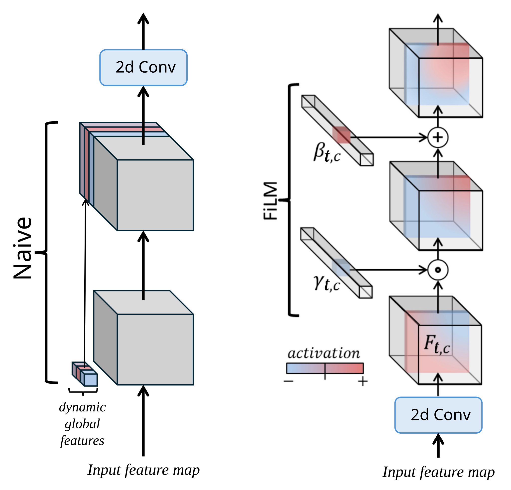
```

FiLM (feature-wise linear modulation) [@perezFiLMVisualReasoning2018] instead conditions the network by applying a per-channel affine transform to the feature maps,

$$\mathrm{FiLM}(F_c) = \gamma_c\, F_c + \beta_c, \qquad \gamma_c = f_c(x_t), \; \beta_c = h_c(x_t),$$

where $F_c$ is the activation of channel $c$ and the scale $\gamma_c$ and shift $\beta_c$ are learned functions $f_c, h_c$ of the global features $x_t$, produced together by a small shared MLP.
Rather than adding channels, FiLM lets the global state reshape the existing ones in an interaction-like manner. Figure \@ref(fig:convlstm-film) shows where this conditioning enters the ConvLSTM cell introduced above.

```{r convlstm-film, echo=FALSE, fig.cap="Where FiLM sits inside the ConvLSTM cell: it conditions the embedded input feature map before the gate convolutions.", out.width="75%", fig.align="center"}
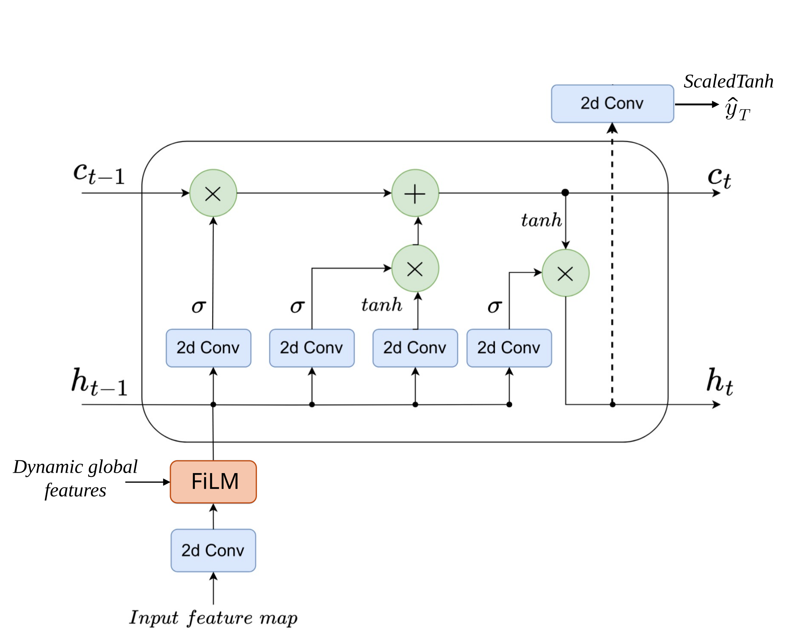
```

### RQ3: Static spatial features
Three ways of incorporating the static topography are compared, contrasted in Figure \@ref(fig:naive-vs-static-encoder).
The naive baseline appends the raw static field repeatedly at each time step, treating it the same as a dynamic spatial feature.

```{r naive-vs-static-encoder, echo=FALSE, fig.cap="Static spatial feature injection strategies. Naive injection is on the left and the learned encoder on the right (single and seasonal variants).", out.width="90%", fig.align="center"}
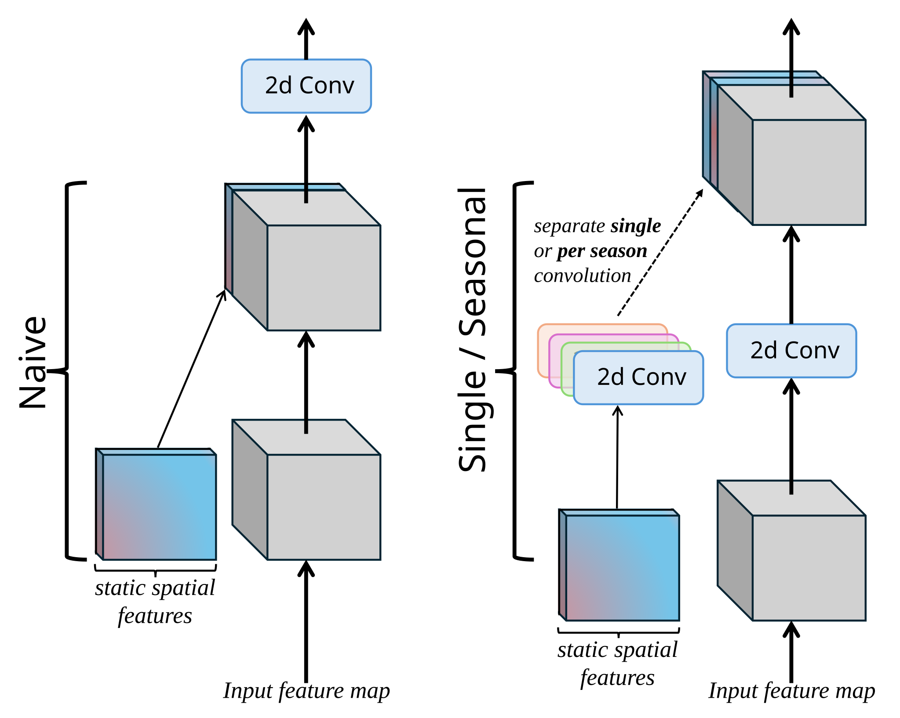
```

The other two learn a seperate static encoding through a small convolutional network,

$$E(S) = \mathrm{ReLU}(W_2 \ast \mathrm{ReLU}(W_1 \ast S)),$$

with static features $S$ and convolutional kernels $W_1, W_2$ (each with batch normalization), whose output is concatenated to the embedding $x_t^{\text{emb}}$ at every timestep.
The *single* variant uses one shared encoder, giving $[\,x_t^{\text{emb}}, E(S)\,]$, while the *seasonal* variant uses four encoders, one per meteorological season, selected by the season $s(m_t)$ of the target month, giving $[\,x_t^{\text{emb}}, E_{s(m_t)}(S)\,]$. Figure \@ref(fig:convlstm-static) shows where the resulting encoder output enters the cell.

```{r convlstm-static, echo=FALSE, fig.cap="Where the static encoder sits inside the ConvLSTM cell: it concatenates its output to the embedded input feature map before the gate convolutions.", out.width="75%", fig.align="center"}
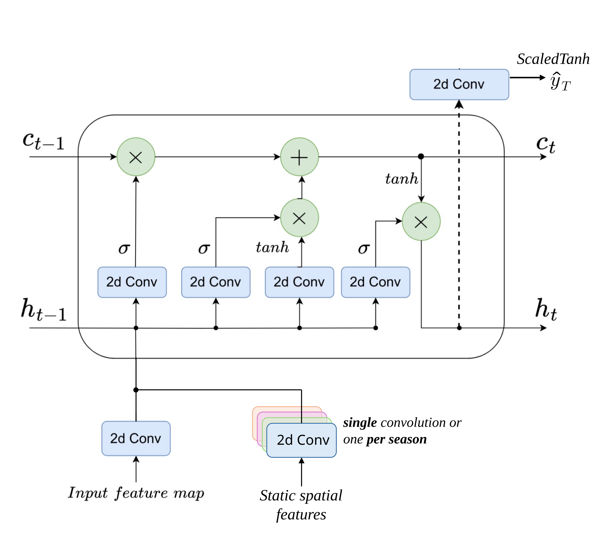
```

### Experimental setup

The three axes are crossed into a full grid of $4 \times 2 \times 3 = 24$ configurations: four losses, by two global-feature strategies, by three static-feature strategies.
All configurations share a single random seed (42) and the same training protocol: an Adam optimizer with batch size 32, up to 50 epochs with early stopping based on the validation RMSE, and the learning rate reduced on plateau.
Learning rate, dropout, and weight decay received limited tuning on the validation set.

### Evaluation

All metrics are computed on the test period (2015--2024), over all valid cells and test months.
Point accuracy is measured by the RMSE of the predicted SPEI,

$$\mathrm{RMSE} = \sqrt{\frac{1}{T G}\sum_{t=1}^{T}\sum_{g=1}^{G}\left(\hat{y}_{g,t} - y_{g,t}\right)^2},$$

over $T$ test months and $G$ valid cells.

Detection is evaluated at the severe-drought cutoff $c = -1.5$, with observed and predicted indicators $d_{g,t} = \mathbb{1}\{y_{g,t} \le c\}$ and $\hat{d}_{g,t} = \mathbb{1}\{\hat{y}_{g,t} \le c\}$ at cell $g$ and month $t$.
The true positives, false positives, and false negatives are pooled over all valid cells and test months into a single confusion matrix, rather than a per-cell or per-month average, giving the true positive rate (TPR) and F1,

$$\mathrm{TPR} = \frac{TP}{TP + FN}, \qquad \mathrm{F1} = \frac{2\,TP}{2\,TP + FP + FN}.$$

## Results

### Baselines

Three reference forecasts are evaluated on the test period (2015--2024): persistence (the last observed SPEI carried forward twelve months), climatology (the training-period cell mean), and a per-cell linear trend extrapolated from the training years to the test years [@wilksStatistical2011; @jolliffeStephenson2003].
They are evaluated in Table \@ref(tab:baselines).
The trend gives the lowest baseline RMSE (1.065), just ahead of climatology (1.077), but neither ever predicts a severe drought, so both score zero on detection.
Persistence is the only baseline that detects drought (F1 0.290, TPR 0.281), at a substantially higher RMSE (1.349).
The trend therefore sets the bar to beat on RMSE, and persistence the bar to beat on detection.

```{r baselines, echo=FALSE}
b <- data.frame(
  Baseline = c("Persistence", "Climatology", "Trend"),
  Forecast = c("last SPEI carried forward 12 months",
               "per-cell training-period mean",
               "per-cell linear-trend extrapolation"),
  RMSE = c("1.349", "1.077", cell_spec("1.065", bold = TRUE)),
  F1   = c(cell_spec("0.290", bold = TRUE), "0.000", "0.000"),
  TPR  = c(cell_spec("0.281", bold = TRUE), "0.000", "0.000"),
  check.names = FALSE)
kbl(b, escape = FALSE, booktabs = TRUE, align = "llccc",
    caption = "Baseline performance on the test set.") |>
  kable_styling(latex_options = "hold_position", full_width = FALSE, font_size = 13)
```

### RQ1: Loss functions

Holding both static spatial feature injection and dynamic global feature injection at the naive strategy, the loss alone shapes a trade-off between accuracy and detection (Table \@ref(tab:loss-results)).
MSE and the $w=1$ hinge-weighted MSE loss attain the lowest RMSE (0.965 and 0.962), both beating the trend floor, but MSE's detection collapses to F1 0.115, far below persistence: minimizing squared error pulls predictions toward the mean and away from the dry tail.
This mean-pulling is most pronounced for MSE and the $w=1$ hinge, which still closely resembles a plain MSE, although even that mild weighting already improves detection markedly, doubling or even tripling both detection metrics.
Raising the hinge weight to $w=5$ buys some detection capability at the cost of RMSE (1.028), althoug it is only a slight improvement over $w=1$ in detection.
Pinball performs best on both detection metrics and is the only loss to beat persistence on both F1 (0.384) and TPR (0.327), but it carries the highest RMSE (1.155), above the trend floor.
Accuracy and detection thus generally move in opposite directions as the loss shifts from MSE to Pinball.

```{r loss-results, echo=FALSE}
lc <- c("#3C3C3C", "#6EA5C8", "#286EA0", "#C6402A")
loss <- cell_spec(c("$\\mathrm{MSE}$", "$\\mathrm{hwMSE}_{w=1}$",
                    "$\\mathrm{hwMSE}_{w=5}$", "$\\mathrm{Pinball}_{\\tau=0.2}$"),
                  color = lc, bold = TRUE)
gap <- cell_spec(c("+0.100", "+0.103", "+0.037", "-0.090"),
                 color = c("#005028", "#005028", "#005028", "#781414"))
d <- data.frame(
  Loss = c(loss, "Persistence"),
  F1   = c("0.115", "0.277", "0.297", cell_spec("0.384", bold = TRUE), "0.290"),
  TPR  = c("0.064", "0.192", "0.208", cell_spec("0.327", bold = TRUE), "0.281"),
  RMSE = c("0.965", cell_spec("0.962", bold = TRUE), "1.028", "1.155", "1.349"),
  Gap  = c(gap, "---"),
  check.names = FALSE)
kbl(d, escape = FALSE, booktabs = TRUE, align = "lcccc",
    col.names = c("Loss", "F1", "TPR", "RMSE", "Trend RMSE $-$ model RMSE"),
    caption = "Loss function performance on the test set.") |>
  kable_styling(latex_options = "hold_position", full_width = FALSE, font_size = 13)
```

### RQ2: Global features

With the static features held at naive injection, naive injection and FiLM conditioning are compared for the global features (Table \@ref(tab:film-results)).
The effect is again loss-dependent.
Under MSE and the hinge-weighted MSE losses, FiLM reduces detection, sharply for the lighter losses (MSE and the $w=1$ hinge), while RMSE hardly moves.
Only under Pinball does FiLM improve detection, raising F1 by 0.064 and TPR by 0.131.
FiLM therefore does not help uniformly. It reshapes the accuracy-detection balance in a loss-dependent way, improving detection only under Pinball while barely changing accuracy.

```{r film-results, echo=FALSE}
lc <- c("#3C3C3C", "#6EA5C8", "#286EA0", "#C6402A")
grn <- "#005028"; red <- "#781414"
loss <- cell_spec(c("$\\mathrm{MSE}$", "$\\mathrm{hwMSE}_{w=1}$",
                    "$\\mathrm{hwMSE}_{w=5}$", "$\\mathrm{Pinball}_{\\tau=0.2}$"),
                  color = lc, bold = TRUE)
d <- data.frame(
  Loss = loss,
  f1n = c("0.115","0.277","0.297","0.384"),
  f1v = c("0.008","0.094","0.261","0.448"),
  f1d = cell_spec(c("-0.107","-0.183","-0.035","+0.064"), color = c(red,red,red,grn)),
  tpn = c("0.064","0.192","0.208","0.327"),
  tpv = c("0.004","0.051","0.167","0.459"),
  tpd = cell_spec(c("-0.060","-0.142","-0.041","+0.131"), color = c(red,red,red,grn)),
  rmn = c("0.965","0.962","1.028","1.155"),
  rmv = c("0.943","0.948","1.055","1.160"),
  rmd = cell_spec(c("-0.022","-0.014","+0.027","+0.005"), color = c(grn,grn,red,red)),
  check.names = FALSE)
kbl(d, escape = FALSE, booktabs = TRUE, align = c("l", rep("c", 9)),
    col.names = c("Loss","Naive","FiLM","$\\Delta$","Naive","FiLM","$\\Delta$","Naive","FiLM","$\\Delta$"),
    caption = "Global-feature injection performance on the test set. $\\Delta$ is FiLM minus naive.") |>
  add_header_above(c(" " = 1, "F1" = 3, "TPR" = 3, "RMSE" = 3)) |>
  kable_styling(latex_options = c("hold_position", "scale_down"), font_size = 13)
```

FiLM does not act uniformly across the SPEI range either, as Table \@ref(tab:film-stratified-main) shows.
Its benefit is largely concentrated in the two drought categories the $-1.5$ detection threshold covers, severe ($-2 <$ SPEI $\le -1.5$) and extreme (SPEI $\le -2$).
FiLM lowers RMSE in both categories, and the reduction grows with drought severity and as the loss pushes harder toward the tail, reaching $-0.10$ in the extreme category under Pinball.
Because the severe and extreme categories together cover under a tenth of the test distribution, these gains carry little weight in the pooled RMSE, which worsens by just $+0.005$ under Pinball.
Under MSE, which weights the tail least, the reduction is negligible, $0.01$ or less in both categories.

```{r film-stratified-main, echo=FALSE}
lc <- c("#3C3C3C", "#6EA5C8", "#286EA0", "#C6402A")
grn <- "#005028"; neu <- "#777777"
loss <- cell_spec(c("$\\mathrm{MSE}$", "$\\mathrm{hwMSE}_{w=1}$",
                    "$\\mathrm{hwMSE}_{w=5}$", "$\\mathrm{Pinball}_{\\tau=0.2}$"),
                  color = lc, bold = TRUE)
d <- data.frame(
  Loss = loss,
  sn = c("1.162", "0.915", "0.660", "0.519"),
  sf = c("1.162", "0.890", "0.621", "0.475"),
  sd = cell_spec(c("-0.000", "-0.025", "-0.039", "-0.044"), color = c(neu, grn, grn, grn)),
  en = c("1.520", "1.253", "1.008", "0.832"),
  ef = c("1.509", "1.181", "0.946", "0.735"),
  ed = cell_spec(c("-0.010", "-0.072", "-0.062", "-0.097"), color = grn),
  check.names = FALSE)
kbl(d, escape = FALSE, booktabs = TRUE, align = c("l", rep("c", 6)),
    col.names = c("Loss", "Naive", "FiLM", "$\\Delta$", "Naive", "FiLM", "$\\Delta$"),
    caption = paste0("Per-category RMSE on the test set. $\\Delta$ is FiLM minus naive. Severe: $-2 ",
                     if (knitr::is_latex_output()) "<" else "\\lt",
                     "$ SPEI $\\le -1.5$ (18,572 cell-occurrences). Extreme: SPEI $\\le -2$ (5,221 cell-occurrences).")) |>
  add_header_above(c(" " = 1, "Severe" = 3, "Extreme" = 3)) |>
  kable_styling(latex_options = "hold_position", full_width = FALSE, font_size = 13)
```

### RQ3: Static features

With the global features held at naive injection, naive injection, a single encoder, and a seasonal encoder are compared for the static features (Tables \@ref(tab:single-results) and \@ref(tab:seasonal-results)).
Both encoders show the same loss-dependence and act mainly on detection, leaving RMSE broadly stable.
The single encoder improves detection only under Pinball, where it lifts TPR by 0.214 and lowers RMSE slightly, but reduces detection under the hinge losses.
The seasonal encoder also helps most under Pinball (TPR up 0.220) and, unlike the single encoder, under MSE too, yet it degrades sharply under the $w=5$ hinge (F1 down 0.220).
Neither encoder consistently beats the other.

```{r single-results, echo=FALSE}
lc <- c("#3C3C3C", "#6EA5C8", "#286EA0", "#C6402A")
grn <- "#005028"; red <- "#781414"
loss <- cell_spec(c("$\\mathrm{MSE}$", "$\\mathrm{hwMSE}_{w=1}$",
                    "$\\mathrm{hwMSE}_{w=5}$", "$\\mathrm{Pinball}_{\\tau=0.2}$"),
                  color = lc, bold = TRUE)
d <- data.frame(
  Loss = loss,
  f1n = c("0.115","0.277","0.297","0.384"),
  f1v = c("0.096","0.110","0.254","0.438"),
  f1d = cell_spec(c("-0.018","-0.167","-0.042","+0.054"), color = c(red,red,red,grn)),
  tpn = c("0.064","0.192","0.208","0.327"),
  tpv = c("0.054","0.061","0.180","0.541"),
  tpd = cell_spec(c("-0.010","-0.131","-0.027","+0.214"), color = c(red,red,red,grn)),
  rmn = c("0.965","0.962","1.028","1.155"),
  rmv = c("0.964","0.965","1.044","1.144"),
  rmd = cell_spec(c("-0.001","+0.004","+0.016","-0.011"), color = c(grn,red,red,grn)),
  check.names = FALSE)
kbl(d, escape = FALSE, booktabs = TRUE, align = c("l", rep("c", 9)),
    col.names = c("Loss","Naive","Single","$\\Delta$","Naive","Single","$\\Delta$","Naive","Single","$\\Delta$"),
    caption = "Static-feature encoding performance on the test set. $\\Delta$ is the single encoder minus naive.") |>
  add_header_above(c(" " = 1, "F1" = 3, "TPR" = 3, "RMSE" = 3)) |>
  kable_styling(latex_options = c("hold_position", "scale_down"), font_size = 13)
```

```{r seasonal-results, echo=FALSE}
lc <- c("#3C3C3C", "#6EA5C8", "#286EA0", "#C6402A")
grn <- "#005028"; red <- "#781414"
loss <- cell_spec(c("$\\mathrm{MSE}$", "$\\mathrm{hwMSE}_{w=1}$",
                    "$\\mathrm{hwMSE}_{w=5}$", "$\\mathrm{Pinball}_{\\tau=0.2}$"),
                  color = lc, bold = TRUE)
d <- data.frame(
  Loss = loss,
  f1n = c("0.115","0.277","0.297","0.384"),
  f1v = c("0.165","0.251","0.077","0.427"),
  f1d = cell_spec(c("+0.051","-0.026","-0.220","+0.043"), color = c(grn,red,red,grn)),
  tpn = c("0.064","0.192","0.208","0.327"),
  tpv = c("0.099","0.176","0.041","0.547"),
  tpd = cell_spec(c("+0.035","-0.016","-0.166","+0.220"), color = c(grn,red,red,grn)),
  rmn = c("0.965","0.962","1.028","1.155"),
  rmv = c("0.971","0.964","1.056","1.142"),
  rmd = cell_spec(c("+0.006","+0.003","+0.028","-0.013"), color = c(red,red,red,grn)),
  check.names = FALSE)
kbl(d, escape = FALSE, booktabs = TRUE, align = c("l", rep("c", 9)),
    col.names = c("Loss","Naive","Seasonal","$\\Delta$","Naive","Seasonal","$\\Delta$","Naive","Seasonal","$\\Delta$"),
    caption = "Static-feature encoding performance on the test set. $\\Delta$ is the seasonal encoder minus naive.") |>
  add_header_above(c(" " = 1, "F1" = 3, "TPR" = 3, "RMSE" = 3)) |>
  kable_styling(latex_options = c("hold_position", "scale_down"), font_size = 13)
```

### Overall

Across the full grid, the 24 configurations trade accuracy against detection, and the best of them form a Pareto front (Figure \@ref(fig:frontier)).
Where a model lands is set almost entirely by the loss, from MSE at low RMSE and near-zero detection to Pinball at high detection and high RMSE, with the hinge losses between.
The feature-injection choices only make small, loss-specific differences, with no single configuration winning throughout, leaving the loss as the dominant control.

```{r frontier, echo=FALSE, fig.cap="RMSE against drought detection, as TPR (left) and F1 (right), for all 24 configurations and the persistence and climatology baselines. The vertical line marks the linear-trend RMSE.", out.width="48%", fig.show="hold", fig.align="center"}
knitr::include_graphics(c(
  "work/02-drought_prediction/figures/frontier_tpr_light.svg",
  "work/02-drought_prediction/figures/frontier_f1_light.svg"
))
```


## Discussion

A consistent picture emerges across the three comparisons.

- **RQ1:** The loss function governs the accuracy-detection trade-off more strongly than any other choice examined here: it moves a model from low RMSE and almost no detection (MSE) to high detection and high RMSE (Pinball).
- **RQ2:** FiLM conditioning on the global dynamic variables helps only conditionally. It improves detection as compared to naive injection only under Pinball but costs detection under the other losses. In the drought tail it lowers error across the severe and extreme categories under every loss.
- **RQ3:** Neither the learned single nor the seasonal topography encoder reliably improves on naive injection: both act mainly on detection in a similar loss-dependent way, and neither is consistently ahead.

Across the full grid of configurations the loss is the main lever, and no single setup dominates the Pareto front.

At a twelve-month lead in a complex region like the Alps, the task itself is hard.
Some of the models beat the simple linear-trend baseline on RMSE, but only by a small margin, and no configuration pulls far ahead.
The loss acts less as a way to extract more skill than as a way to choose an operating point on this trade-off, moving the model toward lower RMSE or toward higher detection.
Together, these factors could also explain why the feature-injection choices, which barely affect this basic tension, only move models short distances along the trade-off.

Because Pinball shifts predictions toward the dry tail, part of its detection edge could come from that shift, though it also wins on F1, which penalises false alarms, so it is not merely predicting more droughts blindly.
Nevertheless, its detection gains are best read together with the RMSE they cost.
The limited impact of the injection strategies may also be a reflection of the usefulness of the features themselves, since the achievable gains are bounded by how informative the injected features are.
Further analysis of interpretability and feature importance is given in the appendix.

These conclusions should be seen in light of several limitations.
Each configuration was trained once, so the reported differences carry no estimate of run-to-run variance, and the smaller gaps should be read cautiously.
This work also only covers a single region, a single lead time, a single drought index (SPEI-1), and one fixed set of input features, so how far the loss-dominance and the feature-injection comparisons generalize is unclear.
The chronological split also leaves the test period drier than the training period, as severe-drought frequency rises across time, so the models are evaluated under a distribution shift rather than on identically distributed data.

## Conclusion

This work compared loss functions and feature-injection strategies for a ConvLSTM forecasting SPEI-1 one year ahead over the Alps.
The main finding is that the loss is the dominant lever, fixing where the model sits on a trade-off between point accuracy and severe-drought detection, while the global and static feature injection strategies only change model performance marginally.
Future work should investigate whether these findings hold across multiple seeds or ensembles, more regions, shorter and more predictable forecasting horizons, and richer or differently chosen conditioning features.

## Appendix: Feature importance

Each input was occluded in turn (set to its training mean) and the frozen Pinball model re-scored on the test set [@zeilerVisualizingUnderstandingConvolutional2013].
Inputs are occluded rather than permuted because the driver fields are correlated [@hookerUnrestrictedPermutationForces2021].

The left panel of Figure \@ref(fig:feat-importance) shows that point accuracy is unmovable, as every bar sits near zero and no input shifts the pooled RMSE by more than 0.06 in any configuration.
Detection (right panel) rests on a few inputs.
The Mediterranean SST is the strongest, and its removal drops TPR most where no static encoder is present (the grey bars), while once a single or seasonal encoder is added, temperature takes over instead.
FiLM changes this less than the static encoder does, though without an encoder it slightly deepens reliance on the global drivers it conditions on, lengthening the Mediterranean SST and month bars (the darker shade in each pair).
Topography is the one input whose removal raises TPR, and the remaining fields barely move it.

```{r feat-importance, echo=FALSE, fig.cap="Occlusion feature importance for the Pinball models across all six architecture conditions. Change in pooled RMSE (left) and drought TPR (right) when each input is set to its training mean on the test set, configurations labelled static / global.", out.width="95%", fig.align="center"}
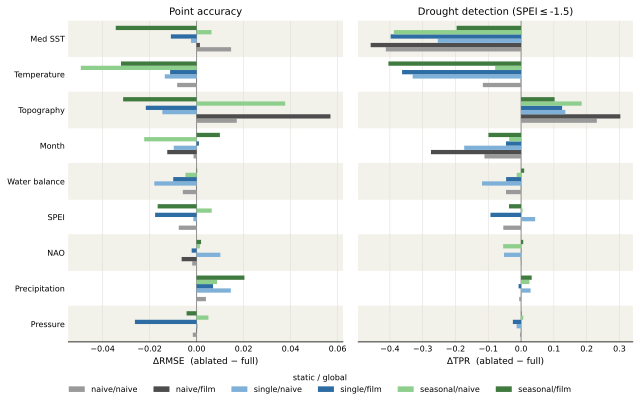
```

