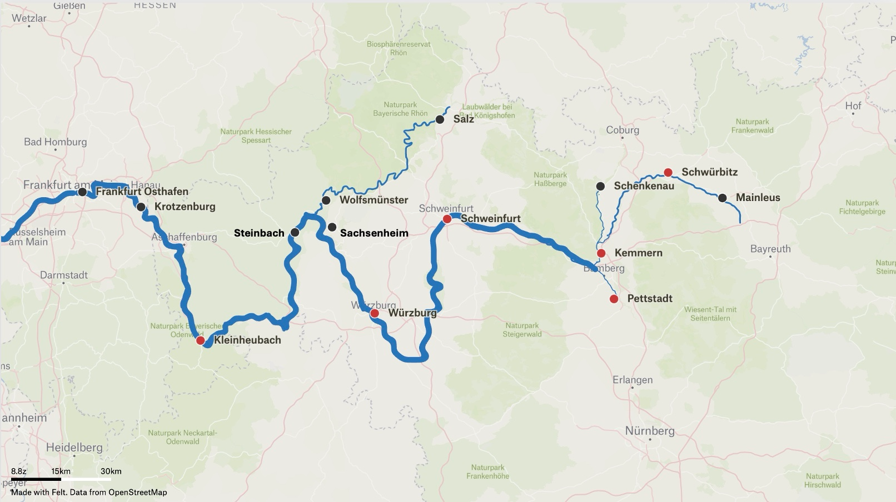
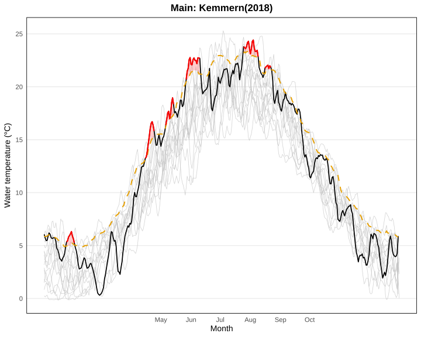
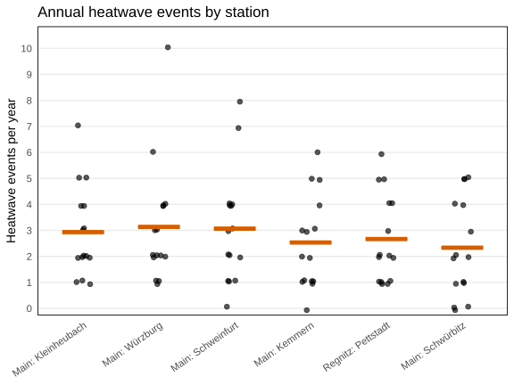
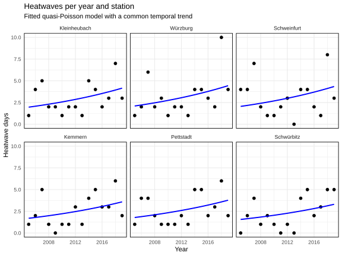
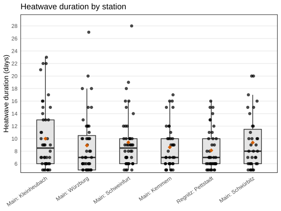
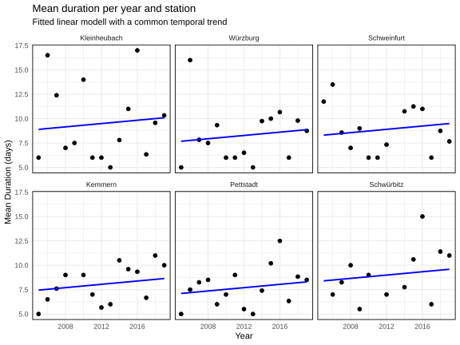
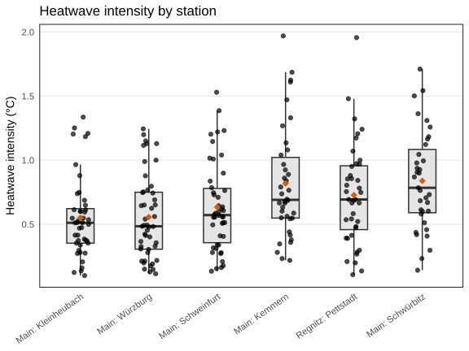
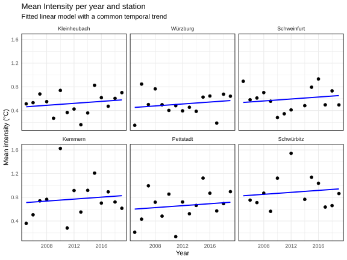
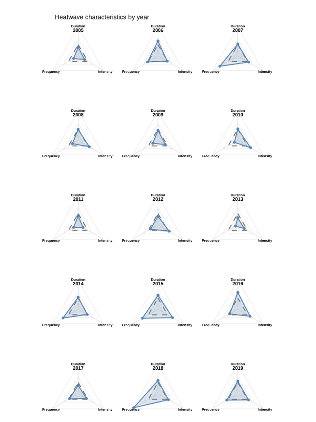
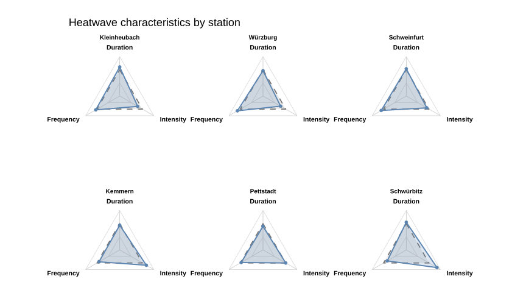

---
output:
  pdf_document:
    keep_tex: true
    fig_crop: false
  html_document: default
  word_document: default
---

```{r message=FALSE, warning=FALSE, include=FALSE}
library(bookdown)
library(svglite)
library(kableExtra)

# SVG has no LaTeX backend: use the .pdf twin of each figure when knitting to
# PDF (knitr only swaps the extension where that twin actually exists)
options(knitr.graphics.auto_pdf = TRUE)
```

# Riverine Heatwaves {#rh}

*Author: Tom Baumann*

*Supervisor: Henri Funk*

*Degree: Bachelor*

## Abstract

Riverine Heatwaves, which are prolonged periods of exceptionally high water temperatures in river systems, are a 
hydrological phenomenon, that is expected to gain considerable importance throughout the next years, also due to their 
link to climate change. The following paper will give an introduction to the precise definition of riverine heatwaves, 
as well as explain its drivers and impacts. Furthermore, it will focus on the methodology used to detect riverine 
heatwaves from temperature time series, and how their development, both spatially and temporally, can be quantified. Applying these methods on a dataset from Main river system in Bavaria delivered a significant increase in frequency over time, while increasing temporal trends in duration and intensity were insignificant. Also linear trends between river kilometer and the heatwave metrics could not be verified. However, the dataset only included a relatively short time period, therefore a larger data size might lead to more precise results.

## Introduction

### Overview

In contrast to air, lake and ocean heatwaves, research on river heatwaves is still just emerging. However it is a topic 
that is only projected to become more relevant over time, as increasing water temperatures in rivers are closely linked 
to climate change, and also riverine heatwaves are expected to become more frequent, long and intense. In fact, they are 
even projected to increase more rapidly than air heatwaves [@sadayappan2025]. To research riverine heatwaves, it is 
important to understand precisely how they are defined, how they can be quantified, and what sort of data is required 
for their analysis. Also the drivers and impacts of riverine heatwaves need to be examined, to understand their 
appearance, and how they can be mitigated. Lastly, it is important to be able to forecast and predict riverine 
heatwaves, which requires the construction of reliable models. 
This paper is going to give an overview on the topic of riverine heatwaves, by introducing their definition, drivers and
impacts. This will be helpful, to gain a better understanding of riverine heatwaves. Furthermore it will give a baseline on how riverine heatwaves can be detected from temperature time series, and what metrics can be used to quantify them. Later 
these methods will be used to perform an exploratory analysis on a data set of water temperature data from Main river 
system, focusing on the evolution of riverine heatwaves over time and the differences between stations.

### Definition

Riverine Heatwaves are defined similarly to atmospheric heatwaves, as periods where daily mean water temperature 
exceeds a local seasonally varying percentile based threshold for a prolonged period of time. For riverine heatwaves,
usually a 90th percentile threshold and a 5 day period are used [@vanhamel2025].
Although their definitions are similar, riverine heatwaves and atmospheric heatwaves behave differently, as riverine 
heatwaves tend to be more rare, but more persistent, than atmospheric heatwaves [@sadayappan2025].


### Drivers

As riverine heatwaves are a phenomenon that has not gained much attention so far, its drivers are not fully understood 
yet. We know that river temperature in general is controlled by a variety of factors. There are the atmospheric 
conditions like air temperature, wind, rainfall and solar radiation, the hydrologic conditions which means the 
discharge, how the river interacts with different water bodies within its proximity and processes at the water stream 
bed interface, for example the interaction of the river with ground water. On top of that, the water temperature can be 
influenced by its environment, for example by the amount of vegetation and shading, by impervious surfaces nearby or by 
the presence of thermal effluents from near industries or human waste water [@vanhamel2025].

However, so far little is known on how specifically riverine heatwaves are caused. From literature we know, that 
riverine heatwaves are primarely driven by climate drivers. These include air temperature, while especially trends of 
minimum and maximum temperature play a role, and trends in low discharge. Also the contribution of groundwater, winter 
precipitation percentage and trends of snow water play a role, as these help to buffer the impact of extremely hot air 
temperatures on river temperature [@sadayappan2025]. Behind climate drivers, there are also direct anthropogenic 
drivers, such as river dams, which typically tend to elongate riverine heatwaves [@sadayappan2025]. Nevertheless, the 
processes that cause riverine heatwaves are still not fully understood.

### Impacts

The appearance of riverine heatwaves can have both ecological and socioeconomic impacts. These can be parted into 
different layers. Firstly there are the immediate effects of prolonged periods of high water temperature. The higher 
temperature could lead to an increased rate of open water evaporation. Moreover, they might lead to an increased spread 
of diseases, harmful algee bloom and a decrease in water quality in general. This in turn can reduce the availability 
of drinking water or the possibility of recreational activities and be harmful to flora and fauna living in, or close by 
the river systems. Also the prolonged high temperatures can cause thermal stress on fish and other aquatic species 
[@vanhamel2025]. Together this is threatening fishing and aquaculture which is a vital source of food for a large part of 
the population [@chen2026]. Moreover, high water temperatures can also negatively impact energy production, as nuclear 
power production often relies on cooling water from close by river system, which already has been unavailable due to 
riverine heatwaves in some cases [@vanhamel2025].


## Data

### Data Set

For the analysis a dataset of longitudinal temperature data from 14 gauges at Main river system in Bavaria was used. 
The data set includes eight measurements of water temperature per day over a time period of 5 to 20 years between 2000 
and 2020.
According to the literature, the analysis of riverine heatwaves requires time series of at least 10, ideally 30 years with 
at least daily data and not more than 50 percent, ideally not more than 25 percent of missing data [@vanhamel2025] . Also for this 
analysis it is necessary to have a common time period for all stations, to obtain comparable results between 
stations. As many of the stations do not cover a common time period, and as some of the stations have a high amount of 
missing data for some years, the analysis was limited to six of the stations to guarantee these standards. Excluding 
the other stations gave us a 15 year common period time series of daily water temperature, with almost no missing 
values (not more than ten percent per yearly station specific time series). The used stations are marked in figure \@ref(fig:rh-stations-map), which also shows their position along the main river system.

### Locations

```{r rh-stations-map, echo=FALSE, out.width="80%", fig.cap="Map of Main river systen. The station included in the analysis are marked red."} 

```


## Methods

### Threshold

The threshold which classifies riverine heatwaves has to be precisely defined. This paper uses the definition
of marine heatwaves by Hobday. Although it was originally defined for marine heatwaves, it has since been used on many 
different studies about riverine heatwaves as well.

The definition of marine heatwaves by Hobday uses a 90th percentile seasonally varying threshold, which is also varying 
with location and therefore calculated separately for each station. To calculate the seasonally varying threshold, for 
each day the historical temperature measurements, as well as the historical measurements from a 11 day surrounding 
window are taken. From these data points, the 90 percent quantile is taken. The exact formula for this calculation is 
depicted below, where y is the year variable, d is the day variable and j is the day for the considered temperature \@ref(eq:rh-threshold). $Y_s$ and $y_e$ are the years that mark the beginning and end of the baseline period, $P_{90}(X)$ is the 90 percent 
quantile of $X$ . This procedure will be repeated for each day of year, until the threshold for the entire year is 
completed [@hobday2016].

\begin{equation}
T_{90}(j) = P_{90}(X),
\quad \text{where}
\quad
X = \left\{T(y,d)\;\middle|\; y_s \le y \le y_e,\; j-5 \le d \le j+5 \right\}
(\#eq:rh-threshold)
\end{equation}

Usually, for this a historical baseline period is used. But since here the data set only covers a relatively short time 
period, the same time period was used for the calculation of the threshold and the analysis. Even if the same threshold 
definition is used, comparing results from different studies on riverine heatwaves has to be treated carefully. It can 
be problematic to compare exact numbers for metrics between studies with different baseline periods, as climate change 
suggests a temperature biased over time. However, as in this paper the focus is only to demonstrate how heatwaves evolve 
relatively to another over time by looking for general trends rather than comparing exact metrics with other studies.
And since in this paper only measurements from the same stations with the same baseline period were compared, this 
approach also suffices.

Resulting from this procedure, for each station a threshold is obtained, that can be used for comparison with the time 
series of each year. In figure \@ref(fig:rh-threshold-kemmern) an example of this is shown for the Kemmern station and the 
year 2018. Heatwaves can then be detected, by firstly marking all potential candidates, which are all days exceeding the 
thresholds. After, the time series are examined for events of at least five consecutive days exceeding the threshold. 
These are marked as heatwaves and given an ID, while all shorter events are discarded. When there is a gap of only one 
or two days between two or more heatwaves that have a duration of at least five days each, the heatwaves, are 
merged into one heatwave.

### Threshold example: Main data (Kemmern, 2018)

```{r rh-threshold-kemmern, echo=FALSE, out.width="70%", fig.cap="Temperature time series for Main Kemmern in 2018 (black line). The dotted orage line represents the heatwave threshold for Kemmern station. The red areas mark heatwaves in that year for Kemmern station. The light grey lines represent all temperature time series of Kemmern station for the baseline period."}

```


### Metrics used

This paper focuses on three primary metrics, that are used to quantify the evolution of riverine heatwaves. A frequency 
metric, a duration metric and an intensity metric were used, to describe the evolution under different aspects.

To quantify the evolution of frequency the number of heatwave events per year is used. For this, the number of different 
heatwaves IDs are being counted per year and station.

Furthermore, the duration of a heatwave is considered. This is calculated using the first and last day of each 
heatwave \@ref(eq:rh-duration) [@hobday2016]. The duration plays an important role, as especially longer heatwaves can have more severe
impacts.

\begin{equation}
D = t_e - t_s
(\#eq:rh-duration)
\end{equation}
  
Lastly, intensity is used, to assess the amount of the heat spike. The original definition by Hobday suggests to to define it as the temperature by which the climatological mean is exceeded. However, most literature on riverine heatwaves define intensity as the exceendance of the 90th percentile threshold [@sadayappan2025] [@chen2026]. Therefore this was also adopted for this paper. Also in this paper intensity is defined, as the mean of the daily temperature exceedance per heatwave\@ref(eq:rh-intensity).

\begin{equation}
i_{\mathrm{mean}}
=
\overline{T(t)-T_{90}(j)}
(\#eq:rh-intensity)
\end{equation}

These metrics can also be used to summarize two or more of these characteristics. For example, the heatwave events can 
be multiplied with the mean annual duration, to obtain the number of heatwave days per year. Or the duration of a 
heatwave can be multiplied with its mean intensity, to obtain its mean severity. 

### Research Question

This paper examines the evolution of riverine heatwaves during climate change. Therefore, its focus lies primarily on the development of the three previously defined metrics over time by posing the following questions:

1. How has the frequency of riverine heatwaves changed over time?

2. How has the duration of riverine heatwaves changed over time?

3. How has the intensity of riverine heatwaves changed over time?

Given the availability of stations with different locations along the same river system, it was also looked into how 
the metrics differ between the stations. To answer these research questions, an exploratory analysis was performed 
on the heatwave data, examining it for differences between stations and years. Also linear and quasi poisson modells 
were fitted on the data, to look for significant temporal and spatial trends.

## Results

### Frequency

Figure \@ref(fig:rh-heatwave-events-overview) shows the distribution of the number of heatwave events per year for each 
station, with the stations being ordered by their position along the river from downstream to upstream. The plot shows, that 
for each station the mean number of heatwave events lies between 2.5 and 3. Both its mean and its variance seem to 
slightly increase in a downstream direction. To investigate this more thoroughly, a linear model between the mean 
number of heatwave events per station, and the river kilometer was used. The river kilometer is a static variable that describes, the stations distance to the river mouth in kilometers. The model indicated a decreasing, however insignificant trend of -0.001935 events / year 
with a p value of 0.197. As Pettstadt station lies on an inflow river and not directly on Main, it was excluded from 
this model.

To examine the temporal trend of frequency, the heatwave events were grouped by their station, and a quasi poisson model 
was used, to look for correlation between the frequency and year. Fitting a model for each individual station led only 
to 1 significant and 5 insignificant results. Furthermore a common temporal trend quasi poisson model of frequency and 
year was used, to examine the general temporal frequency trend. An analysis-of-deviance F-test was used to assess 
whether including a year x station interaction significantly improved the quasi poisson model compared with a model 
containing only year and station main effects. The year × station interaction did not significantly improve model fit (analysis of deviance F-test: F(5, 78) = 0.737, p = 0.598), indicating no statistical evidence that temporal trends 
differed among stations.Therefore, the model with station as a fixed effect and a common temporal trend was used for the 
analysis. 
This resulted into a significant positive trend over time (slope: 0.05350, p value : 0.002), which indicates an increase 
of heatwave events by 5.5 % per year. The common quasi poisson is depicted in figure \@ref(fig:rh-heatwave-events-plot) 
where it is plotted into the frequency distribution of each station individually. The offset represents the intercept of 
the station effect, as the frequency of heatwaves differs from station to station.


```{r rh-heatwave-events-overview, echo=FALSE, out.width="80%", fig.cap="Frequency distribution over all stations. The orange square signifies station mean value."}

```


```{r rh-heatwave-events-plot, echo=FALSE, out.width="80%", fig.cap="Temporal development of heatwave events by station. The blue line shows the common temporal trend quasi poisson model."}

```


### Duration

The durations of heatwaves of Main river in the considered period lay between 5 and 28, with averages between 8 and 
10 days. Again the stations were placed according to their order along the 
river, and while the mean stays consistent, the variance seems to increase downstream \@ref(fig:rh-mean-duration-overview). Also extremely long heatwaves 
seem more common at the downstream stations. Again there was a model fitted between the mean duration of each station 
and the river kilometer, this time a linear model was used, however it showed no significant trend 
(slope: -0.002058 days / km, p value: 0.459). Another idea would be to examine the mean of the yearly maximum duration 
of each station and look for a downstream trend. However, for this data set, this approach also did not deliver a 
significant result (slope: -0.002475 days / km, p value: 0.616 ).

For the temporal trend a similar approach was used. The yearly mean durations for each station were plotted \@ref(fig:rh-duration-plot), and for each a linear model was fitted. Four of the six stations showed a positive trend, with only one of them being 
significant, while the other stations showed a insignificant negative trend. To fit a linear model for the common 
temporal duration trend, again the model with year x station interaction was tested against the model including only the 
main effects, analogously to the frequency trend, this time using a analysis of variance F-Test. Again there was no indication for significantly differing trends between station, therefore the model with only the main effects was chosen. This resulted in a increasing, however insignificant, temporal trend of duration (slope: 0.08490 days / year, p value: 0.217).

```{r rh-mean-duration-overview, echo=FALSE, out.width="80%", fig.cap="Distribution of mean duration for all stations. Each point signifies a single heatwave. The orange square signifies the average duration per station."}

```


```{r rh-duration-plot, echo=FALSE, out.width="80%", fig.cap="Temporal development of mean heatwave duration by station. Each point signifies the annual mean duration for the considered station. The blue line shows the common temporal trend linear model."}

```


### Intensity

The intensity lies between 0 and 2 degrees celsius over the threshold, with the stations means laying between 0.5 and 
0.8 degrees Celsius. Again the plot \@ref(fig:rh-mean-intensity-overview) suggests a trend between the location of the 
stations, it seems like the mean intensity and its variance decrease stream downwards. To capture this trend, a linear 
model was used, which gave a slope of 0.0011531 °C per km, however again this result was not significant for the 95 
percent confidence level with a p value of 0.059. 

Looking at the yearly data \@ref(fig:rh-intensity-plot), the plots again reflect the higher variance for upstream stations 
Schwürbitz, Schweinfurt and Kemmern, however a clear temporal trend is not visible. Also neither the station specific 
linear models, nor the common temporal trend model showed a significant trend. The result of the common model was a slope 0.008265 °C per year with a p value of 0.187, while the individual models showed no significant trend for any of the stations. The common temporal trend model was fitted and tested analogously to the model for duration.

```{r rh-mean-intensity-overview, echo=FALSE, out.width="80%", fig.cap="Distribution of heatwave intensity by station. Each point represents the intensity of one heatwave. The orange square signifies the mean heatwave intensity for each station"}

```


```{r rh-intensity-plot, echo=FALSE, out.width="80%", fig.cap="Temporal development of mean heatwave intensity by station. Each point signifies the annual mean heatwave intensity for the considered station. The blue line shows the common temporal trend linear model."}

```

## Discussion

### Overview of trends common models


```{r rh-polygon-temporal, echo=FALSE, out.width="80%", fig.cap="All three heatwave metrics by year. Values are expressed relative to the mean across years (1.0 = overall mean); the dashed grey triangle indicates the overall mean."}

```

The observed results of all three metrics are summarized for the temporal trends in figure \@ref(fig:rh-polygon-temporal) 
and for the differences between stations in figure \@ref(fig:rh-polygon-spatial). From the literature a increasing trend 
over time for all three metrics would be expected [@chen2026] [@sadayappan2025]. This analysis only reflects a significant increasing trend for 
frequency, while duration and intensity also show increasing, but insignificant trends. However, the recommended data 
size of time series with a length of ideally at least 30 years were not met, as only a period of 15 years was 
considered. Also there was no historical period used to calculate the heatwave threshold. This might explain the 
insignificance of the duration and intensity trend. Moreover, only data from one river was considered, and a trend of 
one river does not necessarily match the global trend of riverine heatwave increase. With a longer time series it might 
be possible to obtain significant results for the temporal trends of duration and intensity, or it might be possible to 
have a larger confidence that there is no significant temporal trend for these metrics in Main river system.

However, finding usable data for the analysis of riverine heatwaves is difficult, as due to the suspected climate 
change bias it is not always reasonable to use a long period of historical data as a baseline. With the temperatures 
being in general a lot higher than in the past, a historical threshold would not be able to capture heatwaves anymore, 
as a too large amount of temperatures would exceed it. Leading to permanent heatwave states, which would make the 
examination of frequency and duration meaningless, and a temporal trend would not be able to be detected. An idea to 
account for the temporal bias in temperature data would be to use simulated data. By using simulated data, longer time 
series could be used, the climate change bias would be incorporated in the threshold calculation, and predictions for 
future development of riverine heatwaves would be possible.

```{r rh-polygon-spatial, echo=FALSE, fig.cap="All three heatwave metrics by station. Values are expressed relative to the mean across all stations (1.0 = overall mean); the dashed grey triangle indicates the overall mean."}

```

The plots indicated, that there was a correlation between frequency and intensity and the river kilometer. The 
implication was, that the frequency of heatwaves increase downstream ward, while their intensity decreases. These trends 
however could not be verified using linear models, which did not deliver significant results. However, it could be 
interesting to perfom further examinations on this trends, using longer time series, or a larger number of stations along 
the same river, maybe also on a different river with a denser network of gauges. The frequency trend might indicate, 
that there is a downstream movement of riverine heatwaves, that might explain the higher frequency downstream wards. 
This could be interesting to make predictions on the appearance of heatwaves downstreams, after one has appeared further 
upstream.

The results, in a way, show the difficulties of data scarcities when working on temporal trend analysis with riverine 
heatwaves during climate change. This underlines the importance of constructing a dense network of temperature data, 
perhaps with the help of simulated data. Although a significant temporal trend was only detected for frequency, there 
were some implications for increasing trends from the other metrics, which, as potential trends between the river
kilometer and frequency and intensity, might be an interesting relation to examine in a larger data set. In conclusion
riverine heatwaves remain a relevant phenomenon, during climate change, that still offers many interesting research
possibilities.

