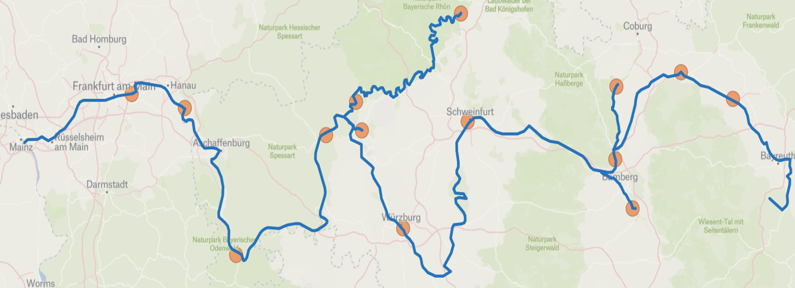
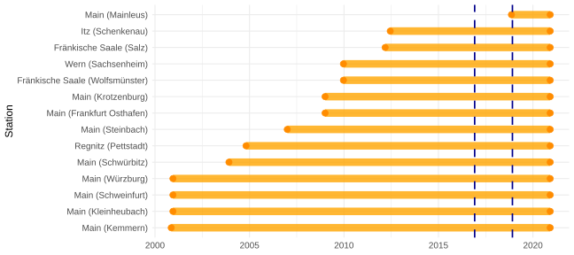
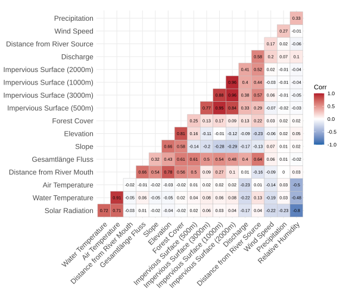
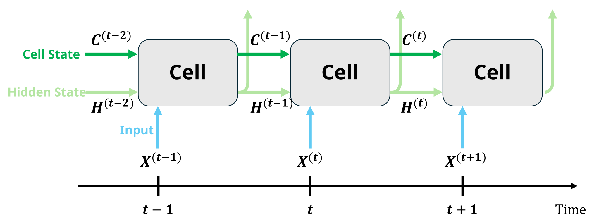
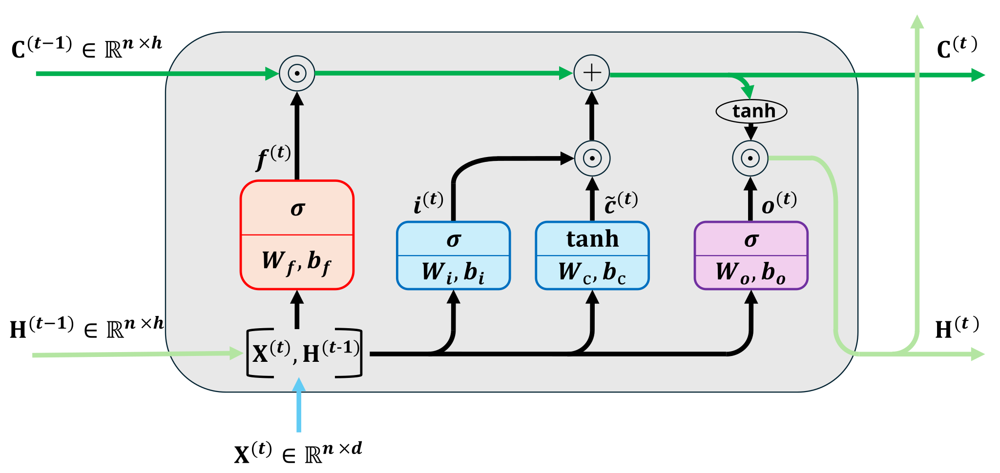
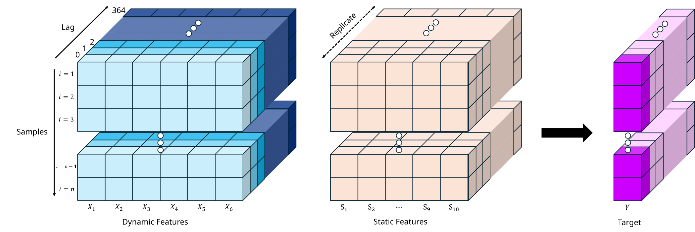
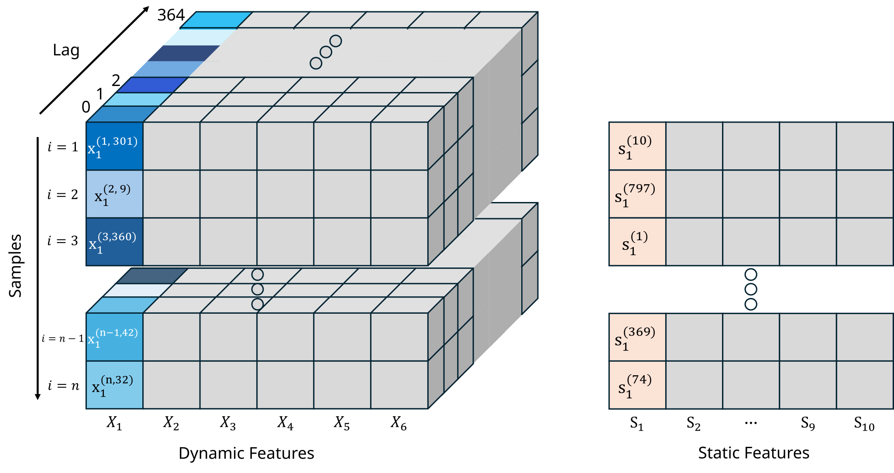
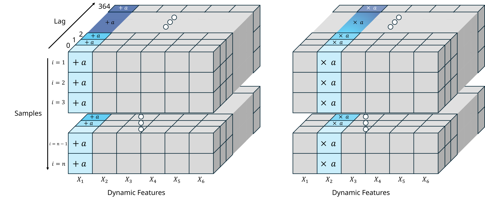
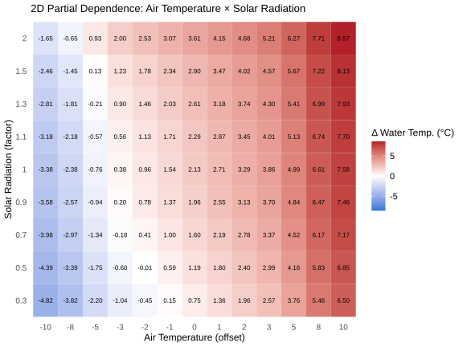

---
output:
  pdf_document: default
  html_document: default
---

```{r message=FALSE, warning=FALSE, include=FALSE}
knitr::opts_chunk$set(echo = FALSE)
library(bookdown)
library(svglite)
library(kableExtra)
```

# Interpretable Riverine Heatwaves {#irh}

*Author: Alexander Zielke Esteban*

*Supervisor: Henri Funk*

*Degree: Bachelor/Master*

## Abstract

This study examines how riverine water temperatures can be modelled using a Long-Short-Term Memory (LSTM) model together with a set of environmental features and how the resulting model can be interpreted using several machine learning interpretability methods presented in @molnar2025 and adapted to our setting. The model was implemented in Python using the Neural Hydrology library. Results indicate that air temperature and solar radiation are the most important features for water temperature prediction, both showing an approximately linear relationship with water temperature.


## Introduction

Riverine heatwaves are an increasingly concerning problem, with impacts on both ecological and socioeconomic systems: They cause elevated thermal stress for aquatic animals, reduce the thermal cooling efficiency of power plants and degrade drinking water quality [@vanHamel2025]. To understand which environmental factors drive riverine water temperatures, we model the water temperature of the Main River using an LSTM and several environmental features. Specifically, we address the following research questions:

1. How does an LSTM model perform in this context?
2. What are the most influential features?
3. In what ways do these features affect water temperature?


## Data
### Origin

The data used in this study originate from the [BayWat-AI](https://henrifnk.github.io/henrifnk/projects.html) project and are provided by the Bavarian Landesamt für Umwelt (LfU) and the Gewässerkundlicher Dienst Bayern (GKD).

```{r fig-stations-map, fig.cap="Map of the 14 measurement stations along the river Main and its tributaries Regnitz, Fränkische Saale, Itz and Wern. Map created with Felt and River Data from Natural Earth Data."}

```

The dataset comprises river and environmental data from 14 measurement stations located along the river Main and its tributaries. The following variables are available:

:::: {.columns style="display: flex;"}

::: {.column width="48%"}
**Static variables (station-specific)**

- Elevation (m a.s.l.)
- Slope (°)
- Forest cover (\%)
- Impervious surface (\%) within a radius of:
    - 500 m
    - 1,000 m
    - 2,000 m
    - 3,000 m
- Distance (km) to:
    - River mouth
    - River source
- Total river length (km)
:::

::: {.column width="4%"}
:::

::: {.column width="48%"}
**Dynamic variables**

- Water temperature (°C)
- Air temperature (°C)
- Precipitation (mm)
- Wind speed (m/s)
- Relative humidity [0-1]
- Solar radiation (Wh/$\text{m}^2$)
- Discharge ($\text{m}^3$/s)
:::

::::

The static variables describe different environmental characteristics of the area surrounding each measurement station and remain constant over time. In contrast, the dynamic variables vary over time and are measured at the respective stations.

In the original dataset, the dynamic variables were recorded at three-hour intervals. For the analysis, these measurements were aggregated to a daily resolution. Daily means were calculated for water temperature, air temperature, wind speed, relative humidity and discharge, while daily sums were calculated for precipitation and solar radiation.

### Preprocessing

```{r fig-stations-periods, fig.cap="Temporal coverage of each measurement station.", out.width="100%"}

```

Figure \@ref(fig:fig-stations-periods) illustrates the temporal coverage of the different measurement stations. The vertical dotted lines indicate the beginning of the validation and test periods, respectively (see Section \@ref(sec-model-impl) for a detailed description of the train, validation and test periods).

For a given variable and station, a daily value was calculated only if all eight three-hourly observations for that day were available. Otherwise, the daily value was set to missing (NA).

Figure \@ref(fig:fig-stations-missing-patterns) shows the resulting missing-data patterns of the dynamic variables.

```{r fig-stations-missing-patterns, fig.cap=" Missing Patterns of dynamic variables on a daily basis for each station. A daily value is missing if at least one of the eight three-hourly observations for the respective variable and station is missing.", fig.show='hold'}
knitr::include_graphics(
  c("work/06-interpretable_heat/figures/stations_missings_wt.svg",
    "work/06-interpretable_heat/figures/stations_missings_Ta_C_P_mm_wind_ms_rad_whm2_relhum.svg",
    "work/06-interpretable_heat/figures/stations_missings_Q.svg")
)
```


<!-- TODO: verify exact dates-->

Large periods of missing discharge data can be observed between 2017 and 2021 at the stations Main (Würzburg), Main (Steinbach), Main (Schweinfurt) and Main (Kleinheubach). At Main (Krotzenburg), discharge data are missing throughout the entire observation period.

Therefore, Main (Krotzenburg) was excluded from the analysis entirely. The four stations with substantial gaps in discharge data were excluded from the test set.

### Correlations {#sec-corr}

```{r fig-corr-vars-heatmap, fig.cap="Heatmap of pairwise correlations between all variables. For dynamic variables, it shows the correlations of the daily synchronized values of all available days."}

```


In Figure \@ref(fig:fig-corr-vars-heatmap), we observe that water temperature shows a strong positive correlation with air temperature (0.91) and solar radiation (0.72) and a moderate negative correlation with relative humidity (-0.48). Furthermore, solar radiation itself is positively correlated with air temperature (0.71) and strongly negatively correlated with relative humidity (-0.80).

<!-- TODO: Add figure:
Either density plot or time series plot of dynamic variables
Perhaps also a plot for static variables?
-->

<!--
Figure ... shows the distribution of the dynamic variables, both across all stations (blue) and separately for each station (grey). The distributions of discharge and precipitation are strongly right-skewed.
-->

## Modelling
### Model Explanation
**Long-Short-Term-Memory (LSTM) Model** 

A Long-Short-Term Memory (LSTM) network is a recurrent neural network (RNN) architecture designed for sequential data, such as time series [@zhang2023dive]. LSTMs mitigate the vanishing-gradient problem of conventional RNNs by incorporating a separate cell state with gated information flow. This allows information to be retained or discarded over longer time intervals, enabling the model to capture temporal dependencies.

```{r fig-lstm-seq-proc, fig.cap="Sequential processing of the input data by an LSTM. Each cell represents one time step and receives the current input as well as the hidden and cell states from the previous time step."}

```

The data are processed sequentially, one time step after another, as illustrated in Figure \@ref(fig:fig-lstm-seq-proc) (in this study, one time step corresponds to one day). At each step, an LSTM cell receives the current input together with the hidden and cell state from the previous time step:

- $\mathbf{X}^{(t)} \in \mathbb{R}^{n \times d}$: Input batch containing $n$ observations of the $d$ features at day $t$. These observations are processed simultaneously and independently, each yielding one model output.
- $\mathbf{H}^{(t-1)}, \mathbf{C}^{(t-1)} \in \mathbb{R}^{n \times h}$: Hidden and cell state from the previous time step, respectively (hidden size $h$)

The cell state acts as long-term memory, retaining information over longer periods, while the hidden state can be interpreted as a more immediate representation of the sequence history.

```{r fig-lstm-cell-structure, fig.cap="Structure of an LSTM cell. The current input and previous hidden state are combined and passed through the forget, input and output gates and the input node to update the cell and hidden states."}

```

Figure \@ref(fig:fig-lstm-cell-structure) illustrates the computations within an LSTM cell.

The hidden state of the previous time step is concatenated with the current input:

$$
\mathbf{Z}^{(t)} = 
\begin{pmatrix}
\mathbf{X}^{(t)} & \mathbf{H}^{(t-1)}
\end{pmatrix} \in \mathbb{R}^{n \times (d + h)}
$$

so that both are processed jointly. $\mathbf{Z}^{(t)}$ is then passed through four transformations: the forget gate, input gate, input node and output gate. Together, they determine what information is discarded from and added to the cell and hidden state.

For each gate, $\mathbf{Z}^{(t)}$ is transformed using a weight matrix $\mathbf{W} \in \mathbb{R}^{(d + h) \times h}$ and a bias vector $\mathbf{b} \in \mathbb{R}^h$ (broadcast row-wise across the batch), followed by an element-wise sigmoid ($\sigma$) or hyperbolic tangent ($\tanh$) activation:

$$
\begin{alignat*}{3}
\text{Forget Gate:} \qquad & \mathbf{F}^{(t)} & \enspace = \enspace &
  \sigma \left(\mathbf{Z}^{(t)} \mathbf{W}_f + \mathbf{b}_f\right) \in (0, 1)^{n \times h} \\
\text{Input Gate:} \qquad & \mathbf{I}^{(t)}& \enspace = \enspace &
  \sigma \left(\mathbf{Z}^{(t)} \mathbf{W}_i + \mathbf{b}_i\right) \in (0, 1)^{n \times h} \\
\text{Input Node:} \qquad & \tilde{\mathbf{C}}^{(t)} & \enspace = \enspace &
  \tanh \left(\mathbf{Z}^{(t)} \mathbf{W}_c + \mathbf{b}_c\right) \in (-1, 1)^{n \times h} \\
\text{Output Gate:} \qquad & \mathbf{O}^{(t)} & \enspace = \enspace & 
  \sigma \left(\mathbf{Z}^{(t)} \mathbf{W}_o + \mathbf{b}_o\right) \in (0, 1)^{n \times h}
\end{alignat*}
$$

The cell and hidden state are then updated in sequence:

$$
\begin{align*}
  \mathbf{C}^{(t)} &= \mathbf{C}^{(t-1)} \odot \mathbf{F}^{(t)} + \mathbf{I}^{(t)} \odot \tilde{\mathbf{C}}^{(t)} \\
  \\
  \mathbf{H}^{(t)} &= \tanh\left(\mathbf{C}^{(t)}\right) \odot \mathbf{O}^{(t)}
\end{align*}
$$
where $\odot$ denotes element-wise multiplication.

Intuitively, the forget gate controls how much of the previous cell state's information is retained. The input gate determines how much new information provided by the input node is added. And the output gate, together with the updated cell state, determines the new hidden state. 

The updated cell and hidden states are then passed to the next time step. The hidden state can additionally feed into subsequent network layers, such as an output layer generating the model's prediction at step $t$.

All weight matrices and bias vectors are learned during training and shared across time steps and observations within a batch, i.e. they are independent of $t$ and $n$.

### Implementation {#sec-model-impl}

**Prediction Setting**

The target is the water temperature of the current day, i.e. at lag 0. It is predicted from the static variables and the observations of the remaining dynamic variables over a historical window of 365 days, ranging from lag 364 to lag 0.

**Model Configuration**

The model was implemented in Python using the Neural Hydrology library.<!-- TODO: Add additional information or link/ reference --> The main model configuration is summarized in Table \@ref(tab:lstm-config). 

Table: (#tab:lstm-config) Configuration of the LSTM model

| Parameter         | Value                   |
| ----------------- | ----------------------- |
| LSTM layers       | 1                       |
| Hidden size       | $h = 64$                |
| Sequence length   | 365 days                |
| Output activation | Linear                  |
| Training period   | 10/11/2000 - 30/11/2016 |
| Validation period | 01/12/2016 - 30/11/2018 |
| Test period       | 01/12/2018 - 30/11/2020 |

**Input and Output Structure**

The input data are provided to the model as a three-dimensional tensor with dimensions
$$
\left[n_{\mathrm{samples}}, n_{\mathrm{features}}, n_{\mathrm{lags}}\right]
$$
where the dimensions correspond to observations, variables and time lags, respectively, as illustrated in Figure \@ref(fig:fig-lstm-input-output-structure). The entry at position $(i, x, l)$ contains the value of feature $x$ for the $i$-th observation at lag $l$.

```{r fig-lstm-input-output-structure, fig.cap="Input and output structure of the LSTM model. The dynamic features are arranged in a three-dimensional tensor with dimensions corresponding to samples, variables and lags. The static features are replicated across all time steps and concatenated with the dynamic features. The model produces a prediction for each time step, resulting in a $(n_{samples}, 1, n_{lags})$ tensor, of which only the prediction at lag 0 is used as the target prediction."}

```

To incorporate the static features, we use a replication approach, where the matrix containing the static features for the $n_{\mathrm{samples}}$ observations is copied across all 365 time steps. The resulting tensor is then concatenated with the tensor of dynamic features, such that the static features are provided as additional inputs at every time step.

At each time step, the model thus processes a matrix containing both the dynamic and static features for all observations in the batch. This matrix corresponds to the input $\mathbf{X}^{(t)}$ described in the previous section.

The model produces a water temperature prediction for each observation at every time step of the input sequence. Since the prediction task concerns the water temperature at lag 0, only the prediction corresponding to the final time step, i.e. lag 0, is used as the model output.

### Evaluation

The model was evaluated using the Nash-Sutcliffe Efficiency (NSE), defined as 

$$
\mathrm{NSE}(\boldsymbol y, \hat{\boldsymbol y}) = 1 - \frac{\sum_{i = 1}^n\left(y^{(i)} - \hat y^{(i)}\right)^2}{\sum_{i=1}^n \left(y^{(i)} - \bar{y}\right)^2}
$$
where $y^{(i)}$ denotes the observed water temperature of the $i$-th observation in the test set, $\hat{y}^{(i)}$ the corresponding model prediction, $\bar{y}$ the mean of the observed water temperatures in the test set and $n$ the number of observations in the test set.

The NSE compares the model predictions against a baseline that always predicts the mean of the observed values. An NSE of 1 indicates a perfect fit, an NSE of 0 indicates performance equal to this baseline and an NSE below 0 indicates performance worse than the baseline.

## Interpretability

Beyond predictive performance, we aimed to understand how the model captures the complex relationships between the input features and the water temperature. In particular, we were interested in which features matter most and how their values, history and interactions affect the prediction. To this end, we applied several interpretability approaches. 

First, we used **Permutation Feature Importance** to assess the overall importance of the input features. Based on these results, we examined the two most important features from four complementary perspectives:

1. **Overall dependence over the whole last year:** 
Via a variation of Partial Dependence Plots (PDPs), investigating how manipulating a feature's entire 365-day history by adding a constant offset $a$ or multiplying each day with a constant factor $a$ affects the predicted water temperature.
2. **Dependence on the most recent observation:** 
Using Accumulated Local Effects (ALE) plots, which are robust to correlated features, we examine how a feature's value at lag 0 affects today's prediction.
3. **Lag Importances of a feature:** 
Using ALE curves computed separately for each lag, the standard deviation of each curve serves as a measure of that lag's influence on today's prediction.
4. **Interaction between the two most important features:**
Via a two-dimensional PDP, visualizing the joint effect of both features and whether the effect of one depends on the value of the other.

In the following, the model's prediction function for the $i$-th observation is denoted by

\begin{align*}
\hat{f}: \underbrace{\mathbb{R}^{365} \times \cdots \times \mathbb{R}^{365}}_{d \text{ dynamic features}} \times \underbrace{\mathbb{R} \times \cdots \times \mathbb{R}}_{s \text{ static features}} &\longrightarrow \mathbb{R}, \\[4pt]
\left(\boldsymbol x_1^{(i, \cdot)}, \dots, \boldsymbol x_d^{(i, \cdot)}, s_1^{(i)}, \dots, s_s^{(i)}\right) &\longmapsto \hat{y}^{(i)} := \hat{f}\left(\boldsymbol x_1^{(i, \cdot)}, \dots, \boldsymbol x_d^{(i, \cdot)}, s_1^{(i)}, \dots, s_s^{(i)}\right)
\end{align*}

with

- $\boldsymbol x_j^{(i, \cdot)} = \left(x_j^{(i, 0)}, \dots, x_j^{(i, 364)}\right) \in \mathbb{R}^{365}$: the 365 day history of dynamic feature $j$ for observation $i$
- $s_j^{(i)} \in \mathbb{R}$: value of static feature $j$ for observation $i$

All interpretability methods were performed on the test set.

### Permutation Feature Importance

The underlying idea of Permutation Feature Importance is to randomly permute the values of a feature while keeping all other features unchanged. This disrupts the relationship between the permuted feature and the target while preserving the feature's marginal distribution. The resulting deterioration in predictive performance (i.e. the NSE decrease) indicates how strongly the model relies on that feature. A larger decrease reflects a higher importance.

For both static and dynamic features, we first  calculate the NSE on the original test set:

$$
\mathrm{NSE}_{\text{test}} = 1 - \frac{\sum_{i = 1}^n \left(y^{(i)} - \hat{y}^{(i)}\right)^2}{\sum_{i = 1}^n \left(y^{(i)} - \bar{y}\right)^2} 
$$

The permutation itself differs between the two feature types, as illustrated in Figure \@ref(fig:fig-tensor-feature-perm). For a static feature $S_j$, the observation $s_j^{(1)}, \dots, s_j^{(n)}$ are permuted randomly across observations. For a dynamic feature $X_j$, the time series $x_j^{(i, 0)}, \dots, x_j^{(i, 364)}$ is permuted within each observation $i$. 

```{r fig-tensor-feature-perm, fig.cap="Manipulation of the static feature matrix and dynamic feature tensor for the calculation of Permutation Feature Importance. For static features, the corresponding feature values are permuted across all observations. For dynamic features, the time series of the corresponding feature is permuted within each observation."}

```

In both cases, the following three steps are then applied:

1. Randomly permute the feature, obtaining $\boldsymbol s_j^{\text{perm}} = \left(s_j^{\text{perm},\, (1)}, \dots, s_j^{\text{perm},\, (n)}\right)$ (static) or $\boldsymbol{x}_j^{\mathrm{perm}, \, (i, \cdot)}$ for each $i$ (dynamic).
2. Compute the predictions with the feature permuted:
$$
\hat y_{s_j \text{ perm}}^{(i)} = \hat{f}\left(\boldsymbol x_1^{(i, \cdot)}, \dots, \boldsymbol x_d^{(i, \cdot)}, s_1^{(i)}, \dots, s_j^{\text{perm, (i)}}, \dots, s_s^{(i)}\right) \\[4pt]
\text{or} \\[4pt]
\hat y_{x_j \text{ perm}}^{(i)} = \hat{f}\left(\boldsymbol x_1^{(i, \cdot)}, \dots, x_j^{\text{perm}, \, (i, \cdot)}, \dots, \boldsymbol x_d^{(i, \cdot)}, s_1^{(i)}, \dots, s_s^{(i)}\right)
$$
for $i = 1, \dots, n$
3. Calculate the resulting NSE decrease relative to the test NSE:
$$
\mathrm{Importance}_{s_j} = \mathrm{NSE}_{\text{test}} - \mathrm{NSE}(\boldsymbol y, \boldsymbol{\hat{y}}_{s_j \text{ perm}}) \\[4pt]
\text{or} \\[4pt]
\mathrm{Importance}_{x_j} = \mathrm{NSE_{\mathrm{test}}} - \mathrm{NSE}(\boldsymbol y, \boldsymbol{\hat y}_{x_j \text{ perm}})
$$
where
$$
\boldsymbol{\hat{y}}_{s_j \text{ perm}} = \left(\hat y_{s_j \text{ perm}}^{(1)}, \dots, \hat y_{s_j \text{ perm}}^{(n)}\right), \boldsymbol{\hat y}_{x_j \text{ perm}} = \left(\hat y_{x_j \text{ perm}}^{(1)}, \dots, \hat y_{x_j \text{ perm}}^{(n)}\right)
$$

### Partial Dependence Plots (for dynamic features)

Here, we address the question: 
"How would the predicted water temperature change, on average, if feature $X_j$ had been $a$ units (or times) higher over the entire last year?"

To this end, we manipulate the entire time series of the feature at once (leaving all other features untouched), distinguishing between interval-scaled and ratio-scaled features, as shown in figure \@ref(fig:fig-tensor-pdp):

- interval-scaled features: add a constant offset $a$ to all observed values of the feature
- ratio-scaled features: multiply all observed values by a constant factor $a$, preserving the natural zero point

```{r fig-tensor-pdp, fig.cap="Manipulation of the dynamic feature tensor for the computation of the Partial Dependence Plot. For interval-scaled features, a constant offset a is added to the corresponding feature (left tensor); for ratio-scaled features, the corresponding feature is multiplied by a constant factor a (right tensor)."}

```

In both cases, we compare the resulting prediction to the prediction obtained with the original, unmanipulated feature values. This results in a variation of an Individual Conditional Expectation (ICE) curve for each observation, expressing how the predicted deviation from the original prediction changes as a function of $a$.

\begin{align*}
  \mathrm{ICE}_j^{(i)}(a) = 
  &\begin{cases}
    \hat f \left(\boldsymbol x_1^{(i, \cdot)}, \dots, \boldsymbol x_j^{(i, \cdot)} + \boldsymbol a,\dots, \boldsymbol x_d^{(i, \cdot)}, s_1^{(i)}, \dots, s_s^{(i)}\right) & X_j \enspace \text{interval-scaled} \\[4pt]
    \hat f \left(\boldsymbol x_1^{(i, \cdot)}, \dots, \boldsymbol x_j^{(i, \cdot)} \,\,\cdot \, a,\dots, \boldsymbol x_d^{(i, \cdot)}, s_1^{(i)}, \dots, s_s^{(i)}\right) & X_j \enspace \text{ratio-scaled}
  \end{cases} \\[4pt]
  &- \hat f \left(\boldsymbol x_1^{(i, \cdot)}, \dots, \boldsymbol x_j^{(i, \cdot)}, \dots, \boldsymbol x_d^{(i, \cdot)}, s_1^{(i)}, \dots, s_s^{(i)}\right)
\end{align*}

Averaging these differences over all $n$ observations in the test set then yields the PDP.

$$
\mathrm{PDP}_j(a) = \frac{1}{n} \sum_{i=1}^n \mathrm{ICE}_j^{(i)}(a)
$$

**Limitation**: For correlated features, manipulating one feature while leaving all others unchanged can create unrealistic, out of distribution feature combinations, which may distort the interpretation of the resulting PDP curve.

### Accumulated Local Effects

ALE plots address this issue by only slightly perturbing each observation's value of the feature of interest within a local neighborhood, rather than replacing it with an arbitrary fixed value as in PDPs. This keeps the manipulated values close to those actually observed, avoiding unrealistic feature combinations even for correlated features. The feature range is divided into bins, and for each bin the average effect of moving from its lower to its upper bound is computed. Accumulating these local effects across bins then yields the ALE curve.

We compute the ALE for a given feature $X_j$ at a specific lag $l$, evaluated at a point $a$ in the feature's range.

**Notation:** Let the range of $X_j$ at lag $l$ be divided into $m$ bins $N_{j, l}(1), \dots, N_{j, l}(m)$ with bin bounds $z_{j, l}(0) < z_{j, l}(1) < \dots < z_{j, l}(m)$ and let

- $n_{j, l}(k)$ denote the number of observations of $X_j$ at lag $l$ falling into bin $k$
- $k_{j, l}$ denote the index of the bin containing the value $a$
- $\boldsymbol x_j^{(i, \cdot)}[l \to z]$ denote the time series $\boldsymbol x_j^{(i, \cdot)}$ of feature $j$ for observation $i$, with the value at lag $l$ replaced by $z$ (all other lags unchanged).

**Procedure:**

1. For each bin $k = 1, \dots, m$ and each observation $i$ with $x_j^{(i, l)} \in N_{j, l}(k)$, compute the change in prediction when the lag-$l$  value is moved from the lower to the upper bin bound:

\begin{align*}
  \text{LocalDiff}_{j}^{(i, l)} = 
  \hat{f}\left(\boldsymbol x_1^{(i, \cdot)}, \dots, \boldsymbol x_j^{(i, \cdot)}[l \to z_{j, l}(k)], \dots, \boldsymbol x_d^{(i, \cdot)}, s_1^{(i)}, \dots, s_s^{(i)}\right) \\
  - \hat{f}\left(\boldsymbol x_1^{(i)}, \dots, \boldsymbol x_j^{(i, \cdot)}[l \to z_{j, l}(k - 1)], \dots, \boldsymbol x_d^{(i, \cdot)}, s_1^{(i)}, \dots, s_s^{(i)}\right)
\end{align*}

2. Average these differences over all observations in bin $k$ to obtain the local effect of bin $k$:
$$
\text{LocalEffect}_{j, k}^{(l)} = \frac{1}{n_{j, l}(k)} \sum_{i : x_j^{(i, l)} \in N_{j, l}(k)} \text{LocalDiff}_j^{(i, l)}
$$
3. Accumulate the local effects of all bins up to $a$:
$$
\mathrm{ALE}_j^{(l), \text{ uncent.}}(a) = \sum_{k=1}^{k_{j, l}(a)} \text{LocalEffect}_{j, k}^{(l)}
$$
4. Center the curve so that its average over the test data is zero:
$$
\mathrm{ALE}_j^{(l)}(a) = \mathrm{ALE}_j^{(l), \text{ uncent.}}(a) - \frac{1}{n} \sum_{i=1}^n \mathrm{ALE}_j^{(l), \text{ uncent.}} \left(x_j^{(i, l)}\right)
$$

### Lag Importance using ALE

ALE Curves can also be used to quantify feature importance. Intuitively, the more an ALE curve varies, the greater the feature's influence on the prediction: Strong variation means that small changes in the feature value already lead to noticeable changes in the prediction, whereas a flat (constant) ALE curve indicates that local changes in the feature have little to no effect.

We use the standard deviation of the ALE curve as a measure of importance, applied separately to each lag of a given feature. Specifically:

1. Compute the ALE curve separately for every lag $l = 0, \dots, 364$ of the feature.
2. Use the standard deviation of each lag's ALE curve as a measure of that lag's importance for the prediction:
$$
\mathrm{Importance}_{x_j}(l) = \mathrm{sd}\left(\mathrm{ALE}_j^{(l)}\right) = \sqrt{\frac{1}{n} \sum_{k=1}^m n_{j, l}(k) \left(\mathrm{ALE}_j^{(l)}\left(z_{j, l}(k)\right)\right)^2}
$$

Note that this method only captures how important a single lag alone is for today's prediction, not the joint effect of a whole historical interval. A given day might have little effect on its own, yet contribute meaningfully to the prediction only in combination with neighboring days.

### 2D Partial Dependence Plot
Finally, we examine the joint effect of the two most important features, $X_j$ and $X_k$, on the target using a two-dimensional Partial Dependence Plot (PDP). This works analogously to the one-dimensional case, but both features are manipulated simultaneously (each according to its own scale type (interval or ratio)), while all other feature are left unchanged. As before, the resulting differences are averaged over all $n$ observations in the test set:

$$
\mathrm{PDP}_{j, k}(a, b) = \frac{1}{n}\sum_{i=1}^n \left[\hat f \left(\dots, \boldsymbol x_j^{(i, \cdot)} \oplus a, \dots, \boldsymbol x_k^{(i, \cdot)} \oplus b,\dots \right) - \hat f \left(\boldsymbol x_1^{(i, \cdot)}, \dots, \boldsymbol x_d^{(i, \cdot)}, s_1^{(i)},\dots, s_s^{(i)} \right)\right]
$$
where $\oplus$ denotes addition (for interval-scaled features) or multiplication for ratio-scaled features), applied depending on the scale type of $X_j$ and $X_k$ respectively, and $a, b$ are the corresponding manipulation values for $X_j$ and $X_k$.

The resulting surface additionally reveals wether and how the effect of one feature depends on the value of the other.

**Limitation**: As with the one-dimensional PDP, this approach can produce unrealistic, out-of-distribution feature combinations if $X_j$ and $X_k$ are strongly correlated with each other or with other features.


## Results
### Model Evaluation
The model achieved an overall NSE of 0.9814 on the test set, indicating strong predictive performance.

### Permutation Feature Importance

```{r fig-feat-imp, fig.cap="Permutation Feature Importance of static (orange) and dynamic (blue) features.", fig.show='hold'}
knitr::include_graphics(c(
  "work/06-interpretable_heat/figures/int_perm_importance_static.svg",
  "work/06-interpretable_heat/figures/int_perm_importance_dynamic.svg"
))
```

As shown in Figure \@ref(fig:fig-feat-imp), the most important features according to Permutation Feature Importance are Air Temperature and Solar Radiation. Their importance values are more than ten times higher than the highest importance value among the static features.

### Partial Dependence Plots (PDP)

```{r fig-pdp, fig.cap="Partial Dependence Plots for Air Temperature and Solar Radiation. Each gray line represents the ICE curve of an individual observation, that is, how that observation's prediction would change under the corresponding offset or factor, while the red line shows the averaged PDP curve.", fig.show='hold'}
knitr::include_graphics(c(
  "work/06-interpretable_heat/figures/int_pdp_Ta_C.svg",
  "work/06-interpretable_heat/figures/int_pdp_rad_whm2.svg"
))
```

The PDP for Air Temperature (\@ref(fig:fig-pdp)) shows a nearly linear trend for offsets with small absolute value, flattening for offsets with large absolute value. This is consistent with our expectations: at sufficient high or low air temperatures, we would expect the effect on water temperature to be damped relative to the (nearly) linear response observed for smaller offsets.

For Solar Radiation, we likewise observe a nearly linear relationship with water temperature, again slightly damped for large factors. The ICE curves show that the slope varies considerably across individual observations. On average, if solar radiation had been 50 percent higher over the entire last year, with all other features unchanged, water temperature would increase by approximately 1°C.

Nevertheless, the interpretation of PDPs at large offsets should be treated with caution: As shown in Section \@ref(sec-corr), Air Temperature and Solar Radiation are correlated with each other and with relative humidity. Further, large offsets may extrapolate feature values beyond the range observed in the training data.

### ALE Curves for the Most Recent Day (Lag 0)

```{r fig-ale, fig.cap="ALE curves once across all observations (black) and separately for observations falling within each season. The points represent the bin bounds, connected by lines that trace the estimated local effect across the feature range. The rug plot below each curve shows the feature's distribution within each season.", fig.show='hold'}
knitr::include_graphics(c(
  "work/06-interpretable_heat/figures/int_ale_Ta_C.svg",
  "work/06-interpretable_heat/figures/int_ale_rad_whm2.svg"
))
```

Regarding the ALE curves, we observe a similar pattern to the PDPs: overall and consistently across seasons, the relationship follows a roughly linear trend, slightly damped at high air temperatures. For Solar Radiation, the relationship remains approximately linear throughout the whole observed range.

### Lag Importance (ALE)

```{r fig-lag-importance, fig.cap="Lag Importance for different Lags of Air Temperature and Solar Radiation. Note that the y-axes of the two plots are scaled differently.", fig.show='hold'}
knitr::include_graphics(c(
  "work/06-interpretable_heat/figures/int_lag_importance_Ta_C.svg",
  "work/06-interpretable_heat/figures/int_lag_importance_rad_whm2.svg"
))
```

For both variables, lag importance decreases rapidly as lag increases. Relative to its importance at Lag 0, solar radiation's importance decreases more slowly with increasing lag, but its absolute importance remains lower or similar to that of Air Temperature across all lags.

### 2D Partial Dependence Plot

```{r fig-pdp-2d, fig.cap="Two-dimensional Partial Dependence Plot of Air Temperature and Solar Radiation"}

```

We observe a joint, approximately monotonic relationship between Air Temperature, Solar Radiation and Water Temperature.


## Conclusion

The LSTM model performed well, achieving an NSE of 0.9814 on the test set. According to Permutation Feature Importance, Air Temperature and Solar Radiation emerged as the most important features, both showing a positive, approximately linear relationship with water temperature.

## Outlook

Future work could incorporate station coordinates as an additional input, allowing the model to be used for regionalization by varying these coordinates to predict water temperature at ungauged locations. Another interesting approach would be to include the dynamic feature values of stations located further upstream along the river network as additional dynamic features for the station of interest, in order to model and explore the spatial dependence structure of water temperature along the river network.

