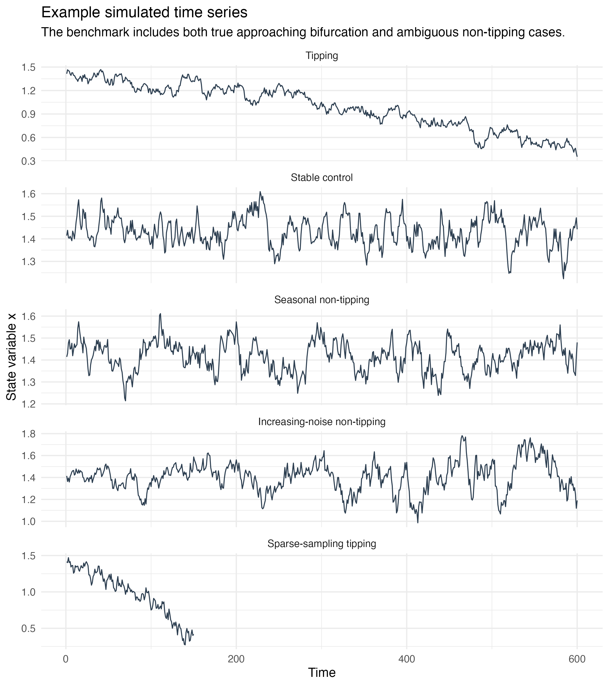
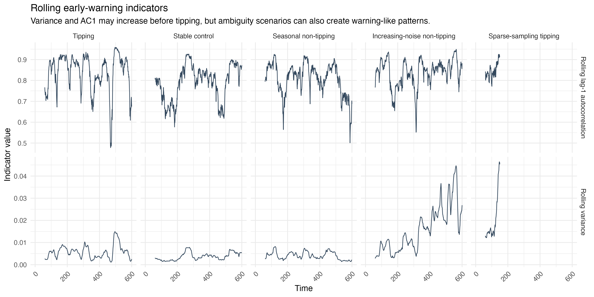
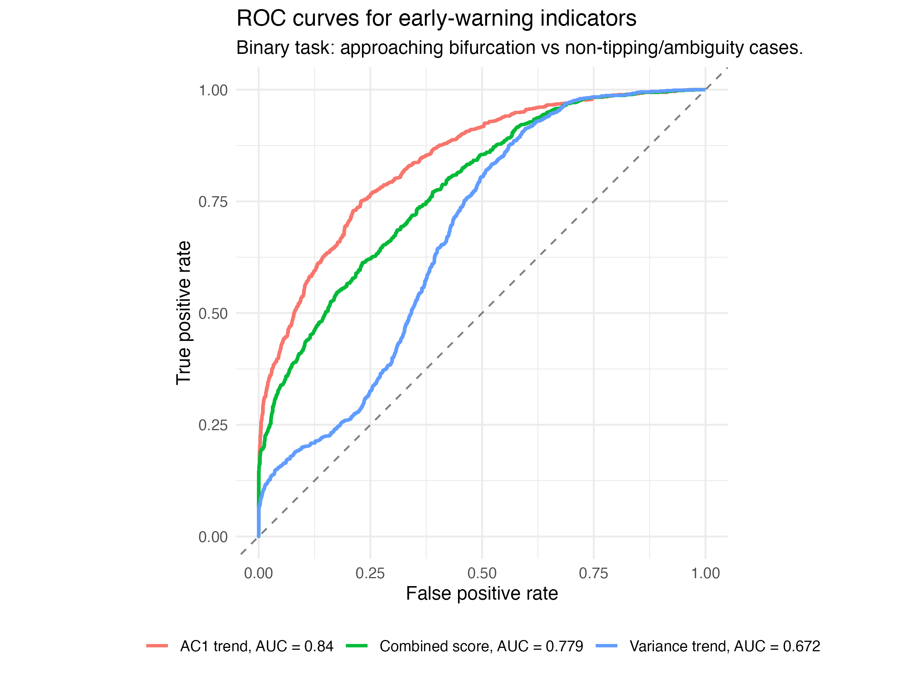
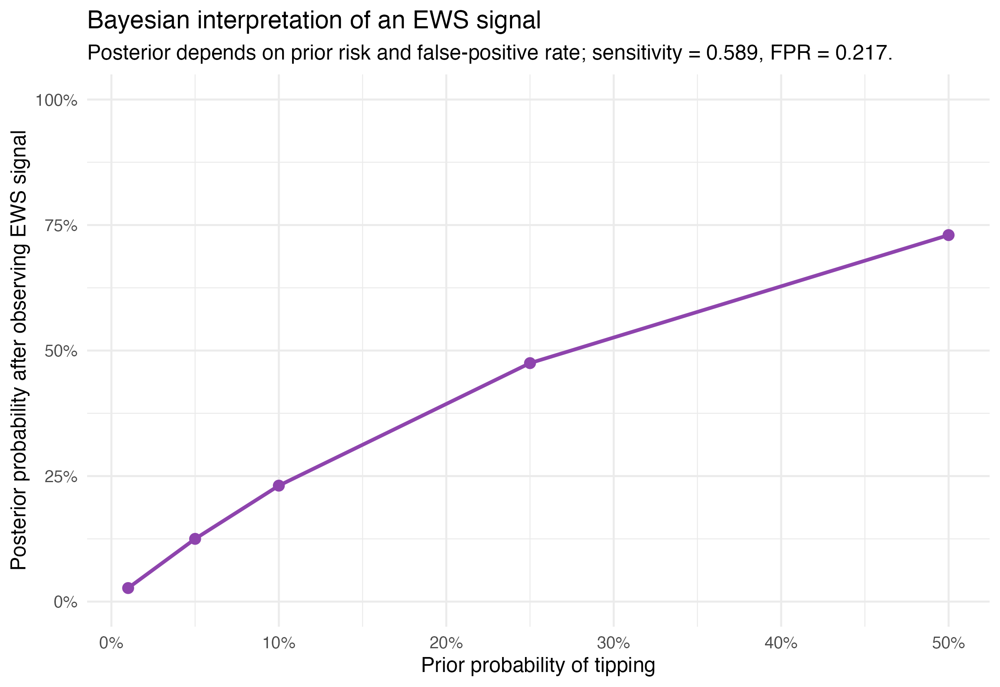

---
output:
  pdf_document: default
  html_document: default
---

```{r message=FALSE, warning=FALSE, include=FALSE}
library(bookdown)
library(svglite)
library(kableExtra)
```

# Uncertainty of tipping points in climate research {#utp}

*Author: Jihao Li*

*Supervisor: Helmut Küchenhoff*

*Degree: Master*

## Abstract

Climate tipping points may be preceded by early-warning signals (EWS) associated with critical slowing down, particularly increasing variance and lag-1 autocorrelation. However, similar statistical patterns can also arise from non-tipping mechanisms, making their interpretation uncertain. This study investigates the reliability of these indicators using a simulation benchmark that compares an approaching fold bifurcation with stable, seasonal, increasing-noise, and sparse-sampling scenarios. Rolling variance and lag-1 autocorrelation are evaluated using trend statistics and receiver operating characteristic (ROC) analysis. In the simulations, lag-1 autocorrelation provides the strongest discrimination, with an area under the ROC curve (AUC) of 0.840, while increasing noise demonstrates how warning-like signals can occur without an approaching tipping point. A Bayesian interpretation further shows how the meaning of an observed EWS depends on the assumed prior tipping risk. Finally, the framework is illustrated using a North Atlantic sea-surface-temperature proxy related to the Atlantic Meridional Overturning Circulation. The empirical application shows no clear and consistent early-warning signal. Overall, EWS provide useful probabilistic evidence of declining stability, but should not be interpreted as standalone proof of an approaching climate tipping point.

## Introduction
Climate tipping points are critical thresholds at which relatively small changes in external forcing can lead to large and potentially irreversible changes in the state of the climate system. Several major components of the Earth system, including the Atlantic Meridional Overturning Circulation (AMOC), polar ice sheets, and large-scale ecosystems, have been identified as potential tipping elements [@lenton2008]. Assessing whether such systems are approaching critical thresholds is therefore important for climate-risk assessment. However, tipping points are inherently difficult to predict because the underlying mechanisms are only partially observed, relevant time series are often short, and the critical thresholds themselves are uncertain [@mckay2022].

A widely studied approach for detecting an approaching critical transition is based on critical slowing down. As a dynamical system loses stability near certain types of bifurcations, its recovery from small perturbations becomes progressively slower. This theoretical mechanism can generate observable statistical changes, most notably increases in variance and lag-1 autocorrelation (AC1) [@scheffer2009]. These quantities have therefore been proposed as early-warning signals (EWS) and have been applied to a variety of ecological and climate systems [@dakos2012]. For example, observation-based studies have investigated whether changes in statistical indicators derived from sea-surface-temperature data provide evidence of declining AMOC stability [@boers2021].

The interpretation of EWS is nevertheless challenging. An increasing indicator is not uniquely associated with an approaching tipping point. Changes in noise intensity, seasonality, sampling frequency, external forcing, or other non-stationary processes may produce similar statistical patterns. Consequently, an observed EWS should not automatically be interpreted as evidence that a system is approaching a critical transition. This creates an important statistical problem: how reliably can commonly used EWS discriminate between genuine loss of stability and alternative non-tipping mechanisms?

This chapter investigates this question using a controlled simulation benchmark combined with a probabilistic interpretation of EWS. Two commonly used indicators, rolling variance and rolling AC1, are evaluated across five scenarios representing an approaching fold bifurcation, a stable control, seasonal variation, increasing noise without tipping, and sparse observations of an approaching tipping point. Their discriminatory performance is assessed using Kendall's rank correlation and receiver operating characteristic (ROC) analysis. The resulting sensitivity and false-positive rates are then incorporated into a Bayesian framework to illustrate how an observed warning signal updates the probability of tipping under different prior assumptions. Finally, the approach is illustrated using a North Atlantic sea-surface-temperature (SST) proxy related to the AMOC. The aim is not to diagnose an imminent AMOC collapse, but to demonstrate how early-warning indicators can be interpreted cautiously when both the signal and the underlying tipping risk are uncertain.

## Early-Warning Signals and Critical Slowing Down

Many early-warning signals of critical transitions are motivated by the concept of **critical slowing down**. Consider a dynamical system whose state $x$ evolves under a slowly changing control parameter. A simple representation of an approaching fold bifurcation is the stochastic differential equation

$$
dx_t = (a_t - x_t^2)\,dt + \sigma\,dW_t,
$$

where $a_t$ is a slowly varying control parameter, $\sigma$ represents the intensity of stochastic perturbations, and $W_t$ denotes a Wiener process. As the system approaches the critical threshold, the stable equilibrium moves closer to the unstable equilibrium and eventually disappears at the bifurcation point. Before this transition occurs, the local stability of the system decreases and perturbations take increasingly longer to decay. This phenomenon is known as critical slowing down [@scheffer2009].

The statistical consequences can be understood by considering the dynamics locally around a stable equilibrium. After linearisation, deviations $y_t$ from equilibrium can approximately be represented as

$$
dy_t = -\lambda y_t\,dt + \sigma\,dW_t,
$$

where $\lambda>0$ describes the local recovery rate. When the system approaches a fold bifurcation, $\lambda$ decreases towards zero. The lag-1 autocorrelation of discretely observed states can then be approximated by

$$
\rho_1 \approx \exp(-\lambda \Delta t).
$$

Consequently, as $\lambda \rightarrow 0$, $\rho_1$ approaches one: consecutive observations become increasingly similar because the system recovers more slowly from perturbations. Under the same local approximation, the stationary variance is

$$
\mathrm{Var}(Y) \approx \frac{\sigma^2}{2\lambda}.
$$

A declining recovery rate therefore also tends to increase variance. Rising **lag-1 autocorrelation (AC1)** and **variance** are consequently two of the most widely used statistical indicators of critical slowing down [@scheffer2009; @dakos2012].

In practice, these indicators are commonly estimated over rolling windows rather than from the entire time series. To quantify whether an indicator systematically increases over time, this study uses **Kendall's rank correlation coefficient $\tau$** between the indicator and time. A positive value of $\tau$ indicates an increasing tendency, while values near zero indicate little evidence of a monotonic trend. This provides a simple non-parametric summary of the development of each early-warning indicator.

However, increases in variance or AC1 are not unique signatures of an approaching bifurcation. Changes in noise intensity, seasonal structure, sampling frequency, and other forms of non-stationarity may generate similar statistical patterns. Early-warning signals should therefore be interpreted as evidence of changing system stability rather than deterministic proof of an approaching tipping point. This ambiguity motivates the simulation benchmark in the following section, where the behaviour of variance and AC1 is compared across both tipping and non-tipping scenarios.

## Simulation Benchmark

To evaluate the reliability of early-warning signals under controlled conditions, a simulation benchmark was constructed containing both tipping and non-tipping scenarios. The main objective is to determine whether increasing variance and lag-1 autocorrelation (AC1) can reliably distinguish an approaching loss of stability from alternative mechanisms that may generate similar statistical patterns. Five scenarios were considered, with 500 independent simulations generated for each scenario.

The first scenario represents an **approaching tipping point**. The control parameter of the stochastic fold model changes gradually over time, moving the system towards its bifurcation threshold. As the recovery rate decreases, critical slowing down is expected to emerge, and both variance and AC1 may increase before the transition. This scenario therefore provides the positive benchmark against which the performance of the early-warning indicators can be evaluated.

The second scenario is a **stable control**. Here, the system remains away from the critical threshold and does not experience a systematic loss of stability. Any increasing early-warning indicator observed in this scenario therefore represents variation that occurs despite the absence of an approaching tipping point.

Three additional scenarios were used to examine important sources of ambiguity. The **seasonal non-tipping scenario** introduces periodic variation without moving the underlying system towards a bifurcation. The **increasing-noise scenario** maintains a stable underlying system while the magnitude of stochastic perturbations increases over time. This provides an important counterexample because increasing noise can produce rising variance even when the recovery dynamics of the system have not weakened. Finally, the **sparse-sampling tipping scenario** represents an approaching tipping process observed at a lower temporal resolution. It is intended to illustrate how limited sampling can affect the statistical evidence available for detecting critical slowing down.



For each simulated time series, two early-warning indicators were calculated over rolling windows: **variance** and **lag-1 autocorrelation**. Variance measures the magnitude of fluctuations around the local state of the system, whereas AC1 measures the persistence between consecutive observations. Under critical slowing down, both quantities are theoretically expected to increase as the system approaches a fold bifurcation.

To summarize the temporal development of each indicator, **Kendall's rank correlation coefficient $\tau$** was calculated between the rolling indicator and time. Positive values of $\tau$ indicate that the indicator tends to increase over the observation period, while values close to zero indicate little evidence of a monotonic trend. Each simulation therefore produces a trend statistic for variance and AC1 that can be compared across the five scenarios.

The benchmark is designed to assess both the ability of an indicator to detect genuine loss of stability and its tendency to generate warning-like behaviour under alternative conditions. In particular, a useful early-warning indicator should show increasing trends frequently in the tipping scenario while avoiding similar signals in the non-tipping scenarios. The distributions of the resulting trend statistics are subsequently used to evaluate discrimination between tipping and non-tipping simulations using receiver operating characteristic (ROC) analysis.


## Simulation Results

The simulation benchmark reveals substantial differences in the behaviour of the early-warning indicators across scenarios. In the approaching-tipping simulations, both rolling variance and lag-1 autocorrelation (AC1) tend to increase as the system moves towards the bifurcation. This is consistent with the theoretical expectation from critical slowing down. However, the simulations also demonstrate that increasing indicators are not unique to genuine loss of stability.



The comparison across scenarios highlights an important source of ambiguity. In particular, the increasing-noise scenario can generate warning-like behaviour even though the underlying system is not approaching a bifurcation. Increasing stochastic variability can directly raise the observed variance and may therefore resemble one of the expected signatures of critical slowing down. Seasonal variation and changes in sampling also affect the observed indicators, illustrating that the statistical properties of a time series depend not only on the underlying stability of the system but also on the observation process and external variability.

To quantify how well the indicators distinguish tipping from non-tipping simulations, their performance was evaluated using receiver operating characteristic (ROC) curves. The ROC curve compares the true-positive rate, or sensitivity, with the false-positive rate across different decision thresholds. The area under the ROC curve (AUC) provides a threshold-independent summary of discriminatory performance, with a value of 0.5 corresponding to random classification and larger values indicating better discrimination.



Among the evaluated indicators, **AC1 shows the strongest discriminatory performance, with an AUC of 0.840**. The combined early-warning measure reaches an AUC of **0.779**, whereas variance alone produces a lower AUC of **0.672**. Thus, combining the indicators does not outperform AC1 in this benchmark. These results suggest that increasing persistence contains more useful information about the approaching fold bifurcation than increasing variability alone.

At the selected decision threshold, the empirical sensitivity of the warning signal is **0.589**, meaning that approximately 58.9% of tipping simulations generate a positive signal. At the same time, the false-positive rate is **0.217**, so warning signals also occur in approximately 21.7% of non-tipping simulations. These values illustrate the central uncertainty associated with EWS: observing a warning signal increases the evidence for an approaching transition, but the signal is neither necessary nor sufficient for tipping.


The simulation results therefore support a probabilistic rather than deterministic interpretation of early-warning indicators. AC1 performs relatively well at separating the simulated tipping and non-tipping conditions, but false positives and missed detections remain unavoidable. Consequently, the presence of an EWS should not by itself be interpreted as proof that a critical transition is approaching. The next section formalizes this interpretation using Bayes' rule, combining the empirical sensitivity and false-positive rate with an assumed prior probability of tipping.

## Bayesian Interpretation of Early-Warning Signals

The simulation results show that an early-warning signal is informative but imperfect. A positive signal occurs more frequently in tipping simulations than in non-tipping simulations, but false positives remain substantial. Therefore, observing an EWS cannot be interpreted as direct proof of an approaching tipping point. A Bayesian perspective provides a natural framework for expressing this uncertainty explicitly.

Let $T$ denote the event that the system is approaching a tipping point and $S$ the event that a positive early-warning signal is observed. From the simulation benchmark, the empirical sensitivity is

$$
P(S \mid T) = 0.589,
$$

while the empirical false-positive rate is

$$
P(S \mid \neg T) = 0.217.
$$

Bayes' rule can then be used to update a prior probability of tipping after observing a warning signal:

$$
P(T \mid S)
=
\frac{P(S \mid T)P(T)}
{P(S \mid T)P(T)+P(S \mid \neg T)P(\neg T)}.
$$

For example, suppose that the prior probability of an approaching tipping point is $P(T)=0.10$. Substituting the empirical rates from the simulation gives

$$
P(T \mid S)
=
\frac{0.589 \times 0.10}
{0.589 \times 0.10 + 0.217 \times 0.90}
\approx 0.231.
$$

Thus, observing a positive EWS increases the estimated tipping probability from **10% to approximately 23.1%**. The signal therefore contains relevant information, but the posterior probability remains far below certainty. This illustrates why a warning signal should be interpreted as probabilistic evidence rather than as a deterministic diagnosis.



An important consequence of this formulation is that the interpretation of the same statistical signal depends on the prior probability of tipping. If the prior risk is low, even a relatively informative EWS may result in a moderate posterior probability. Conversely, when independent physical or observational evidence already suggests a high prior risk, the same signal can lead to a substantially higher posterior probability. Bayesian updating therefore makes an assumption that is often implicit in EWS interpretation explicit: the meaning of a warning signal depends not only on its statistical properties, but also on what was believed about the underlying system before the signal was observed.

The probabilities used here are empirical quantities derived from the controlled simulation benchmark and should not be interpreted as calibrated probabilities of an actual climate tipping event. Rather, the Bayesian calculation serves as an illustration of how uncertainty in EWS can be communicated transparently. In real climate applications, both the prior probability and the sensitivity and false-positive rate of an indicator are themselves uncertain, which further reinforces the need for cautious interpretation.


## North Atlantic SST Application

After evaluating early-warning indicators under controlled simulation conditions, the framework was applied to an empirical climate time series. The purpose of this application is not to provide a direct diagnosis of the Atlantic Meridional Overturning Circulation (AMOC), but to illustrate how the same early-warning methodology behaves when applied to real-world climate data.

The AMOC is a major component of the climate system and has been discussed as a potential tipping element [@lenton2008]. Because sufficiently long direct observations of AMOC strength are not available, previous studies have used sea-surface-temperature (SST) patterns in the North Atlantic as indirect indicators of changes in AMOC stability [@boers2021]. Following this general motivation, an SST-based proxy is used here as an illustrative application rather than as a direct measurement of the circulation itself.

The analysis uses annual detrended SST anomalies for the North Atlantic region bounded by **45--60°N and 60--10°W**, derived from the NOAA Extended Reconstructed Sea Surface Temperature Version 5 (ERSST v5) data set. The early-warning indicators are calculated using a **20-year rolling window**, applying the same two principal statistics considered in the simulation benchmark: rolling variance and rolling lag-1 autocorrelation (AC1).

The empirical results do not show a clear and consistent early-warning pattern. Rolling variance exhibits only a weak increasing tendency, with a Kendall rank correlation of

$$
\tau_{\mathrm{variance}} = 0.123.
$$

In contrast, rolling AC1 does not increase over time and has a Kendall correlation of

$$
\tau_{\mathrm{AC1}} = -0.032.
$$

This distinction is particularly relevant in light of the simulation benchmark, where AC1 provided the strongest discriminatory performance. The absence of an increasing AC1 trend therefore means that the two indicators do not provide mutually consistent evidence of critical slowing down in this empirical example.

Several factors may contribute to this ambiguous result. Real climate records are considerably more complex than the controlled stochastic system used in the simulations. The available record is relatively short compared with the potentially long timescales of AMOC dynamics, while anthropogenic forcing and other forms of non-stationarity may influence the observed SST signal. In addition, an SST-based index is only a proxy for AMOC behaviour and therefore introduces additional uncertainty into the interpretation.

Consequently, the results should not be interpreted as evidence that the AMOC is approaching a tipping point. Instead, the application demonstrates an important limitation of empirical early-warning analysis: indicators that behave clearly under controlled simulations may become weak, inconsistent, or ambiguous when applied to real climate observations. The North Atlantic SST example therefore reinforces the central argument of this chapter that EWS should be treated as uncertain evidence of changing stability rather than as standalone proof of an approaching climate tipping point.

## Discussion and Conclusion

This study examined the uncertainty associated with early-warning signals (EWS) of climate tipping points by combining theoretical arguments, controlled simulations, probabilistic interpretation, and an empirical climate illustration. The simulation results show that indicators associated with critical slowing down can contain useful information about declining system stability, but their interpretation is not straightforward. Among the evaluated indicators, lag-1 autocorrelation (AC1) achieved the strongest discrimination between tipping and non-tipping simulations, with an AUC of 0.840, whereas variance alone was less informative. Importantly, non-tipping mechanisms such as increasing noise could also generate warning-like behaviour, demonstrating that an increasing EWS is not unique to an approaching bifurcation.

The Bayesian analysis further illustrates why EWS should be interpreted probabilistically. With an empirical sensitivity of 0.589 and a false-positive rate of 0.217, a positive signal increased an illustrative prior tipping probability of 10% to a posterior probability of 23.1%. Thus, the same warning signal can have very different implications depending on the prior risk assigned to the system.

The North Atlantic SST application highlights additional difficulties in real climate data. The weak increase in variance ($\tau=0.123$) and absence of an increasing AC1 trend ($\tau=-0.032$) do not provide consistent evidence of critical slowing down. Short observational records, non-stationary forcing, proxy uncertainty, and differences between simplified models and the real climate system further limit interpretation.

Overall, EWS are best regarded as indicators of changing stability rather than deterministic predictions of tipping. Their value lies in contributing probabilistic evidence that can be combined with physical understanding, observations, and other sources of information. Future work should therefore focus not only on developing more sensitive indicators, but also on quantifying their uncertainty and robustness under realistic climate conditions.
