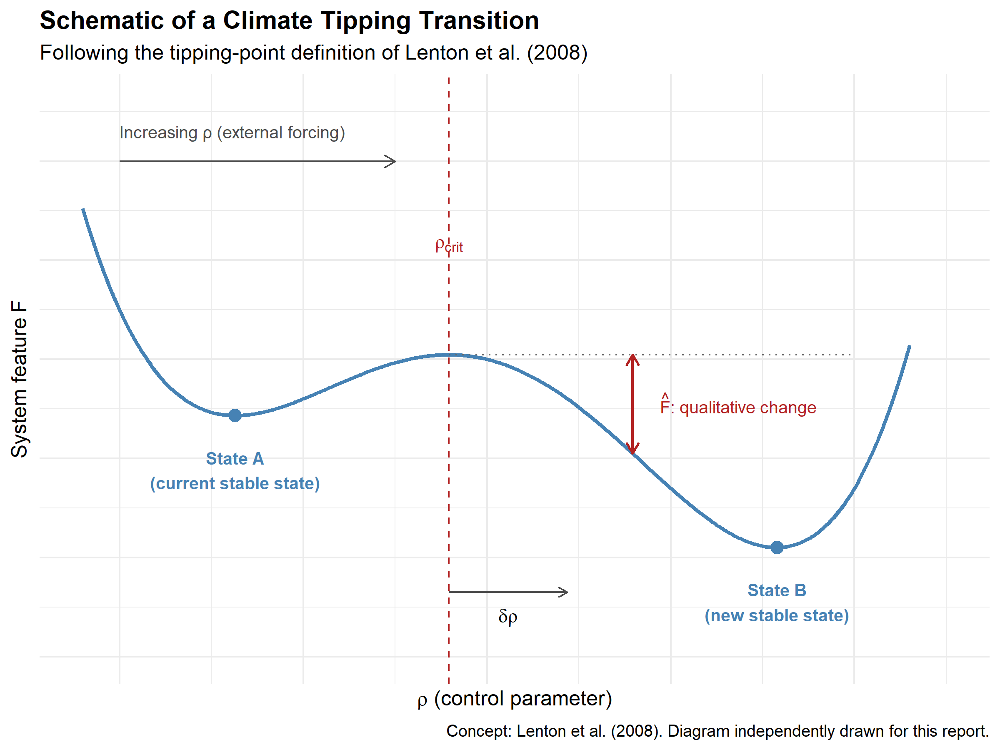
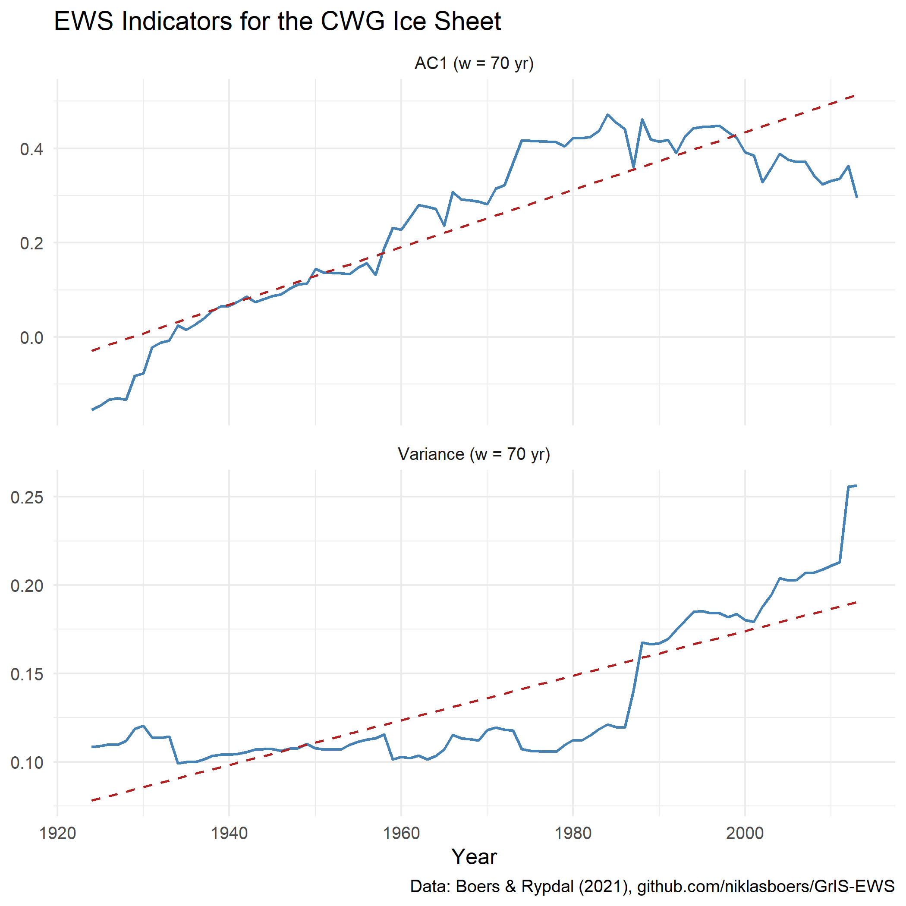

---
output:
  pdf_document: default
  html_document: default
---

```{r message=FALSE, warning=FALSE, include=FALSE}
library(bookdown)
library(svglite)
library(kableExtra)
```

# Tipping Points in Climate Research: An Overview {#tp-overview}

*Author: Chengyuan Ou*

*Supervisor: Prof. Dr. Helmut Küchenhoff*

*Degree: Bachelor*

## Abstract

A climate tipping point is a critical threshold beyond which a component of
the Earth system shifts into a qualitatively different state, often abruptly
and with limited reversibility. This chapter reviews the definition of
tipping points, summarises the 16 major tipping elements assessed by
@armstrongmckay2022, and outlines how their temperature thresholds are
estimated and why those estimates remain uncertain. It then turns to Early
Warning Signals (EWS): statistical indicators based on critical slowing
down that can be computed from observed time series without prior knowledge
of the threshold. The approach is illustrated for the Central-Western
Greenland ice sheet by reproducing the statistical analysis of @boers2021
from the authors' publicly released data. The chapter ends with the main
limitations of EWS, following @rietkerk2025.

## Introduction

The term "tipping point" entered climate science when @lenton2008 used it
for large Earth-system components---tipping elements---that can be driven
past a critical threshold by anthropogenic warming. Once the threshold is
crossed, the system may change state on a timescale short relative to the
forcing, and the change may be hard or impossible to reverse. Because such
transitions would affect sea level, regional climate and ecosystems,
identifying tipping elements, estimating their thresholds and monitoring
their approach have become central research questions.

Section \@ref(tp-definition) states a formal definition. Section
\@ref(tp-elements) summarises the 16 tipping elements currently assessed
in the literature. Section \@ref(tp-thresholds) covers threshold estimation and the main
sources of uncertainty. Section \@ref(tp-ews)
introduces the statistical theory of Early Warning Signals, and Section
\@ref(tp-case) applies it to Central-Western Greenland, including an
independent reproduction of the statistical analysis. Section
\@ref(tp-limits) discusses the limitations of the EWS approach.

## Definition of a Climate Tipping Point {#tp-definition}

@lenton2008 define a tipping element as a climate subsystem with a critical
threshold in some control parameter $\rho$, such that a small push beyond
that threshold produces a disproportionately large change in a system
feature $F$. Formally, a tipping transition occurs if, for a given time
horizon $T$,

$$
|F(\rho \geq \rho_{\text{crit}} + \delta\rho \mid T) - F(\rho_{\text{crit}} \mid T)| \geq \hat{F} > 0 ,
$$

where $\rho_{\text{crit}}$ is the critical value of the control parameter,
$\delta\rho$ an arbitrarily small excess forcing, and $\hat{F}$ a change in
$F$ that is large relative to ordinary variability.

The system can be thought of as starting in a stable state A. As $\rho$
increases past $\rho_{\text{crit}}$, state A loses stability and the
system moves, often rapidly, into an alternative stable state B. For most
of the elements discussed below, Global Mean Surface Temperature (GMST)
above pre-industrial levels is used as the control parameter. GMST does
not act directly on every subsystem; it alters local temperature,
precipitation or salinity, which then drive the feature of interest (ice
volume, forest cover, overturning strength, and so on). Using GMST
nonetheless allows thresholds for physically very different systems to be
compared on a common scale.

```{r tipping-schematic, echo=FALSE, out.width="85%", fig.align="center", fig.cap="Schematic of a climate tipping transition, following the tipping-point definition of Lenton et al. (2008)."}

```

## Overview of the 16 Tipping Elements {#tp-elements}

@armstrongmckay2022 identify 16 tipping elements and give temperature
thresholds relative to pre-industrial levels. The elements span several
geographical domains: the Greenland and Antarctic ice sheets; Atlantic
overturning and subpolar convection; the Amazon basin; Arctic sea ice and
boreal permafrost and forest; tropical coral reefs; mountain glaciers; and
the West African monsoon. They are grouped by the spatial scale of their
expected impacts.

**Global core** elements are those whose tipping would have severe effects
well beyond the region of origin, for example through multi-metre sea-level
rise or large-scale disruption of atmospheric circulation (Table
\@ref(tab:tipping-elements-global)).

```{r tipping-elements-global, echo=FALSE, message=FALSE, warning=FALSE}
global_core <- data.frame(
  Element = c("Greenland Ice Sheet", "West Antarctic Ice Sheet",
              "Labrador-Irminger Seas / SPG Convection",
              "Atlantic Meridional Overturning Circulation (AMOC)",
              "Amazon Rainforest", "Boreal Permafrost",
              "East Antarctic Subglacial Basins", "Arctic Winter Sea Ice",
              "East Antarctic Ice Sheet"),
  Dynamics = c("Collapse", "Collapse", "Collapse", "Collapse", "Dieback",
               "Collapse", "Collapse", "Collapse", "Collapse"),
  `Threshold range (°C)` = c("0.8 - 3.0", "1.0 - 3.0", "1.1 - 3.8",
                              "1.4 - 8.0", "2.0 - 6.0", "3.0 - 6.0",
                              "2.0 - 6.0", "4.5 - 8.7", "5.0 - 10.0"),
  check.names = FALSE
)

kbl(
  global_core,
  booktabs = TRUE,
  escape = TRUE,
  caption = "Global core tipping elements and their estimated temperature thresholds above pre-industrial levels. Source: Armstrong McKay et al. (2022), Table 1."
) %>%
  kable_styling(latex_options = c("hold_position", "scale_down"), full_width = FALSE)
```

**Regional-impact** elements mainly affect the region in which they are
located (Table \@ref(tab:tipping-elements-regional)). Boreal permafrost
appears in both tables because @armstrongmckay2022 distinguishes two modes:
gradual collapse with large carbon release (global core) and abrupt thaw
with more localised impacts (regional). The temperature ranges therefore
refer to different processes, not to a duplicated entry.

```{r tipping-elements-regional, echo=FALSE, message=FALSE, warning=FALSE}
regional_impact <- data.frame(
  Element = c("Low-latitude Coral Reefs", "Boreal Permafrost",
              "Barents Sea Ice", "Mountain Glaciers",
              "Sahel and West African Monsoon", "Boreal Forest (south)",
              "Boreal Forest (north)"),
  Dynamics = c("Die-off", "Abrupt thaw", "Abrupt loss", "Loss",
               "Greening", "Dieback", "Expansion"),
  `Threshold range (°C)` = c("1.0 - 2.0", "1.0 - 2.3", "1.5 - 1.7",
                              "1.5 - 3.0", "2.0 - 3.5", "1.4 - 5.0",
                              "1.5 - 7.2"),
  check.names = FALSE
)

kbl(
  regional_impact,
  booktabs = TRUE,
  escape = TRUE,
  caption = "Regional-impact tipping elements and their estimated temperature thresholds above pre-industrial levels. Source: Armstrong McKay et al. (2022), Table 1."
) %>%
  kable_styling(latex_options = c("hold_position", "scale_down"), full_width = FALSE)
```

The 2015 Paris Agreement aims to keep global warming well below 2°C above
pre-industrial levels, and preferably to 1.5°C. Several estimated threshold
ranges in the tables above already fall within or near this interval,
including those for the Greenland and West Antarctic ice sheets,
Labrador-Irminger Seas convection, low-latitude coral reefs and boreal
permafrost under abrupt thaw. Tipping risk is therefore already relevant at
warming levels still treated as policy targets.

## Threshold Estimation and Uncertainty {#tp-thresholds}

### Threshold estimation

The ranges in Tables \@ref(tab:tipping-elements-global) and
\@ref(tab:tipping-elements-regional) are not taken from a single study.
They are compiled from three types of evidence:

1. **System-specific models**, which estimate when a given system loses
   stability (for example ice-sheet models for Greenland).
2. **Paleoclimate records**, which document system states at known past
   temperatures. For Greenland, the MIS-11 interglacial (about 400,000
   years ago) is a key reference: temperatures of roughly 1.5°C above
   pre-industrial levels coincided with substantially reduced ice extent.
3. **Theoretical constraints and earlier assessments**, carried over from
   previous reviews.

Expert judgement then combines these sources into, for each element, a
maximum threshold, a best ("likely") estimate and a minimum ("possible")
threshold. The Greenland Ice Sheet illustrates the procedure. Model
estimates range from about 1.5--1.6°C [@robinson2012] to
$2.7\pm0.2$°C [@noel2021], while MIS-11 evidence points near 1.5°C.
Putting these together yields a best estimate of 1.5°C and a plausible
range of 0.8°C to 3.0°C.

### Sources of uncertainty

The spread of such estimates is large. Four sources of uncertainty are
particularly important:

- **Definitional differences.** Studies do not always use the same
  criterion for "tipping", nor do they always track the same system
  feature. Changing either can shift the reported threshold.
- **Model and process representation.** Models differ in how they
  represent feedbacks such as ice-elevation feedback or ocean--atmosphere
  coupling, and therefore disagree on when stability is lost.
- **Observational and paleoclimate constraints.** Proxies are sparse and
  indirect, and are subject to dating and interpretation error, so the
  past temperatures and ice extents used as anchors remain uncertain.
- **Tipping cascades.** Elements are not independent. Collapse of AMOC,
  for example, could alter the effective threshold for the Amazon
  rainforest. Thresholds estimated for isolated systems should therefore
  be read as approximate, not as fixed values.

## Early Warning Signals (EWS) {#tp-ews}

Because exact thresholds are hard to pin down in advance, a parallel line
of work asks whether the approach of a tipping point can be seen in the
data themselves. The underlying idea is critical slowing down (CSD).

Near a tipping point, the dynamics of a feature $x$ around its equilibrium
$x^*$ can be approximated by the linear stochastic equation

$$
\frac{d(x - x^*)}{dt} = \lambda (x - x^*) + \eta(t),
$$

where $\lambda < 0$ is the restoring rate and $\eta(t)$ is stochastic
forcing. As the tipping point is approached, the restoring force weakens
and $\lambda \to 0$. Two statistical consequences follow.

First, lag-1 autocorrelation (AC1) rises. Discretising the equation with
time step $\Delta t$ yields an AR(1) process with coefficient

$$
\text{AC1} = \alpha = e^{\lambda \Delta t} \longrightarrow 1 \quad \text{as } \lambda \to 0,
$$

so past perturbations persist longer before the system relaxes.

Second, variance increases. Under the same approximation, the stationary
variance of fluctuations around equilibrium behaves as

$$
\sigma^2 \propto \frac{1}{1-\alpha^2} \longrightarrow \infty \quad \text{as } \alpha \to 1,
$$

so fluctuations accumulate rather than being damped.

In applications, both indicators are estimated in a sliding window on a
detrended series; a significant upward trend is then read as an early
warning signal [@rietkerk2025]. Section \@ref(tp-case) applies this
procedure to observational melt data.

## Case Study: Central-Western Greenland Ice Sheet {#tp-case}

### Background

The Central-Western Greenland (CWG) sector lies on the western margin of
the Greenland Ice Sheet, where surface melt is strong and the
melt--elevation feedback is particularly relevant: lowering of the ice
surface exposes it to warmer air, which further increases melt. @boers2021
ask whether this region shows signs of approaching a tipping point.
Detrended CWG melt rates exhibit rising variance and lag-1 autocorrelation,
consistent with critical slowing down. Such trends alone could, however,
have other causes.

The authors therefore link the statistical signal to a physical mechanism.
They reconstruct the ice-sheet height anomaly $\Delta h$ from the melt
series and fit a melt-elevation feedback (MEF) model,

$$
C \frac{d\Delta h}{dt} = -p_0 (\Delta h^m - p_1) + p_2 (\Delta h - p_1) - (T - p_3) + \eta(t),
$$

in which $C$ is a heat-capacity factor, $m$ a nonlinearity exponent,
$T$ local summer temperature, and $p_0,\dots,p_3$ fitted parameters that
control feedback strength. The reconstructed height tracks the model's
equilibrium closely ($R^2 = 0.94$), and the fluctuations around that
equilibrium behave as predicted: variance and autocorrelation both
increase with temperature.

The MEF model is not an independent second data set. It shows that the
rising variance and autocorrelation correspond to a weakening restoring
force as temperature rises---the mechanism CSD is meant to capture. The
reproduction below concerns only the statistical part of the argument: the
signal in the melt series itself.

### Data and Methods

The analysis is reproduced in R from the melt record released with the
paper (`github.com/niklasboers/GrIS-EWS`, file
`CWG_NU_melt_jja_temp.txt`), covering the CWG stack melt series from 1650
to 2013. Code is in `work/09-tp-overview/R/ews_reproduction.R`.

As in the original study, the series is restricted to 1855--2013; earlier
years were excluded there as noisier and less reliable. The steps are as
follows.

1. **Log-transformation.** Let $m_t$ denote the CWG melt rate in year $t$.
   Because melt rates vary over a large range, the analysis uses
   $x_t = \log(m_t - \min_s m_s + 1)$. The shift keeps all arguments of the
   logarithm strictly positive; the transform reduces heteroscedasticity
   before detrending.

2. **Gaussian detrending.** A slow trend $\tilde x_t$ is estimated by a
   Gaussian-weighted moving average of the neighbouring values of $x_t$,
   with bandwidth $\sigma = 30$ years:
   $$
   \tilde x_t = \sum_{k} w_k x_{t+k}, \qquad
   w_k \propto \exp\!\left(-\frac{k^2}{2\sigma^2}\right),
   $$
   after normalising the weights to sum to one. Near the ends of the
   record the series is reflected so that the smoother is well defined.
   The residual $r_t = x_t - \tilde x_t$ is the detrended series used
   below; it isolates shorter-term fluctuations from the long-term
   warming-related rise in melt.

3. **Sliding-window estimation.** A trailing window of width $w = 70$
   years is used, consistent with @boers2021 (Fig. 1 D/E). For each end
   year $t$ for which the preceding $w$ observations are available, the
   sample variance and the lag-1 autocorrelation of $\{r_s\}$ are computed
   on $\{r_{t-w+1},\ldots,r_t\}$. This yields two indicator series, one for
   variance and one for AC1, each indexed by the window end year.

4. **Trend estimation.** Each indicator series $Y_t$ is modelled as
   $Y_t = \beta_0 + \beta_1 t + \varepsilon_t$. The slope $\beta_1$ is
   estimated by ordinary least squares (OLS) and measures the linear
   change of the indicator over the analysis period. Under standard
   regression assumptions, a $t$-test of $H_0\!:\,\beta_1 = 0$ yields an
   associated $p$-value. Successive window estimates are serially
   dependent, so these $p$-values are reported as indicative. The
   parameter choices $\sigma = 30$ and $w = 70$ match one of the
   combinations shown in the main figure of @boers2021; that study also
   reports robustness for detrending bandwidths of 20--60 years and
   windows of 40--120 years, and assesses trend significance with a
   Fourier phase-surrogate test.

### Results

```{r ews-plot, echo=FALSE, out.width="85%", fig.align="center", fig.cap="Reproduced variance and AC1 trends for the Central-Western Greenland melt record, following the method of Boers and Rypdal (2021)."}

```

Figure \@ref(fig:ews-plot) shows both indicators over the analysis period.
OLS fits of the windowed series on year give a variance slope of
$1.26\times10^{-3}$ yr$^{-1}$ and an AC1 slope of
$6.09\times10^{-3}$ yr$^{-1}$ (90 window end years, from 1924 to 2013).
The associated regression $t$-tests yield $p \ll 0.001$; given serial
dependence in the windowed series, these $p$-values are indicative.
Both indicators rise over the analysis period, in line with the pattern
reported by @boers2021 (Fig. 1 D/E) for the same public melt record.

## Limitations of Early Warning Signals {#tp-limits}

EWS methods do not require a known threshold, but they have clear limits,
several of which @rietkerk2025 emphasise.

- **Model dependence.** A clean rise in variance and AC1 toward a
  well-defined point is typical of simple, low-dimensional models. Complex
  Earth System Models, with many interacting feedbacks and strong spatial
  heterogeneity, need not show the same pattern even when a genuine tipping
  transition is under way.

- **Ambiguous interpretation.** An EWS does not prove that a tipping point
  is approaching: other processes can raise autocorrelation and variance.
  Conversely, a tipping transition can occur without a detectable EWS,
  especially if it is noise-induced rather than driven by a slowly changing
  control parameter. An EWS is therefore neither necessary nor sufficient
  for an approaching tipping point.

- **Statistical artefacts.** Sample variance can increase with record
  length even without a change in stability, and uncorrected spatial
  autocorrelation in gridded data can inflate apparent significance. Both
  effects invite overconfident claims about how close a system is to
  tipping.

In short, EWS are one strand of evidence. They are most useful when read
together with process understanding and physical modelling, as in the
Greenland case above, rather than as a stand-alone detection tool.

## Conclusion

Tipping points matter because the transitions involved can be abrupt and
difficult to reverse. According to @armstrongmckay2022, several of the 16
tipping elements have estimated thresholds near 1.5--2°C above
pre-industrial levels. On that basis, a number of these elements may be
approached within the coming decades if warming continues along pathways
still considered in climate policy. Cascade interactions imply that some
transitions could occur earlier than thresholds estimated for isolated
systems would suggest. EWS based on critical slowing down provide one means
of monitoring stability without exact knowledge of the threshold. The
reproduction for Central-Western Greenland recovers the rising variance and
AC1 reported by @boers2021 from the public melt record. At the same time,
the limitations discussed above indicate that EWS alone are not a reliable
predictor. Statistical monitoring therefore needs to be combined with
physically based models, and the issues raised by @rietkerk2025 still need
to be addressed.

## Use of AI Tools {-}

I confirm that I completed this chapter independently and am fully
responsible for its content, including the R code.

I made limited use of **Cursor** (with a large language model) for:

- English editing of selected paragraphs;
- structuring Section \@ref(tp-thresholds) (splitting threshold estimation
  and sources of uncertainty);
- technical help with R Markdown and the EWS reproduction scripts.

AI output was checked and revised by me. Scientific claims and numerical
results are based on the cited literature and my own code.
