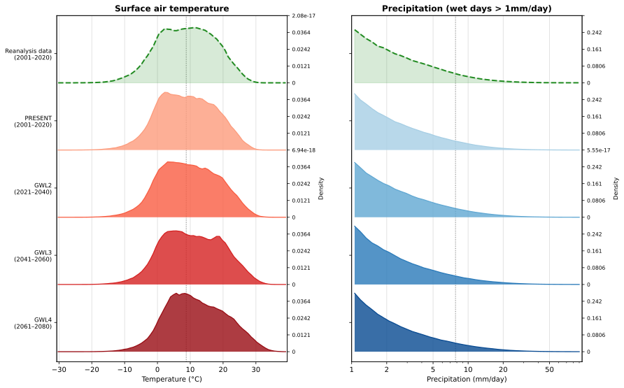
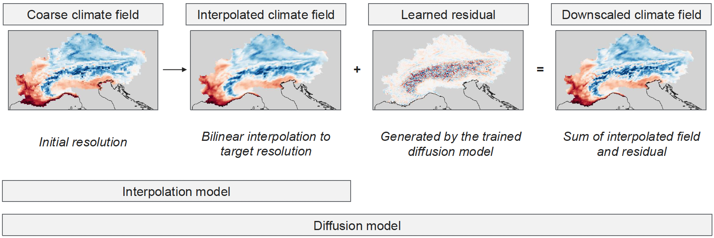
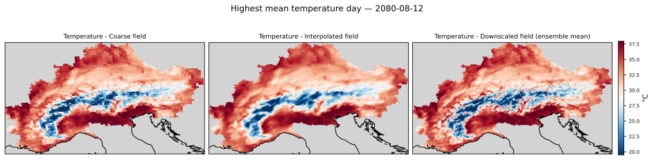
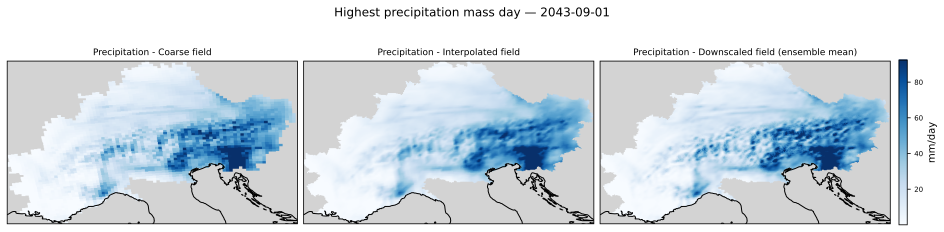

---
output:
  pdf_document: default
  html_document: default
---

```{r message=FALSE, warning=FALSE, include=FALSE}
library(bookdown)
library(svglite)
library(kableExtra)
```

# Climate downscaling using diffusion models {#ddm}

*Author: Alexander Winterstetter*

*Supervisor: Henri Funk*

*Degree: Master*

## Introduction

Climate downscaling, the transformation of a coarse-resolution climate field into a high-resolution climate field, has gained significance under a changing climate
because adaptation decisions are local in nature while most climate models run at a comparatively coarse resolution (Ling et al., 2024).
A high-resolution climate field can represent local extremes on a fine scale, which improves impact assessment and hydrological modelling, particularly under complex terrain (López-Gómez et al., 2024).

Downscaling is performed either dynamically, utilizing regional climate models, or statistically, by learning a relationship between coarse and fine climate fields (Ling et al., 2024).
In recent years, the application of deep learning methods for statistical downscaling has gained increased traction, drawing on the similarity between downscaling
and super-resolution of natural images (Addison et al., 2022; Merizzi et al., 2024).

In particular, the use of diffusion models for downscaling is an active area of research (Springenberg et al., 2026). While many downscaling approaches produce a single deterministic estimate,
diffusion models generate an ensemble of high-resolution climate fields from a coarse-resolution input by drawing from a distribution of high-resolution fields
conditioned on the coarse-resolution field (Watt & Mansfield, 2024; Springenberg et al., 2026).

The way diffusion models have been implemented differs across the literature, above all in how the coarse information relates to the generated output. In the interpolation-residual approach the
coarse climate field is first transferred to the target resolution utilizing an interpolation technique, and the diffusion model is subsequently tasked with generating the residual image between
the ground-truth field and the interpolated field, which is then added back on top (Watt & Mansfield, 2024). The alternatives are regression-residual, where the residual is added to the prediction
of a separate regression model (Mardani et al., 2025; Tomasi et al., 2025), and direct conditional generation, where the network outputs the full field rather than a residual (Addison et al., 2025;
Merizzi et al., 2024). The interpolation-residual approach is the choice for this work. It requires only a single network, which fits the compute budget here, and leaves only the fine-scale correction to be modelled.

Diffusion models for downscaling have predominantly been evaluated in an idealized setting: the target climate field is degraded to a coarse resolution, and the analysis focuses on how well the diffusion model
recovers the original resolution (Merizzi et al., 2024; Watt & Mansfield, 2024). A smaller number of studies apply the trained model to climate projections and assess how well the climate change signal is preserved by the diffusion model
(Addison et al., 2025; Aich et al., 2026).

This seminar work addresses idealized reconstruction as well as projection-signal preservation. The diffusion model architecture from Watt & Mansfield (2024) is trained on reanalysis data over the Alps.
Subsequently, the trained model is applied to bias-adjusted climate projection data spanning several decades
of the twenty-first century to obtain high-resolution climate fields.

Two questions structure this work:

1. **Calibration assessment.** Can the diffusion model architecture generate calibrated ensembles of high-resolution climate fields for temperature and precipitation over the Alpine domain?

2. **Signal preservation.** Is the diffusion model able to preserve the climate change signal when downscaling future climate model projections?

## Diffusion models for image generation {#ddm-theory}

In the context of climate downscaling, the diffusion model should generate samples from the conditional probability density $p(\boldsymbol{x}_0 \mid \boldsymbol{y})$, where $\boldsymbol{x}_0$ is the target field the model generates and $\boldsymbol{y}$ is the context given to the model,
e.g., a coarse version of the target image in super-resolution. The underlying diffusion-model framework was established by Song et al. (2021) and refined by Karras et al. (2022) into the EDM formulation, which is used in several downscaling papers
(Watt & Mansfield, 2024; Mardani et al., 2025; López-Gómez et al., 2024) and is adopted here.
The formulation below is stated for a generic target $\boldsymbol{x}_0$. In this work $\boldsymbol{x}_0$ is the residual field, not the raw climate field (Section \@ref(modelling-setup)).

### Training the model

Conceptually, the idea of diffusion models is to generate a high-quality image by iteratively denoising a Gaussian noise sample (Song et al., 2021). During training, each clean target field $\boldsymbol{x}_0$ is corrupted with Gaussian noise $\boldsymbol{\epsilon}$
at a noise level $\sigma$ randomly drawn from a log-normal distribution:

$$
\ln \sigma \sim \mathcal{N}(\alpha, \beta^2), \qquad
\boldsymbol{\epsilon} \sim \mathcal{N}(\boldsymbol{0},\, \sigma^2 \mathbf{I}), \qquad
\boldsymbol{x}_\sigma = \boldsymbol{x}_0 + \boldsymbol{\epsilon}
$$

The target of the model is the original clean field $\boldsymbol{x}_0$, and the input is the corrupted version $\boldsymbol{x}_\sigma$ together with the contextual input $\boldsymbol{y}$.

$$
\theta^\star = \operatorname*{arg\,min}_{\theta}\;
\mathbb{E}_{(\boldsymbol{x}_0,\, \boldsymbol{y}) \sim p_{\text{data}}}\;
\mathbb{E}_{\sigma \sim p(\sigma)}\;
\mathbb{E}_{\boldsymbol{\epsilon} \sim \mathcal{N}(\boldsymbol{0},\, \sigma^2 \mathbf{I})}
\left[\, \lambda(\sigma)\, \left\lVert D_\theta(\boldsymbol{x}_0 + \boldsymbol{\epsilon};\, \sigma,\, \boldsymbol{y}) - \boldsymbol{x}_0 \right\rVert_2^2 \right]
$$

The model $D_\theta(\boldsymbol{x}_\sigma;\, \sigma,\, \boldsymbol{y})$ is a U-Net (Ronneberger et al., 2015), trained to estimate the noise-free image from a corrupted image, denoted as
$\hat{\boldsymbol{x}}_0 = D_\theta(\boldsymbol{x}_0 + \boldsymbol{\epsilon};\, \sigma,\, \boldsymbol{y})$. Formally, the network parameters are obtained by minimizing the expected denoising error over the data distribution,
the noise-level distribution, and the injected noise, where $\lambda(\sigma)$ weights the contribution of each noise level so that all levels contribute comparably to the loss.

### Generation of samples

After training, the model generates images by starting from pure Gaussian noise at the highest noise level, $\boldsymbol{x}_{\sigma_0} \sim \mathcal{N}(\boldsymbol{0},\, \sigma_0^2\mathbf{I})$,
and descending a decreasing noise schedule $\sigma_0 > \sigma_1 > \dots > \sigma_N = 0$. At each step, the sample is replaced by a combination of itself and its clean estimate,
weighted by the ratio of the next to the current noise level. Simplified, it can be expressed as:

$$
\boldsymbol{x}_{\sigma_{i+1}} = \frac{\sigma_{i+1}}{\sigma_i}\, \boldsymbol{x}_{\sigma_i} + \left(1 - \frac{\sigma_{i+1}}{\sigma_i}\right) D_\theta\left(\boldsymbol{x}_{\sigma_i};\, \sigma_i,\, \boldsymbol{y}\right)
$$

The generation process is stochastic rather than deterministic: primarily, each run starts from an independent Gaussian noise draw. In addition, the stochastic variant of the EDM sampler employed here re-injects a small amount of Gaussian noise
before each denoising step, which the deterministic update shown above omits for readability (Karras et al., 2022).
The diffusion model therefore enables the generation of high-resolution image ensembles from the same input. An extensive visualization of this process can be found in Appendix A.

## Data and methods

### Dataset information {#dataset-information}
The dataset consists of reanalysis and climate projection data and was provided by the Alpine DROught Prediction (A-DROP) project and covers the Alpine domain. Complex topography is where coarse-resolution fields show their largest climatological biases (López-Gómez et al., 2024).
It is also where terrain-driven local phenomena, absent from the coarse input, have to be reconstructed (Tomasi et al., 2025).
The Alps are therefore a demanding domain for statistical downscaling.

#### Reanalysis data
Reanalysis data are a gridded reconstruction of past weather states, produced by assimilating historical observations into a numerical weather prediction model.
The reanalysis data used in this work are derived from the Copernicus European Regional Reanalysis (CERRA; Ridal et al., 2024) and were provided downscaled to a resolution of 500 m.
These 500 m fields were coarsened to 3.4 km due to compute constraints. 3.4 km is the target resolution of the downscaling task throughout this work.

#### Projection data {#projection-data}
The A-DROP project simulated 100 trajectories on how Alpine climate might develop over the current century. This work uses a single trajectory as its projection data. 
The projection data was bias-corrected by the A-DROP team against the reanalysis data utilizing the MBCn-algorithm (Cannon, 2018) and is only available at a resolution of 12 km, considerably coarser than the reanalysis data.

Climate projection data for the years 2001–2080 are subject to downscaling.
The years are assigned to different Global Warming Levels (GWL), following IPCC AR6 (Lee et al., 2021), where a GWL is a 20-year window centred on the year in which the threshold is first crossed.
Here the windows are additionally constrained not to overlap, so they are only approximately centred on the crossing year. An overview of the global warming levels can be found in Table \@ref(tab:gwl-periods).

PRESENT covers the same years as the reanalysis data but contains simulated climate states, not the reanalysis states themselves. The gap between the two is therefore the data-source
shift alone, whereas the later periods add a temporal shift.

```{r gwl-periods, echo=FALSE}
gwl <- data.frame(
  period  = c("PRESENT", "GWL2", "GWL3", "GWL4"),
  warming = c("+1.20", "+2.05", "+3.02", "+4.09"),
  years   = c("2001–2020", "2021–2040", "2041–2060", "2061–2080")
)

kbl(
  gwl,
  booktabs  = TRUE,
  linesep   = "",
  align     = "c",
  col.names = c("GWL period", "Mean warming in period (°C)", "Years"),
  caption   = "Global warming levels used for the projection assessment, defined as non-overlapping 20-year windows of the projection trajectory following IPCC AR6 WGI Ch. 4. Mean warming is given above the pre-industrial baseline (1850–1900)."
) |>
  kable_styling(latex_options = "hold_position",
                bootstrap_options = "condensed") |>
  row_spec(0, bold = TRUE, background = "#3f3f3f", color = "white")
```

The distributional shift between the reanalysis data on which the diffusion model was initially trained, validated and tested and the four projection periods is visualized
in Figure \@ref(fig:distribution-shift). A further breakdown of the deviations for precipitation can be found in Appendix B.

```{r distribution-shift, echo=FALSE, fig.cap="Distributional shift across global warming levels. Distributions of daily mean temperature and daily precipitation sums over the Alpine domain, shown for the reanalysis data and the four warming levels of the climate projection trajectory.", out.width="100%", fig.align="center"}

```

#### Static fields
Additionally, a field with static information about the topography and the geographic location of lakes and seas was acquired, natively available at a resolution of 5.5 km and interpolated to the
target resolution of 3.4 km.

#### Climate variables
The climate variables subject to downscaling are near-surface air temperature (from here on called temperature) and precipitation.
Temperature varies smoothly and its fine-scale structure is strongly tied to terrain elevation (Tomasi et al., 2025). Precipitation is intermittent, non-negative and right-skewed,
and the coarse-scale state does not uniquely determine the fine-scale field (Addison et al., 2025). Precipitation is therefore expected to be the harder of the two variables.
Both variables have been available initially on a 3-hour basis and have been aggregated to the daily mean for temperature and the daily sum for precipitation to meet compute constraints.

### Modelling setup {#modelling-setup}
The diffusion model technique is applied for the climate downscaling context following Watt & Mansfield (2024).
The pipeline is outlined in Figure \@ref(fig:downscaling-workflow). In a first step, the original coarse 12 km climate field is bilinearly interpolated to a smoothed version on the target resolution.
The target of the image generation task ($\boldsymbol{x}_0$ of Section \@ref(ddm-theory)) is the residual climate field between the ground truth and the interpolated field.
It captures the difference between the ground truth climate field and the bilinearly interpolated field.
The contextual information $\boldsymbol{y}$ is composed of the interpolated climate field, the static fields and the date.
After its generation, the residual field is added on top of the interpolated field to retrieve the downscaled field. This is the interpolation-residual approach.

```{r downscaling-workflow, echo=FALSE, fig.cap="Residual downscaling workflow: the coarse climate field is bilinearly interpolated to the target resolution, the diffusion model generates the residual, and their sum yields the downscaled field.", out.width="100%", fig.align="center"}

```

### Training and inference setup {#training-inference-setup}
The training procedure follows established approaches for diffusion-based downscaling (Watt & Mansfield, 2024; Addison et al., 2025). 
Training pairs are constructed from the reanalysis data by coarsening the high-resolution field to the resolution of the projection data. The diffusion model's objective is now to recover the
original fine-scaled field given the coarse input. The model is trained on the years 2001–2016 and validated on 2017–2018.
Following training, the model is applied on the climate projection data to retrieve downscaled realisations of those climate fields without having a high-resolution reference at hand.

The key stationarity assumption underlying this model paradigm is that the learned statistical mapping between the coarse and high-resolution fields learned on the reanalysis data transfers
to the climate projection data. The distribution shift decomposes into a data-source and a temporal component as described in Section \@ref(projection-data). The data-source shift is presumably reduced
due to the projection data being bias-corrected against the reanalysis data.
Whether the diffusion model is also able to handle the temporal shift induced by climate change is assessed in Section \@ref(signal-preservation).

The model was trained for a fixed budget of 20 epochs, translating to approximately 28 hours on a single GPU, by which point the validation loss had largely flattened. 

For the reanalysis test set every 7th day in the years 2019–2020 was selected, totalling 105 days. For every date an ensemble consisting of 12 members was generated. 
In the projection dataset every 12th day was selected and the ensemble consists of 4 members. Both design choices were made to keep compute time reasonable.

### Probabilistic evaluation metrics
The continuous ranked probability score (CRPS) measures how far a predictive distribution lies from an observation, rewarding both accuracy of the individual members and appropriate spread between them (Gneiting & Raftery, 2007).
For a predictive distribution $F$ and a corresponding observation $y$, it can be written as

$$
\mathrm{CRPS}(F, y) = \mathbb{E}\lvert X - y \rvert \;-\; \tfrac{1}{2}\, \mathbb{E}\lvert X - X' \rvert
$$

where $X$ and $X'$ are independent random variables distributed according to $F$.
The first term penalises the distance of the forecast from the observation and the second rewards spread.
In practice, $F$ is the empirical distribution of the generated ensemble.
For a deterministic forecast, such as the interpolation model, $F$ is a point mass, the second term vanishes and the CRPS reduces to the absolute error. Thus, the ensemble CRPS can be compared directly with the MAE of the interpolation baseline.

Spatial realism is assessed via the radially averaged power spectral density (RAPSD), which quantifies the amount of variability a field contains at each spatial scale (Harris et al., 2001; Sinclair & Pegram, 2005).
However, the RAPSD captures only the amount of this variability, not whether it is placed at the correct locations.

Calibration is assessed via the spread–skill relationship. In a calibrated ensemble, the spread of the ensemble members matches the error of the ensemble mean on average. A spread–skill ratio below one indicates an underdispersed ensemble,
whose members vary less than their actual error would justify.

## Results

### Calibration Assessment {#calibration-assessment}
Table \@ref(tab:crps-skill) shows the MAE for the baseline interpolation model and the CRPS for the diffusion model for temperature and precipitation,
averaged over all grid cells and selected days of the held-out test set.

```{r crps-skill, echo=FALSE}
res <- data.frame(
  Metric        = c("MAE", "CRPS"),
  Model         = c("Bilinear interpolation", "Diffusion"),
  Temperature   = c("0.650", "0.185"),
  Precipitation = c("0.280", "0.101")
)

kbl(
  res,
  booktabs  = TRUE,
  linesep   = "",
  align     = c("l", "l", "c", "c"),
  col.names = c("Metric", "Model", "Temperature (°C)", "Precipitation (kg/m²)"),
  caption = "Comparison of ensemble mean CRPS to the interpolation baseline MAE for temperature and precipitation"
) |>
  kable_styling(latex_options = "hold_position",
                bootstrap_options = "condensed") |>
  row_spec(0, bold = TRUE, background = "#3f3f3f", color = "white") |>
  collapse_rows(columns = 1, latex_hline = "major", valign = "top")
```


```{r power-spectrum, echo=FALSE, fig.cap="Radially averaged power spectral density for temperature and precipitation, comparing the interpolated field, the diffusion model and the reanalysis ground truth.", out.width="100%", fig.align="center"}
knitr::include_graphics("work/13-diffusion_downscaling/figures/calibration/1_power_spectrum.svg")
```

Figure \@ref(fig:power-spectrum) shows the RAPSD of the generated fields, read alongside CRPS and the spread–skill relationship as in Addison et al. (2025) and Aich et al. (2026).
The power spectrum indicates that the climate field produced by the diffusion model exhibits a higher variance of the climate variable on finer scales compared to the simple interpolation. 
For temperature the field varies on fine scales as much as the ground truth.
Overall providing evidence that the diffusion model adds fine-scale information about the climate variable compared to the interpolation baseline.
However, for precipitation the variance at the finest scales exceeds that of the ground truth, indicating that the model introduces more fine-scale variability than is actually present.
The model therefore does not merely restore the fine-scale structure removed by the interpolation step but overshoots it.

```{r error-prone-areas, echo=FALSE, fig.cap="Spatial distribution of the downscaling error over the Alpine domain.", out.width="100%", fig.align="center"}
knitr::include_graphics("work/13-diffusion_downscaling/figures/calibration/5_mae_spatial.svg")
```

Figure \@ref(fig:error-prone-areas) maps the error of the ensemble mean with regards to the ground truth over the Alpine domain.
The visualization indicates that the errors are more concentrated along the Alpine ridge.

```{r spread-skill, echo=FALSE, fig.cap="Spread–skill relationship of the diffusion ensemble. A well-calibrated ensemble follows the one-to-one line, along which the ensemble spread matches the error of the ensemble mean.", out.width="100%", fig.align="center"}
knitr::include_graphics("work/13-diffusion_downscaling/figures/calibration/2_spread_skill.svg")
```

Figure \@ref(fig:spread-skill) bins pixels by ensemble-mean RMSE and shows the mean ensemble spread within each bin. The points lie below the diagonal throughout, indicating an underdispersed
ensemble, as also reported by Mardani et al. (2025) and Addison et al. (2025), among others.

### Signal Preservation {#signal-preservation}
This section is concerned with downscaling climate projection data. As mentioned above, this data source is only available at a coarse resolution.
In contrast to the calibration assessment, in which high-resolution climate fields were available, there is now no high-resolution field available against which a downscaled climate field can be
validated. Therefore, the projection assessment is limited to a consistency check between the deterministic interpolation climate field and the downscaled high-resolution climate fields,
produced by the diffusion model, to assess how the diffusion model affects the characteristics of the climate field.

Figure \@ref(fig:proj-period-means) compares the metrics average temperature and precipitation mass between the interpolated climate field and the downscaled climate field.
The difference between the diffusion model and the interpolation baseline is constant across all periods: the downscaled fields are consistently about 0.06 °C cooler and carry roughly
4.6–4.8 Gt/yr more precipitation mass than the interpolation reference.
Because the offset is already present in the PRESENT baseline, it cancels in every change signal; the residuals that remain are small, non-monotonic and change sign between periods.

```{r proj-period-means, echo=FALSE, fig.cap="Effect of the downscaling step on the domain-wide climate field, relative to the interpolated climate field, per global warming level. Left: change in average temperature. Right: change in total precipitation mass.", out.width="100%", fig.align="center"}
knitr::include_graphics("work/13-diffusion_downscaling/figures/projection/3_period_means.svg")
```

Figure \@ref(fig:proj-delta-gwl4) provides a spatial assessment of how the climate change signal is preserved for GWL4, the largest distributional shift from the distribution of the reanalysis dataset.
The third column shows the difference between the two change signals and thus isolates any spatial reorganisation introduced by the diffusion model.
The differences are small in magnitude and show no coherent spatial structure.
Averaging over the whole domain leads to the temperature change signal being essentially unaltered (−0.00 °C) and the precipitation change signal increasing only slightly (+0.08 Gt/yr). Thus, the model transfers the change signal to
the fine grid without systematically relocating it spatially. 

```{r proj-delta-gwl4, echo=FALSE, fig.cap="Spatial climate change signal at GWL4 relative to PRESENT. Top row: temperature, bottom row: total precipitation mass. Left: interpolated field, middle: downscaled ensemble mean, right: difference between the two change signals (downscaled minus interpolated).", out.width="100%", fig.align="center"}
knitr::include_graphics("work/13-diffusion_downscaling/figures/projection/2_delta/gwl4.svg")
```

Figures \@ref(fig:hottest-day) and \@ref(fig:wettest-day) encompass a dedicated analysis for the hottest and the wettest day in the projection data.
For the hottest day the average temperature in the domain decreases only slightly from the interpolated to the downscaled field, while the temperature of the warmest pixel in the field increases.
A more interesting pattern can be documented for the wettest day (highest precipitation mass) in the projection period. While the total precipitation mass in the domain is preserved, the pixel
carrying the largest precipitation mass increases substantially.

```{r hottest-day, echo=FALSE, fig.cap="Hottest day of the projection trajectory. Near-surface air temperature on the native 12 km grid, after bilinear interpolation to the target resolution, and after downscaling (ensemble mean).", out.width="100%", fig.align="center"}

```

```{r wettest-day, echo=FALSE, fig.cap="Wettest day of the projection trajectory. Daily precipitation sum on the native 12 km grid, after bilinear interpolation to the target resolution, and after downscaling (ensemble mean).", out.width="100%", fig.align="center"}

``` 

A short analysis on whether the spread of the generated ensembles is affected by the distributional shift can be found in Appendix C.

## Discussion {#discussion}

Several limitations of this study should be noted. Due to the constrained resources, the model was trained for a fixed budget of 20 epochs without hyperparameter optimization.
A further limitation is the orography field, which was only available at 5.5 km and may explain the error concentration along the Alpine ridge reported in Section \@ref(calibration-assessment).
The evaluation sample also limits the precision of the reported metrics: they rest on 105 test days, every 7th day of 2019–2020, with 12 ensemble members per date. This matters most for the
spread–skill relationship, where the spread is estimated from those 12 members.
Finally, no high-resolution reference exists for the projection period, so that part of the evaluation remains a consistency check against the interpolation baseline rather than a validation.

Several directions follow from this work. There are three ways to improve precipitation downscaling that seem worth pursuing. One is to transform the variable before training, for example with a log or square-root mapping, which reduces its skew (Addison et al., 2025; Aich et al., 2026).
Another is to change the architecture to the regression-residual approach, so that a conditional regression first brings the coarse field to the target resolution and the diffusion model only has to handle the stochastic component (Mardani et al., 2025; Tomasi et al., 2025).
This might also help with the underdispersion, because the spread of the ensemble would then come from the diffusion step alone.
A third option is direct conditional generation, in which the network outputs the full field instead of a residual (Addison et al., 2025).
Checkpoint selection could also be introduced, based on the validation loss together with the accuracy of the generated ensemble on the validation set (Addison et al., 2025). Other climate variables have been downscaled in the literature, wind speed for example (Merizzi et al., 2024; Springenberg et al., 2026).
Finally, a feature importance analysis on the contextual information could show how much
the orography, the date and the coarse input field each contribute, and whether other contextual information might be worth adding (López-Gómez et al., 2024).

-- Lopez-Gomez 2.3 nice point on how we can use ensembles for downscaling future projections S3.2

## Conclusion

For temperature the diffusion model recovers spatial variance beyond the interpolation baseline, demonstrated by the lower CRPS and the power spectrum. For precipitation it introduces more
fine-scale variability than the ground truth contains, suggesting that the current setup produces unrealsitic downscaled climate fields, probably because of precipitations right-skewed distribution
(see Figure \@ref(fig:distribution-shift)). Across both variables the ensemble is underdispersed.

With regards to the climate change signal, the offset relative to the interpolation baseline is constant across all periods and the spatial difference between the two change signals shows no
coherent structure. Both are consistent with the change signal being transferred to the fine grid without systematic distortion, though the absence of high-resolution ground truth for the
projection period implies the fine-scale signal itself cannot be validated.

## Note on the dataset
The reanalysis dataset and the climate projection dataset have been made available by Max Kagerbauer to me from the Alpine DROught Prediction (A-DROP) project.
Further information on the A-DROP project can be found under the following link: https://www.alpine-space.eu/project/a-drop/

## Appendix A - More information on reverse diffusion process

Below can be found a visualization of how the diffusion model generates images. Every fifth step was visualized. At the beginning, the estimate for the clean field does not resemble the true climate field.
Thus, the image (a tensor in practice) takes only a small step in the direction of that estimated target image to reduce the noise level. With subsequent steps the estimated image starts to resemble a realistic climate field, and after 40 steps a clean image is estimated.

Figures \@ref(fig:filmstrip-tas) and \@ref(fig:filmstrip-pr) show this process for the temperature and the precipitation residual field.

```{r filmstrip-tas, echo=FALSE, fig.cap="Reverse diffusion process for the temperature residual field. Columns show every fifth denoising step with the corresponding noise level. Top row: the noised sample entering the step; middle row: the clean-field estimate produced by the denoiser; bottom row: the sample after the update.", out.width="100%", fig.align="center"}
knitr::include_graphics("work/13-diffusion_downscaling/figures/diagnostics/denoiser_estimate_2016-06-23_seed42/filmstrip_tas_residual.svg")
```

```{r filmstrip-pr, echo=FALSE, fig.cap="Reverse diffusion process for the precipitation residual field, shown as in Figure \\@ref(fig:filmstrip-tas).", out.width="100%", fig.align="center"}
knitr::include_graphics("work/13-diffusion_downscaling/figures/diagnostics/denoiser_estimate_2016-06-23_seed42/filmstrip_pr_residual.svg")
```

## Appendix B - Distributional shift of the precipitation variable across global warming levels


## Appendix C - Ensemble spread over projection period