---
output:
  pdf_document: default
  html_document: default
---

```{r message=FALSE, warning=FALSE, include=FALSE}
library(bookdown)
library(svglite)
library(kableExtra)
```

# Climate downscaling using diffusion models {#ddm}

*Author: Alexander Winterstetter*

*Supervisor: Henri Funk*

*Degree: Master*

## Introduction

Climate downscaling, the transformation of a coarse-resolution climate field into a more granular high-resolution climate field, has gained significance under a changing and increasingly extreme climate, because
climate models are typically run at resolutions too coarse to represent the local-scale processes on which adaptation and risk-management decisions depend [@ling2024; @merizzi2024].

Downscaling is performed either dynamically, utilizing regional climate models, or statistically, by learning a relationship between coarse and fine climate fields [@ling2024].
For statistical downscaling, the application of deep learning methods has gained traction in recent years, drawing on the similarity between downscaling
and super-resolution of natural images [@addison2022; @merizzi2024]. In particular, the use of diffusion models is an active area of research [@springenberg2026]. While many downscaling approaches produce a single deterministic estimate,
diffusion models generate an ensemble of high-resolution climate fields from a coarse-resolution input by drawing from a distribution of high-resolution fields
conditioned on the coarse-resolution field [@watt2024; @springenberg2026]. Implementations differ mainly in what the diffusion model generates. Some studies generate the residual between the interpolated coarse field and the high-resolution field [@watt2024; @lopezgomez2025],
and add it back to the interpolated field. Alternatively, the residual is taken with respect to a separate regression model [@mardani2025; @tomasi2025],
or the model outputs the full field directly using the coarse field as context alone [@addison2026; @merizzi2024].
This work adopts the interpolation-residual approach, because it only requires a single model and restricts the learning task to the fine-scale correction.
Diffusion models for downscaling have predominantly been evaluated in an idealized setting. The target climate field is degraded to a coarse resolution, and the analysis focuses on how well the diffusion model
recovers the original resolution [@merizzi2024; @watt2024]. A smaller number of studies utilize the trained model to generate climate projections and assess how well the climate change signal is preserved by the diffusion model
[@addison2026; @aich2026].

This work adresses both research areas, calibration assessment of the generated fields and projection-signal preservation.
For **calibration assessment**, it evaluates whether the @watt2024 architecture generates accurate and calibrated ensembles over the complex topography of the Alps, downscaling reanalysis fields from a 12 km resolution to a target resolution of 3.4 km.
Then for **signal preservation**, the trained model is assessed in how well it preserves the climate change signal when applied to future climate projections.

## Diffusion models for image generation {#ddm-theory}

In the context of climate downscaling or super-resolution, the diffusion model samples from the conditional probability density $p(\boldsymbol{x}_0 \mid \boldsymbol{y})$. $\boldsymbol{x}_0$ is the target field the model generates and $\boldsymbol{y}$ is the context given to the model,
e.g., a coarse version of the target image. The underlying diffusion-model framework was established by @song2021 and refined by @karras2022 into the EDM-formulation, which is used in several downscaling papers
[@watt2024; @mardani2025; @lopezgomez2025] and is adopted in this work.

### Training the model

Conceptually, the idea of diffusion models is to generate a high-quality image by iteratively denoising a Gaussian noise sample [@song2021]. During training, each clean target field $\boldsymbol{x}_0$ is corrupted with Gaussian noise $\boldsymbol{\epsilon}$
at a noise level $\sigma$ randomly drawn from a log-normal distribution [@karras2022]:

$$
\sigma \sim \operatorname{LogN}(\alpha, \beta^2), \qquad
\boldsymbol{\epsilon} \sim \mathcal{N}(\boldsymbol{0},\, \sigma^2 \mathbf{I}), \qquad
\boldsymbol{x}_\sigma = \boldsymbol{x}_0 + \boldsymbol{\epsilon}
$$

where $\alpha$ and $\beta$ are the mean and standard deviation of $\sigma$.
The target of the model is the original clean field $\boldsymbol{x}_0$, and the input is the corrupted version $\boldsymbol{x}_\sigma$ combined with the contextual input $\boldsymbol{y}$.

$$
\theta^\star = \operatorname*{arg\,min}_{\theta}\;
\mathbb{E}_{(\boldsymbol{x}_0,\, \boldsymbol{y}) \sim p_{\text{data}}}\;
\mathbb{E}_{\sigma \sim p(\sigma)}\;
\mathbb{E}_{\boldsymbol{\epsilon} \sim \mathcal{N}(\boldsymbol{0},\, \sigma^2 \mathbf{I})}
\left[\, \lambda(\sigma)\, \left\lVert D_\theta(\boldsymbol{x}_0 + \boldsymbol{\epsilon};\, \sigma,\, \boldsymbol{y}) - \boldsymbol{x}_0 \right\rVert_2^2 \right]
$$

The model $D_\theta(\boldsymbol{x}_\sigma;\, \sigma,\, \boldsymbol{y})$ is a U-Net [@ronneberger2015], trained to estimate the noise-free image from a corrupted image, denoted as
$\hat{\boldsymbol{x}}_0 = D_\theta(\boldsymbol{x}_0 + \boldsymbol{\epsilon};\, \sigma,\, \boldsymbol{y})$. Formally, the network parameters are obtained by minimizing the expected denoising error over the data distribution,
the noise-level distribution, and the injected noise, where $\lambda(\sigma)$ weights the contribution of each noise level so that all levels contribute comparably to the loss [@karras2022].

### Generation of samples

After training, the model generates images by starting from pure Gaussian noise at the highest noise level, $\boldsymbol{x}_{\sigma_0} \sim \mathcal{N}(\boldsymbol{0},\, \sigma_0^2\mathbf{I})$,
and descending a decreasing noise schedule $\sigma_0 > \sigma_1 > \dots > \sigma_N = 0$. At each step, the sample is replaced by a combination of itself and its clean estimate,
weighted by the ratio of the next to the current noise level. Simplified, it can be expressed as [@karras2022]:

$$
\boldsymbol{x}_{\sigma_{i+1}} = \frac{\sigma_{i+1}}{\sigma_i}\, \boldsymbol{x}_{\sigma_i} + \left(1 - \frac{\sigma_{i+1}}{\sigma_i}\right) D_\theta\left(\boldsymbol{x}_{\sigma_i};\, \sigma_i,\, \boldsymbol{y}\right)
$$

The generation process is stochastic rather than deterministic. Each run starts from an independent Gaussian noise draw. In addition, the stochastic variant of the EDM sampler employed here re-injects Gaussian noise
before each denoising step, which the deterministic update shown above omits for readability [@karras2022].
The diffusion model therefore enables the generation of high-resolution image ensembles from the same input. An extensive visualization of this generation process can be found in [Appendix A](#appendix-a).

## Data and methods

### Climate variables
The climate variables subject to downscaling are near-surface air temperature (from here on called temperature) and precipitation.
Temperature varies smoothly and its fine-scale structure is strongly tied to terrain elevation [@tomasi2025]. Precipitation is intermittent, non-negative and right-skewed.
Additionally, the coarse-scale state does not uniquely determine the fine-scale field [@addison2026].
Both variables were initially available on a 3-hour basis and were subsequently aggregated to the daily mean for temperature and the daily sum for precipitation.

### Dataset information {#dataset-information}
The dataset consists of reanalysis and climate projection data and was provided by the [Alpine DROught Prediction (A-DROP)](https://www.alpine-space.eu/project/a-drop/) project covering the Alpine domain.
**Reanalysis data** is a gridded reconstruction of past weather states and is provided in this work on a resolution of 500 m.
These 500 m fields were coarsened to 3.4 km due to compute constraints. Therefore, 3.4 km is the target resolution of the downscaling task throughout this work.

The **projection data** encompasses a simulated trajectory on how Alpine climate might develop over the current century.
The data was bias-corrected against the reanalysis data utilizing the MBCn-algorithm [@cannon2018] and is only available at a resolution of 12 km, considerably coarser than the reanalysis data.
Projection data from the PRESENT period covers the same years as the reanalysis data, including the years the model was trained on, but contains simulated climate states. 

The distributional shift between the reanalysis data and the four projection periods is visualized in Figure \@ref(fig:distribution-shift).
A more detailed breakdown of the shift can be found in [Appendix B](#appendix-b).

```{r gwl-periods, echo=FALSE}
gwl <- data.frame(
  period  = c("PRESENT", "GWL2", "GWL3", "GWL4"),
  warming = c("+1.20", "+2.05", "+3.02", "+4.09"),
  years   = c("2001–2020", "2021–2040", "2041–2060", "2061–2080")
)

kbl(
  gwl,
  booktabs  = TRUE,
  linesep   = "",
  align     = "c",
  col.names = c("GWL period", "Mean warming in period (°C)", "Years"),
  caption   = "Global warming levels for the projection assessment, defined as non-overlapping 20-year windows approximately following IPCC AR6 WGI Ch. 4. Mean warming is relative to the pre-industrial baseline (1850–1900)."
) |>
  kable_styling(latex_options = "hold_position",
                bootstrap_options = "condensed") |>
  row_spec(0, bold = TRUE, background = "#3f3f3f", color = "white")
```

```{r distribution-shift, echo=FALSE, fig.cap="Distributions of daily mean temperature and daily precipitation sums over the Alpine domain, for the reanalysis data and the four projection periods.", out.width="100%", fig.align="center"}

```

Additionally, a field with static information on the topography and the geographic location of lakes and seas was acquired, natively available at a resolution of 5.5 km and interpolated to the
target resolution of 3.4 km.

### Modelling setup {#modelling-setup}
The diffusion model technique is applied for the climate downscaling context following @watt2024.
The pipeline is outlined in Figure \@ref(fig:downscaling-workflow). In a first step, the original coarse 12 km climate field is bilinearly interpolated to a smoothed version on the target resolution.
The target of the image generation task ($\boldsymbol{x}_0$ of Section \@ref(ddm-theory)) is the residual climate field between the ground truth and the interpolated field.
The contextual information $\boldsymbol{y}$ is composed of the interpolated climate field, the static fields and the date.
After its generation, the residual field is added on top of the interpolated field to retrieve the downscaled field.

```{r downscaling-workflow, echo=FALSE, fig.cap="Residual downscaling workflow. The coarse field is bilinearly interpolated to the target resolution, the diffusion model generates the residual, and their sum yields the downscaled field.", out.width="100%", fig.align="center"}
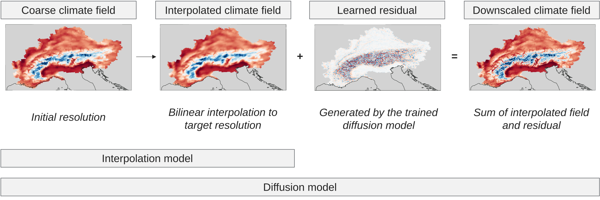
```

### Training and inference setup {#training-inference-setup}
The training procedure follows established approaches for diffusion-based downscaling [@watt2024; @addison2026]. 
Training pairs are constructed by coarsening the high-resolution field from the reanalysis data to the resolution of the projection data. The diffusion model's objective is now to recover the
original fine-scaled field given the coarse input. The model is trained on the years 2001–2016 and validated on 2017–2018.
Following training, the model is applied to the climate projection data to retrieve downscaled realisations of those climate fields without having a high-resolution reference at hand.

The key stationarity assumption underlying this model paradigm is that the learned statistical mapping between the coarse and high-resolution reanalysis fields transfers
to the climate projection data. The distribution shift decomposes into a data-source (reanalysis to projection data) and a temporal (climate change signal) component.
The data-source shift is partially addressed by the projection data being bias-corrected against the reanalysis data.
Whether the diffusion model is also able to handle the temporal shift induced by climate change is assessed in Section \@ref(signal-preservation).

The model was trained for a fixed budget of 20 epochs, by which point the validation loss has largely flattened.
Further information on the model parameters and the compute time can be found in [Appendix D](#appendix-d).
For the reanalysis test set every 7th day in the years 2019–2020 was selected, totalling 105 days. For every date an ensemble consisting of 12 members was generated. 
In the projection dataset every 12th day was selected and the ensemble encompassed 4 members. Both design choices were made to keep compute time reasonable.

### Evaluation metrics {#evaluation-metrics}
The accuracy of a generated ensemble with regards to an observation can be measured using the continuous ranked probability score (CRPS), rewarding both accuracy of the individual members and appropriate spread between them [@gneiting2007].
For a predictive distribution $F$, which the ensemble approximates, and a corresponding observation $y$, it can be written as

$$
\mathrm{CRPS}(F, y) = \mathbb{E}\lvert X - y \rvert \;-\; \tfrac{1}{2}\, \mathbb{E}\lvert X - X' \rvert
$$

where $X$ and $X'$ are independent random variables distributed according to $F$.
The first term penalises the distance of the forecast from the observation and the second rewards spread.
An unbiased estimator of the CRPS was applied to account for the bias introduced by the finite ensemble, following practice from other works [@mardani2025].
For a deterministic forecast, such as the interpolation model, $F$ is a point mass, so the second term vanishes and the CRPS reduces to the absolute error. Thus, the ensemble CRPS can be compared directly to the MAE of the interpolation baseline.

Related works assess the amount of spatial variability in a field via the radially averaged power spectral density (RAPSD), which quantifies the amount of variability a field contains at each spatial scale [@harris2001; @sinclair2005].
However, the RAPSD captures only the amount of the variability, not whether it is placed at the correct locations.

Following @mardani2025, calibration is assessed using the spread–skill relationship. In a calibrated ensemble, the spread of the ensemble members matches the error of the ensemble mean on average. A spread–skill ratio below one indicates an underdispersed ensemble,
whose members vary less than their actual error would justify.

## Results

### Calibration assessment {#calibration-assessment}
Table \@ref(tab:crps-skill) shows the MAE for the baseline interpolation model and the CRPS for the diffusion model for temperature and precipitation,
averaged over all grid cells and selected days of the held-out test set. The diffusion model fields are closer to the ground truth than the
smoothed baseline fields by a wide margin, especially for temperature.
The spatial location of the error between the ensemble mean and the ground truth is visualized in Figure \@ref(fig:error-prone-areas), which indicates that the errors are concentrated along the Alpine ridge.
Figure \@ref(fig:power-spectrum) assesses how well the generated fields capture the spatial variability of the ground truth beyond the evaluation metrics.
Both variables carry more variance on fine scales than the interpolated field. For temperature the field carries approximately the same variance on fine scales as the ground truth.
For precipitation the variance at the finest scales exceeds the ground truth, so the model does not merely restore the fine-scale structure that the smoothed interpolation field lacks
but overshoots it. The generated precipitation fields therefore have variance-flated precipitation values, which is the central shortcoming of the architecture for this variable.

```{r crps-skill, echo=FALSE}
res <- data.frame(
  Metric        = c("MAE", "CRPS"),
  Model         = c("Bilinear interpolation", "Diffusion"),
  Temperature   = c("0.650", "0.078"),
  Precipitation = c("0.280", "0.089")
)

kbl(
  res,
  booktabs  = TRUE,
  linesep   = "",
  align     = c("l", "l", "c", "c"),
  col.names = c("Metric", "Model", "Temperature (°C)", "Precipitation (mm/day)"),
  caption = "Comparison of ensemble CRPS to the interpolation baseline MAE for temperature and precipitation."
) |>
  kable_styling(latex_options = "hold_position",
                bootstrap_options = "condensed") |>
  row_spec(0, bold = TRUE, background = "#3f3f3f", color = "white")
```
```{r error-prone-areas, echo=FALSE, fig.cap="Mean absolute error of the ensemble mean over the Alpine domain, in °C for temperature and mm/day for precipitation.", out.width="100%", fig.align="center"}
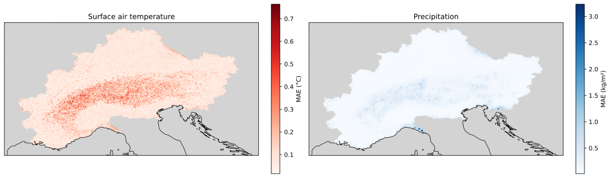
```

```{r power-spectrum, echo=FALSE, fig.cap="Radially averaged power spectral density for temperature and precipitation, comparing the interpolated field, the diffusion model and the reanalysis ground truth.", out.width="100%", fig.align="center"}
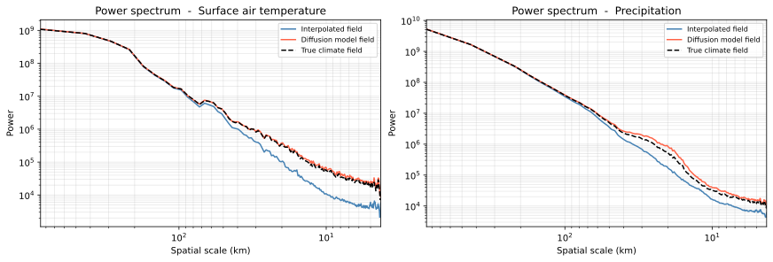
```

The last diagnostic addresses the calibration of the ensemble. Figure \@ref(fig:spread-skill) groups the pixel-day pairs into 30 equal-count bins by ensemble spread and shows the RMSE of the ensemble mean within each bin, with the spread corrected for the finite ensemble size [@mardani2025].
The points lie below the diagonal throughout, indicating an underdispersed ensemble, with a spread–skill ratio of 0.71 for temperature and 0.52 for precipitation.

```{r spread-skill, echo=FALSE, fig.cap="Spread–skill relationship of the diffusion ensemble. A calibrated ensemble follows the one-to-one line.", out.width="100%", fig.align="center"}
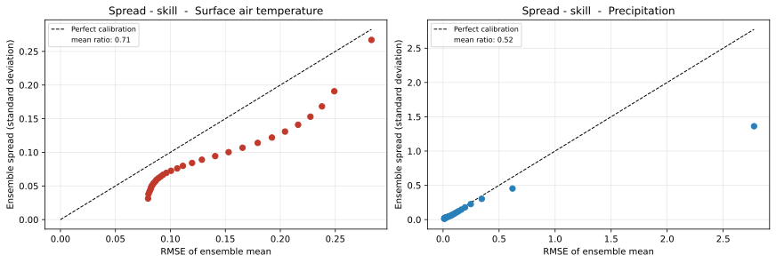
```

### Signal preservation {#signal-preservation}
This section is concerned with downscaling climate projection data. In contrast to the calibration assessment, in which high-resolution climate fields were available, there is now no high-resolution field
available against which a downscaled climate field can be validated.
Therefore, the projection assessment is limited to a consistency check between the deterministic interpolation climate field and the downscaled high-resolution climate fields,
produced by the diffusion model, to assess how the diffusion model affects the characteristics of the climate field.

Figure \@ref(fig:proj-period-means) compares the average temperature and precipitation mass between the interpolated climate field and the downscaled climate field.
The difference between the diffusion model and the interpolation baseline is constant across all periods. The downscaled fields are consistently about 0.02 % cooler and carry
between 0.83 % and 0.88 % more precipitation mass than the interpolation reference.
The offset is independent of the warming level, which is consistent with the downscaling step being insensitive to the distributional shift.

```{r proj-period-means, echo=FALSE, fig.cap="Effect of the downscaling step per global warming level, as a percentage change relative to the interpolated field. Left: average temperature. Right: total precipitation mass.", out.width="100%", fig.align="center"}
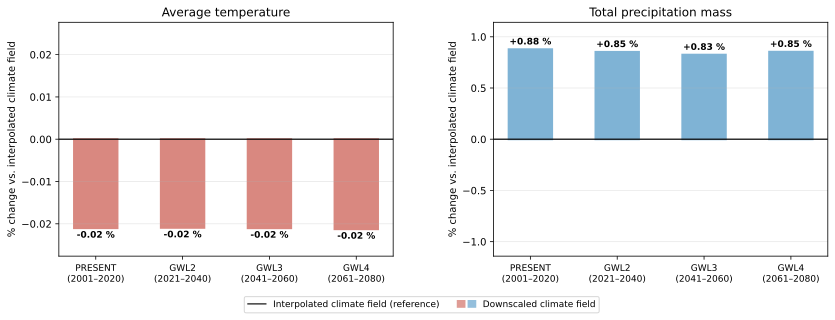
```

Figure \@ref(fig:proj-delta-gwl4) provides a spatial assessment of how the climate change signal is preserved for GWL4, the period containing the largest distributional shift from the distribution of the reanalysis dataset.
The third column shows the difference between the two change signals and thus isolates any spatial reorganisation introduced by the diffusion model.
The figure shows that the differences are small in magnitude and show no coherent spatial structure.
Averaged over the whole domain, the temperature change signal compared to the PRESENT period is essentially unaltered (below 0.01 °C in magnitude) and the precipitation change signal increases only slightly (+0.08 Gt/yr).
Thus, the model transfers the change signal to the fine grid without systematically relocating it spatially. 

```{r proj-delta-gwl4, echo=FALSE, fig.cap="Spatial climate change signal at GWL4 relative to PRESENT. Top row: temperature, bottom row: total precipitation mass. Left: interpolated field, middle: downscaled ensemble mean, right: their difference (downscaled minus interpolated).", out.width="100%", fig.align="center"}
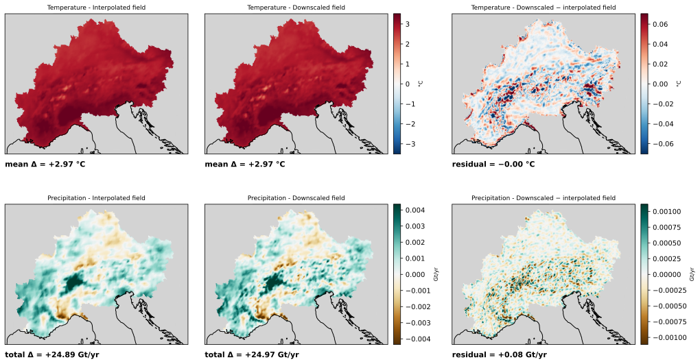
```

Figures \@ref(fig:max-temp-day) and \@ref(fig:max-precip-day) present the day with the highest domain-mean temperature and the day with the highest precipitation mass
in the projection data. The corresponding numbers on how the statistics of the field are affected by the models are given in Table \@ref(tab:max-day-stats),
where the native 12 km field is mapped onto the fine grid by nearest-neighbour lookup so that all three fields share one grid.
On the hottest day the domain mean decreases only slightly from the interpolated to the downscaled field (-0.07 °C), while the maximum
pixel temperature in the field increases (+1.29 °C).
A more interesting pattern can be documented for the day with the highest precipitation mass. While the domain mean is preserved
(+0.04 mm/day), the maximum pixel value increases substantially relative to the interpolated field (+28.70 mm/day). Bilinear resampling had removed part of that peak
beforehand (-7.09 mm/day), so about a quarter of the increase restores what the smoothing destroyed, while the remainder leaves the downscaled maximum 11.7 % above the native 12 km maximum.
The inflated fine-scale variance reported in Section \@ref(calibration-assessment)
is apparent in the same field, which is covered by a granular speckle that neither the coarse nor the interpolated field shows.

```{r max-temp-day, echo=FALSE, fig.cap="Day with the highest domain-mean temperature. Left to right: native 12 km grid, bilinear interpolation to the target resolution, downscaled ensemble mean.", out.width="100%", fig.align="center"}
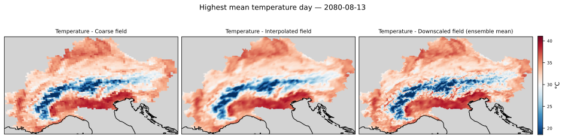
```

```{r max-precip-day, echo=FALSE, fig.cap="Day with the highest precipitation mass, shown as a daily sum. Panels as in Figure \\@ref(fig:max-temp-day).", out.width="100%", fig.align="center"}
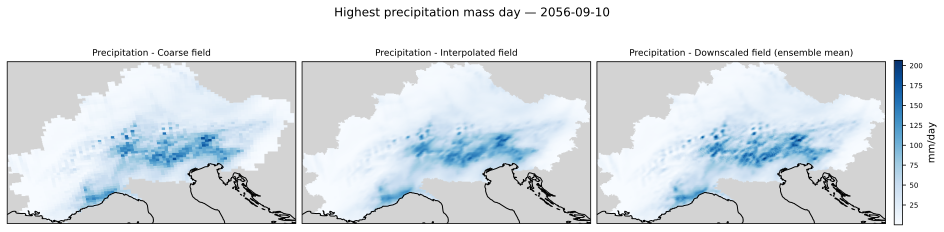
```

```{r max-day-stats, echo=FALSE}
max_day <- data.frame(
  stat       = c("Domain mean", "Maximum pixel", "Domain mean", "Maximum pixel"),
  native     = c("31.90", "39.77", "30.22", "184.90"),
  interp     = c("31.90", "39.79", "30.22", "177.82"),
  downscaled = c("31.83", "41.07", "30.25", "206.51"),
  d_regrid   = c("+0.00", "+0.02", "-0.00", "-7.09"),
  d_model    = c("-0.07", "+1.29", "+0.04", "+28.70")
)

kbl(
  max_day,
  booktabs  = TRUE,
  linesep   = "",
  align     = c("l", "c", "c", "c", "c", "c"),
  col.names = c("", "Native (12 km)", "Interpolated", "Downscaled", "$\\Delta$ interpolation", "$\\Delta$ model"),
  escape    = FALSE,
  caption   = "Field statistics for the hottest and the wettest day, in °C and mm/day. $\\Delta$ interpolation is the resampling effect (interpolated minus native), $\\Delta$ model the diffusion residual (downscaled minus interpolated)."
) |>
  kable_styling(latex_options = "hold_position",
                bootstrap_options = "condensed") |>
  row_spec(0, bold = TRUE, background = "#3f3f3f", color = "white",
           extra_css = "white-space: nowrap;") |>
  column_spec(1, extra_css = "white-space: nowrap;") |>
  pack_rows("Temperature (2080-08-13)", 1, 2) |>
  pack_rows("Precipitation (2056-09-10)", 3, 4)
```

A short analysis on whether the spread of the generated ensembles is affected by the distributional shift can be found in [Appendix C](#appendix-c).

## Discussion {#discussion}

The diagnostic findings line up with previous work. 
@mardani2025 note that temperature downscaling is largely driven by sub-grid topography, which is learnable deterministically from static inputs.
The interpolation-residual setup used here targets exactly this deterministic fine-scale correction, which is a plausible reason for the strong temperature performance.
In contrast, they also report for their intermittent channel (radar reflectivity) that the variance is overestimated at small scales.
@mardani2025 and @lopezgomez2025 both report underdispersed ensembles, while other work focusing on generating the full field instead of only the residual field reports well-calibrated spread [@aich2026; @addison2026].

The projection results are consistent with @aich2026, who find the change signal preserved under a high-emission scenario. This work shows that the downscaling step does not distort the signal it is given,
either in the domain mean or spatially. The large-scale signal is, however, already present in the interpolated field to which the generated residual is added, so its preservation is partly by construction.
The model learned from the reanalysis training pairs how fine-scale structure follows from a coarse field. Under warming the same coarse field may imply different fine-scale structure,
and no high-resolution reference exists to check this. @addison2026, who have projection data at both resolutions, report errors in the magnitude of the projected change that a consistency check of this kind would not reveal.

The work has its limitations. Due to the constrained resources, the model was trained for a fixed budget without hyperparameter optimization.
The orography field was only available at 5.5 km, which may explain the error concentration along the Alpine ridge reported in Section \@ref(calibration-assessment).
The evaluation sample also limits the precision of the reported metrics. This matters most for the
spread–skill relationship, where the spread is estimated from 12 ensemble members per date.
Finally, no high-resolution reference exists for the projection period, so that part of the signal preservation assessment remains a consistency check against the interpolation baseline rather than a validation.

## Conclusion

For temperature the diffusion model approximates the ground truth better than the interpolation baseline and restores fine-scale variability, shown by the CRPS and the power spectrum. 
For precipitation it adds more fine-scale variability than the ground truth contains, so the fields are not realistic.
The likely reasons are the variable's right-skewed distribution and the fact that the coarse field and the orography do not determine its fine-scale structure.
For both variables the ensemble is underdispersed.

With regard to the climate change signal, the offset relative to the interpolation baseline is constant across all periods and the spatial difference between the two change signals shows no coherent structure.
Both are consistent with the change signal being transferred to the fine grid without systematic distortion, though the absence of high-resolution ground truth for the projection period means the fine-scale signal itself cannot be validated.

The interpolation-residual setup is therefore usable for temperature over the Alpine domain, for precipitation further improvements are necessary.
Whether it captures the coarse-to-fine relationship of a future climate remains open until fine-scale projection data is available.

Several directions follow from this work. Multiple options exist to improve the model's capability in downscaling precipitation. One is to transform the variable before training, for example with a log or square-root mapping, which reduces its skew [@addison2026; @aich2026].
Giving the model additional context, for example a surface pressure climate field, might also help improve its precipitation downscaling capabilities.
Another is to change the architecture to the regression-residual approach, so that a conditional regression first brings the coarse field to the target resolution and the diffusion model only has to handle the stochastic component [@mardani2025; @tomasi2025] or to generate the full climate field by the model [@addison2026; @aich2026].
Both architecture changes might also address the underdispersion issue, for the regression-residual approach due to the diffusion model handling only the stochastic component as mentioned above.
For generating a field from scratch, the downscaled field is not directly based on an intermediary field, e.g. interpolation field, potentially increasing the variance of generated fields. 
Checkpoint selection could also be introduced, based on validation loss as well as accuracy of the generated ensemble on the validation set [@addison2026].
Finally, a feature importance analysis on the contextual information could show how much the orography, the date and the coarse input field each contribute,
and whether other contextual information might be worth adding [@lopezgomez2025].

### Note on the dataset
The reanalysis and climate projection datasets were provided by Max Kagerbauer from the Alpine DROught Prediction (A-DROP) project.
Further information on the A-DROP project can be found under the following link: https://www.alpine-space.eu/project/a-drop/

## Appendix

### Appendix A - More information on reverse diffusion process {#appendix-a}

Below can be found a visualization on how the diffusion model generates images. Every fifth step was visualized. At the beginning, the estimate for the clean field does not resemble the true climate field.
Thus, the image (a tensor in practice) takes only a small step in the direction of that estimated target image to reduce the noise level. With subsequent steps the estimated image starts to resemble a realistic climate field, and after 40 steps a clean image is estimated.

Figures \@ref(fig:filmstrip-tas) and \@ref(fig:filmstrip-pr) show this process for the temperature and the precipitation residual field.

```{r filmstrip-tas, echo=FALSE, fig.cap="Reverse diffusion process for the temperature residual field. Columns show every fifth denoising step with its noise level. Top row: the noised sample entering the step; middle row: the denoiser's clean-field estimate; bottom row: the sample after the update.", out.width="100%", fig.align="center"}
knitr::include_graphics("work/13-diffusion_downscaling/figures/diagnostics/denoiser_estimate_2016-06-23_seed42/filmstrip_tas_residual.svg")
```

```{r filmstrip-pr, echo=FALSE, fig.cap="Reverse diffusion process for the precipitation residual field, shown as in Figure \\@ref(fig:filmstrip-tas).", out.width="100%", fig.align="center"}
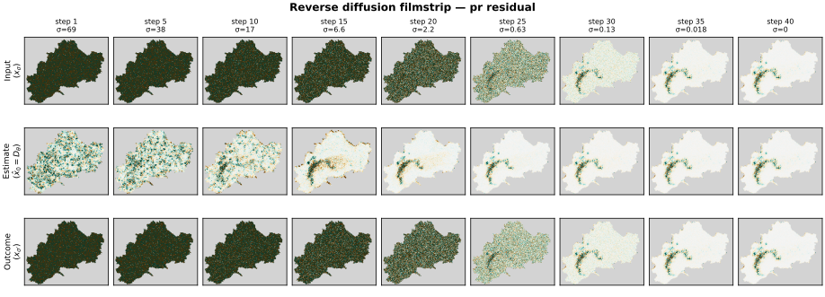
```

### Appendix B - Distributional shift of the climate variable across global warming levels {#appendix-b}

The ridgeline visualization of Figure \@ref(fig:distribution-shift) is supplemented with a percentile plot in Figure \@ref(fig:quantile-delta), which shows how far each percentile of the
domain-wide distribution moves relative to the PRESENT period.
For temperature the whole distribution shifts upwards, most strongly in the upper percentiles. For precipitation the change is confined to the tail: up to roughly the 80th percentile the
percentiles remain essentially unchanged, beyond the 90th they rise steeply, to about +1.4 mm/day at GWL2 and +6 mm/day at GWL3 and GWL4. The shift the model has to extrapolate to is thus not a
uniform wettening but a heavier extreme tail.

```{r quantile-delta, echo=FALSE, fig.cap="Shift of the domain-wide distribution relative to PRESENT, by percentile and global warming level. Left: temperature, right: precipitation. The dashed line marks no change.", out.width="100%", fig.align="center"}
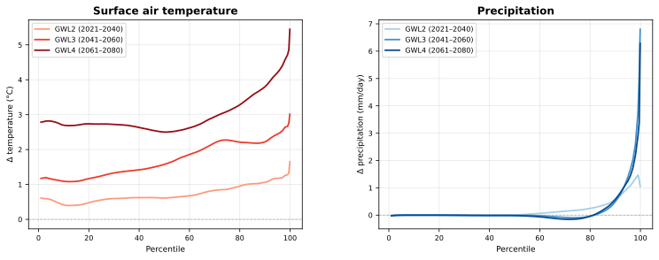
```

### Appendix C - Ensemble spread over projection period {#appendix-c}

Figure \@ref(fig:spread-persistence) shows the distribution of the daily ensemble spread of the four member ensemble over the evaluated days of each global warming level.
The distributions overlap almost completely and are not ordered by warming level, so a systematic difference in the spread between the periods is not visible, although a more extensive study
containing more ensemble members might give more reliable numbers.

```{r spread-persistence, echo=FALSE, fig.cap="Daily ensemble spread of the projection ensembles, per global warming level. Left: temperature, right: precipitation. Each row is the histogram over the evaluated days of one period.", out.width="100%", fig.align="center"}
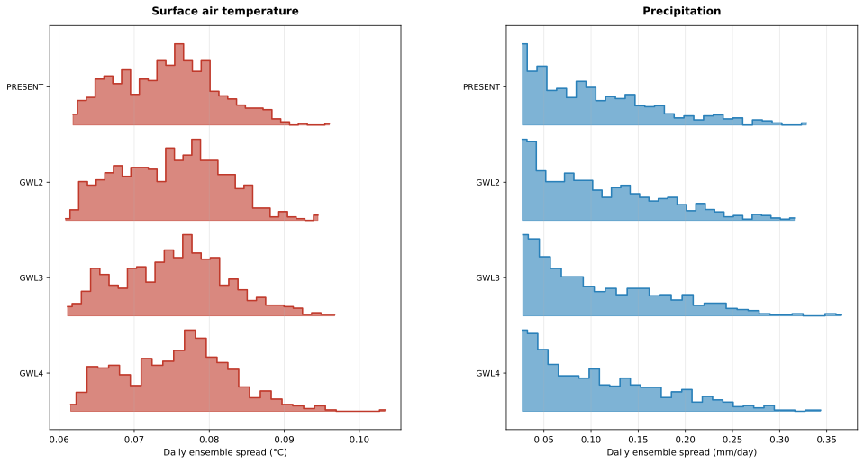
```

### Appendix D - Compute time and model parameters {#appendix-d}

#### Compute time
The training of the model for 20 epochs encompassed 28 hours on a single GPU.
The inference on the test set for the calibration period took about 2 hours.
The inference on the selected days for the projection period took 16 hours.

#### Model parameters
Below are the most relevant parameters of the model listed. Deviations from the @watt2024 implementation
result from reducing compute overhead. Further optimization of those parameters is an interesting direction for further work.

```{r hyperparameters, echo=FALSE}
hp <- data.frame(
  parameter = c(
    # Architecture
    "parameters", "model_channels", "in_channels", "out_channels",
    # Training
    "optimizer", "learning_rate", "batch_size", "num_epochs", "loss", "splits",
    # Sampler
    "solver", "num_steps", "sigma_min / sigma_max", "S_churn", "ensemble size"
  ),
  value = c(
    "24.4 M", "64", "6", "2",
    "AdamW", "1e-4", "32", "20", "EDM", "16 / 2 / 2 yr",
    "Heun (2nd order)", "40", "0.002 / 80", "40", "12 / 4"
  ),
  comment = c(
    "all trainable", "widths 64/128/192/256 over 4 levels",
    "2 noisy residual, 2 coarse, 2 static", "residual tas, pr",
    "weight decay 0.01", "ReduceLROnPlateau, factor 0.5, patience 3",
    "effective; batch 4 with gradient accumulation 8", "fixed budget",
    "P_mean -1.2, P_std 1.2", "2001-2016 / 2017-2018 / 2019-2020",
    "Karras noise schedule, rho 7", "denoising steps", "noise range",
    "stochastic noise re-injection", "reanalysis test / projection"
  )
)

kbl(
  hp,
  booktabs  = TRUE,
  linesep   = "",
  align     = c("l", "l", "l"),
  col.names = c("Parameter", "Value", "Comment"),
  caption   = "Model, training and sampler configuration. Derived quantities are given in the comment column rather than as separate entries."
) |>
  kable_styling(latex_options = "hold_position",
                bootstrap_options = "condensed",
                font_size = 9) |>
  row_spec(0, bold = TRUE, background = "#3f3f3f", color = "white") |>
  column_spec(1, monospace = TRUE, width = "3.6cm") |>
  column_spec(2, monospace = TRUE, width = "2.8cm") |>
  column_spec(3, width = "6.2cm") |>
  pack_rows("Architecture", 1, 4, background = "#efefef") |>
  pack_rows("Training", 5, 10, background = "#efefef") |>
  pack_rows("Sampler", 11, 15, background = "#efefef")
```