<!--- cover-image: images/cover.png -->


# Preface {-}

*Author: Henri Funk*


As the world faces the reality of climate change, natural hazards and extreme weather events have become a major concern, with devastating consequences for nature and humans. The quantification and definition of climate change, extreme events and its implications for life and health on our planet is one of the major concerns in climate science. 

This book explains current statistical methods in climate science and their application.
We do not aim to provide a comprehensive overview of all statistical methods in climate science, but rather to give an overview of the most important methods and their application.
This book is the outcome of the seminar "Climate and Statistics" which took place in summer 2026 at the Department of Statistics, LMU Munich.


This book is licensed under the [Creative Commons Attribution-NonCommercial-ShareAlike 4.0 International License](http://creativecommons.org/licenses/by-nc-sa/4.0/).


\mainmatter

## Technical Setup {-}

The book chapters are written in the Markdown language.
To combine R-code and Markdown, we used rmarkdown.
The book was compiled with the bookdown package.
We collaborated using git and github.
For details, head over to the [book's repository](https://github.com/henrifnk/Seminar_ClimateNStatistics).


<!--chapter:end:index.Rmd-->

---
output:
  pdf_document: default
  html_document: default
---


# Melting Perspectives on Uncertainty in Climate {#unc}

*Author: *

*Supervisor: Henri Funk*

*Degree: Bachelor/Master*

## Abstract

Lorem ipsum dolor sit amet, consectetur adipiscing elit. Sed do eiusmod tempor incididunt ut labore et dolore magna aliqua. Ut enim ad minim veniam, quis nostrud exercitation ullamco laboris nisi ut aliquip ex ea commodo consequat. Duis aute irure dolor in reprehenderit in voluptate velit esse cillum dolore eu fugiat nulla pariatur. Excepteur sint occaecat cupidatat non proident, sunt in culpa qui officia deserunt mollit anim id est laborum.

## Introduction

<!--chapter:end:01-climate_uncertainty.Rmd-->

---
output:
  pdf_document: default
  html_document: default
---


# Long-term drought prediction using deep neural networks based on geospatial weather data {#dp}

*Author: *

*Supervisor: Henri Funk*

*Degree: Master*

## Abstract

Lorem ipsum dolor sit amet, consectetur adipiscing elit. Sed do eiusmod tempor incididunt ut labore et dolore magna aliqua. Ut enim ad minim veniam, quis nostrud exercitation ullamco laboris nisi ut aliquip ex ea commodo consequat. Duis aute irure dolor in reprehenderit in voluptate velit esse cillum dolore eu fugiat nulla pariatur. Excepteur sint occaecat cupidatat non proident, sunt in culpa qui officia deserunt mollit anim id est laborum.

## Introduction

<!--chapter:end:02-drought_prediction.Rmd-->

---
output:
  pdf_document: default
  html_document: default
---


# Hydrology under Climate Change {#hyd}

*Author: Rong Bao*

*Supervisor: Henri Funk*

*Degree: Bachelor*

## Abstract

Streamflow integrates the weather, geology and land cover of an entire catchment into a single measured quantity, which makes it a natural indicator of hydrological change. At the same time, rivers are noisy: they swing between wet and dry years on their own, and this natural variability can mask a slow climate-driven trend for decades. This chapter asks when, where, and in which seasons the climate-change signal in Swiss river flows becomes detectable above natural variability — the *time of emergence* (ToE) [@hawkins2012] — and whether flow is increasing or decreasing. Using observed daily discharge from 209 quality-controlled catchments of the CAMELS-CH dataset (1981–2020) [@hoege2023], the climate signal is separated from noise with a robust STL decomposition [@cleveland1990], and emergence is declared when the signal-to-noise ratio (SNR) permanently exceeds a threshold of 1 (lenient) or 2 (strict). By 2020 only 19 of 209 rivers have emerged at the lenient threshold; extrapolating the robust Theil–Sen trend [@sen1968] suggests a median emergence year around 2046, while 73 rivers never emerge by 2100. Emergence is spatially structured: the low-elevation Jura and Plateau lead, while high Alpine regions are delayed in the annual analysis because winter increases and summer decreases partly cancel. A complementary per-season analysis shows that spring and summer are the sentinel seasons (about 70 % of rivers emerged by 2100), and reveals a seasonal redistribution of water: winter flows predominantly rise while summer flows predominantly fall. Estimated emergence years carry substantial uncertainty and should be read as indicative; the direction, ordering and spatial-seasonal pattern of change are the robust results.

## Introduction

Hydrology is the study of water moving through the landscape: rain and snow fall, water is stored in soil, snowpack and glaciers, and eventually reaches the rivers. Streamflow — the amount of water in a river — is special among climate indicators because it aggregates the meteorological forcing and physical properties of a whole catchment into one number that is measured operationally, often for many decades.

One difficulty runs through any attempt to detect climate change in river flow: rivers are noisy. Even without any external forcing, discharge fluctuates strongly between wet and dry years and between decades. Natural variability in this sense is the year-to-year and decade-to-decade swing a river shows on its own; it has no long-term trend and averages to zero over time. A forced climate signal only becomes *detectable* once it has grown large relative to this background — the concept of the time of emergence, introduced for temperature by @hawkins2012 and since applied across climate variables.

The way around the noisiness of individual records is scale: analysing not one river but hundreds at once. This is exactly what the recent *large-sample hydrology* datasets enable. The research question of this chapter is therefore:

> **When, where, and in which seasons does the climate-change signal in Swiss streamflow become detectable above natural variability — and is the flow increasing or decreasing?**

## Data

### The CAMELS family

Large-sample hydrology requires data for hundreds of catchments in one consistent format. CAMELS ("Catchment Attributes and MEteorology for Large-sample Studies") datasets package, for every gauged catchment in a region, three matched data types: (i) daily streamflow at the gauge, (ii) catchment-averaged meteorology (precipitation, temperature, potential evapotranspiration), and (iii) static attributes describing topography, climate, soil, geology and land cover [@addor2017]. Following the original US dataset, national versions exist for Great Britain [@coxon2020], Brazil [@chagas2020], Central Europe [@klingler2021] and North America [@arsenault2020], among others, and the Caravan initiative merges them into a global community dataset [@kratzert2023].

### CAMELS-CH and the case for Switzerland

CAMELS-CH is the Swiss member of this family [@hoege2023]. It covers 331 catchments in hydrologic Switzerland over 40 years (1981–2020); about one third of the catchments extend into neighbouring countries. This chapter uses two components: the **observed** daily specific discharge (mm d^-1^) — simulated series are deliberately excluded, because the goal is to identify emergence directly from observations — and the catchment boundary polygons, needed to assign every gauge to a reporting region.

Switzerland is a natural laboratory for this question. It is often called the "water tower of Europe", holding the largest share of the Alpine glacier mass, and change is already visible throughout its water cycle: Alpine snow cover has declined by more than 8 % per decade since the early 1970s [@matiu2021], glaciers have lost about half of their volume since 1931 [@mannerfelt2022], flood frequency has increased in parts of the country since around 1970 [@schmockerfackel2010], and the Alps are literally turning greener [@rumpf2022]. The broader water cycle is clearly changing; the precise question here is when that change becomes statistically visible in river discharge itself.

### Regions and preprocessing

For reporting, catchments are grouped into the seven official FOEN bio-geographic regions (Fig. \@ref(fig:hyd-regions)): Jura, the Black Forest border area, the Plateau, and the four Alpine regions Alps North, West, South and East. This grouping matters because Switzerland is not hydrologically uniform — a low-elevation Plateau river and a high Alpine snowmelt river can respond very differently to warming. Regions are assigned by spatial overlay of the official region polygons with the CAMELS-CH catchment polygons; each catchment is assigned to the region covering the largest share of its area. About 20 % of catchments cross a regional boundary.

<div class="figure" style="text-align: center">
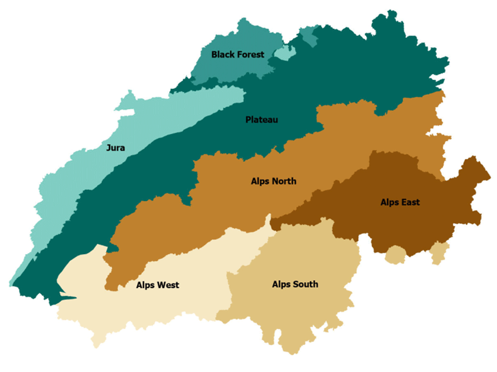
<p class="caption">(\#fig:hyd-regions)The seven FOEN bio-geographic regions of Switzerland used for reporting. Adapted from @hoege2023 (Fig. 4); region polygons: Swiss Federal Office for the Environment (FOEN).</p>
</div>

Three preparation steps precede the analysis. First, daily discharge is aggregated to quarterly means using climatological seasons (DJF, MAM, JJA, SON; December is assigned to the following year's winter). Second, quality control: a quarter with more than 5 % of daily values missing is dropped, and a station is excluded entirely if any of its seasonal series is more than 20 % incomplete. After filtering, **209 of the 331 rivers** remain. Third, the regional assignment described above.

## Methods

### Signal versus noise

Any observed change in river flow can be decomposed into a forced, climate-related **signal** and **noise** — natural variability including wet and dry years and extreme events that are not part of the long-term trend. A signal is detectable only when it is large compared with the noise, which motivates a signal-to-noise framework.

### STL decomposition

Alpine rivers have a strong seasonal cycle — high flow in the melt season, low flow in winter — which would dominate the analysis and inflate the noise if left in the series. STL (Seasonal-Trend decomposition using Loess) [@cleveland1990] writes the observed quarterly flow $Y_t$ as three additive components,

$$
Y_t = T_t + S_t + R_t,
$$

where $T_t$ is the slowly varying **trend** (used as the signal), $S_t$ the regular within-year **seasonal cycle**, and $R_t$ the **remainder** (used to estimate the noise).

STL assumes no parametric model; every component is built from one smoother, loess, applied inside two nested loops. Loess estimates the value at a target time $x$ by taking the $q$ nearest observations, scaling their distances by $\lambda_q(x)$, the distance to the $q$-th nearest neighbour, down-weighting more distant points, and fitting a locally weighted regression. The **inner loop** alternates between updating the seasonal component — smoothing each seasonal subseries (all winters together, all springs together, …) and removing leftover trend with a low-pass filter — and updating the trend by smoothing the deseasonalised series. The **outer loop** makes the procedure robust: points with extreme remainders receive small (or zero) robustness weights before the inner loop is repeated. This matters hydrologically because flood and drought years are real but should not bend the long-term trend; here the outer loop is iterated 15 times.

### Signal, noise, and time of emergence

The reference period is **1981–2000** (80 quarterly values), treated as the pre-change baseline. The signal at time $t$ is the STL trend relative to its baseline mean, and the noise $\sigma_N$ is the standard deviation of the STL remainder over the same period, so every river is scaled by its own baseline variability:

$$
\mathrm{SNR}(t) \;=\; \frac{T_t - \overline{T}_{\mathrm{ref}}}{\sigma_N},
\qquad
\sigma_N = \mathrm{sd}\!\left(R_t \,\middle|\, t \in \text{1981–2000}\right).
$$

The **time of emergence** is the first year in which $|\mathrm{SNR}(t)|$ crosses a threshold and stays beyond it until the end of the record. Two thresholds are reported, following the time-of-emergence literature [@hawkins2012]: a lenient level $|\mathrm{SNR}| \ge 1$ and a strict level $|\mathrm{SNR}| \ge 2$.

To extend the analysis beyond 2020, the trend is extrapolated with the **Theil–Sen slope** [@sen1968]: the median of the slopes between all pairs of time points (12,720 pairwise slopes for 160 quarters). The median is stable because a single extreme event can affect some pairs but cannot easily control the middle of the distribution.

### A worked example

Figures \@ref(fig:hyd-stl-overlay) and \@ref(fig:hyd-stl-snr) illustrate the pipeline for gauge 2219. The observed quarterly series (grey) is strongly seasonal and noisy; STL separates the seasonal cycle (pink: trend + seasonality) from the smooth trend (blue). For this river the baseline trend mean is 5.40 mm d^-1^ and the baseline noise is 0.89 mm d^-1^. The Theil–Sen slope is positive, about +0.22 mm d^-1^ per decade, so this river is getting wetter in the trend component. By 2020 the SNR reaches 0.67 — below the lenient threshold, so the signal has not yet emerged within the observed record; extrapolation puts lenient emergence at 2034 and strict emergence at 2073.

<div class="figure" style="text-align: center">
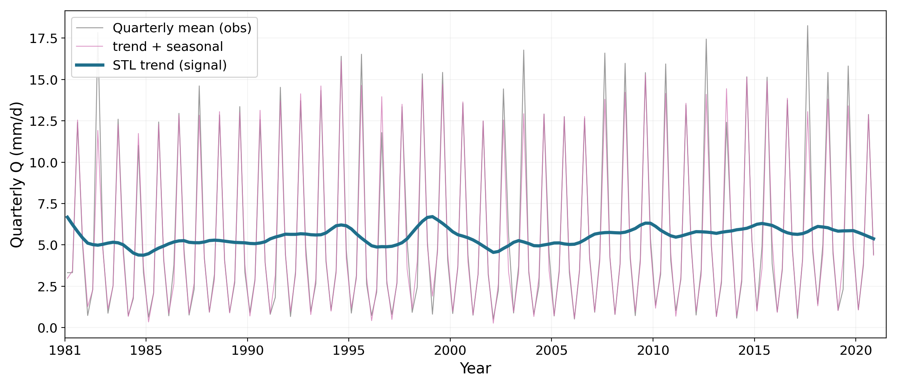
<p class="caption">(\#fig:hyd-stl-overlay)Worked example (gauge 2219): observed quarterly flow (grey), STL trend plus seasonality (pink) and STL trend (blue).</p>
</div>

<div class="figure" style="text-align: center">
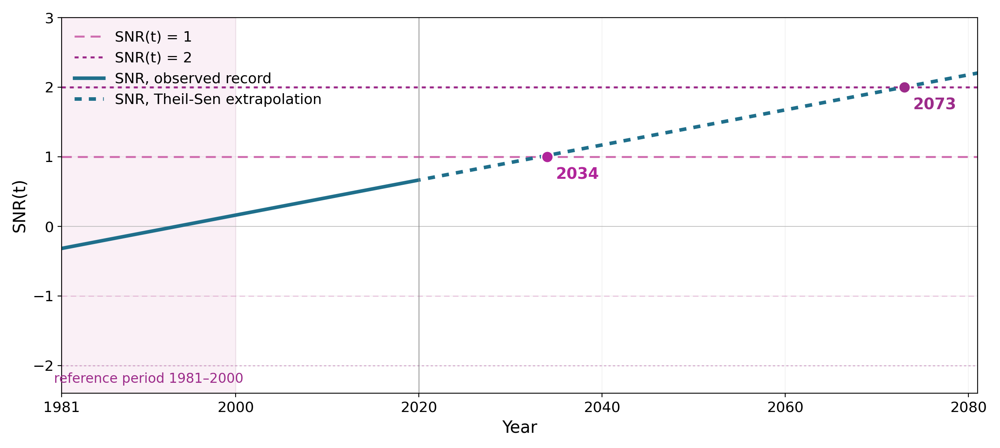
<p class="caption">(\#fig:hyd-stl-snr)Worked example (gauge 2219): the trend standardised by baseline noise, with the lenient and strict emergence thresholds and the extrapolated Theil–Sen trend.</p>
</div>

## Results

### Annual emergence and threshold sensitivity

Across all 209 analysable rivers, the choice of threshold matters greatly for the numbers but not for the conclusion (Table \@ref(tab:hyd-thresholds)). At the lenient threshold, 19 rivers have already emerged by 2020, another 117 are projected to emerge by 2100 (median emergence year around 2046), and 73 never emerge by 2100. At the strict threshold only 2 rivers have emerged, 71 are projected to emerge, and 136 never do. Either way, most annual-flow emergence is not yet visible in 2020 — it happens after mid-century.


Table: (\#tab:hyd-thresholds)Threshold sensitivity of annual emergence (209 rivers).

|Threshold                                  | Emerged by 2020| Projected 2021--2100| Never by 2100|
|:------------------------------------------|---------------:|--------------------:|-------------:|
|Lenient ($\lvert\mathrm{SNR}\rvert \ge 1$) |              19|                  117|            73|
|Strict ($\lvert\mathrm{SNR}\rvert \ge 2$)  |               2|                   71|           136|

How certain are these years? Of the 136 rivers that emerge at the lenient threshold, only 19 do so within the observed record; all other years are extrapolations. Each estimated year therefore carries an error bar — formally about ±5 years, realistically 10–20 years, widening into the future (Fig. \@ref(fig:hyd-uncertainty)). The direction and the *ordering* of emergence are trustworthy; any single year should be read as ±a decade, and anything past 2080 as indicative only.

<div class="figure" style="text-align: center">
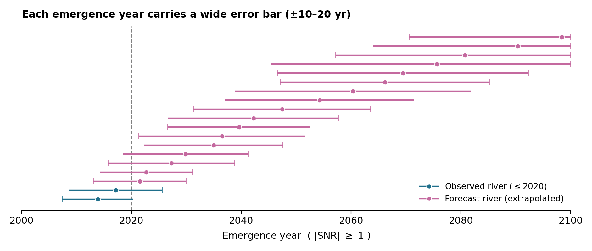
<p class="caption">(\#fig:hyd-uncertainty)Uncertainty of estimated emergence years: the dark band shows the formal range (about $\pm$5 years), the pale band a realistic range (10--20 years), widening into the future.</p>
</div>

### Regional patterns: low elevations lead

Emergence is spatially structured (Fig. \@ref(fig:hyd-extent-region)). The low-to-mid elevation regions climb fastest: by 2050 the Jura reaches 78 % emerged and the Plateau 62 %. The high Alpine regions are slower — Alps North, East and South reach only about 40–60 % by 2100, with Alps South slowest at roughly 40 %. This may seem surprising given how strongly the Alps are affected by warming, but in high Alpine catchments winter *increases* and summer *decreases* can partly cancel in the annual mean, delaying annual emergence — a first hint that the annual perspective hides the real fingerprint.

<div class="figure" style="text-align: center">
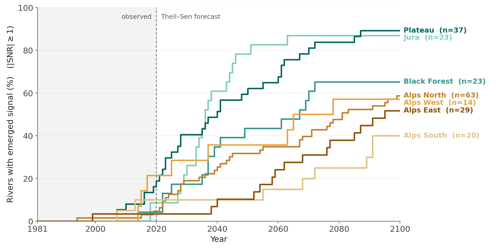
<p class="caption">(\#fig:hyd-extent-region)Cumulative share of rivers with an emerged annual signal over time, by bio-geographic region (lenient threshold).</p>
</div>

### Seasonal analysis: spring and summer as sentinels

Climate change in Alpine hydrology has a seasonal fingerprint: snow storage, snowmelt timing, glacier melt and rainfall affect different seasons differently. For each gauge, four annual series are built (one value per year for DJF, MAM, JJA, SON). Since each series has one value per year, no within-year cycle remains and STL is not re-applied; instead the signal is a Theil–Sen robust line, the noise is the standard deviation of detrended residuals over 1981–2000, and the emergence rule is unchanged.

By 2020 the emerged share is still around 10 % in every season; the seasons then separate (Fig. \@ref(fig:hyd-seasonal-curves)). By 2050 spring, summer and autumn reach about 40–44 % while winter lags at 31 %; by 2100 spring reaches 71 % and summer 70 %, against 59 % in autumn and 53 % in winter. **Spring and summer are the sentinel seasons** — not the only seasons changing, but those where emergence becomes most widespread.

<div class="figure" style="text-align: center">
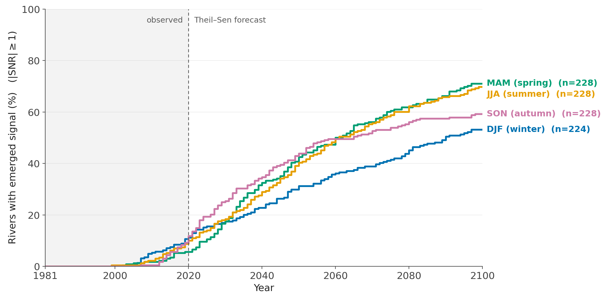
<p class="caption">(\#fig:hyd-seasonal-curves)Emerged share of rivers over time for each season (lenient threshold).</p>
</div>

### Direction of change: winter up, summer down

The directional split is clean (Fig. \@ref(fig:hyd-direction-bars)). Winter is the only season where rises dominate: 39 % of winter rivers show a rising signal by 2100 against 14 % falling. Every other season is dominated by declines, most extremely summer, where 64 % of rivers decline and only 6 % rise. A plausible mechanism is the classic Alpine fingerprint: warming turns winter snowfall into rain and shifts snowmelt earlier, so more water leaves in winter and less meltwater remains for summer. The data thus show a *seasonal redistribution* of water — more flow in winter, less in the rest of the year — which is partly hidden in annual averages.

<div class="figure" style="text-align: center">
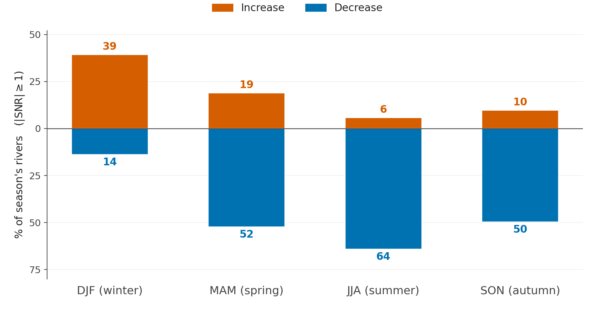
<p class="caption">(\#fig:hyd-direction-bars)Share of rivers per season whose signal emerges by 2100 with rising versus falling direction (lenient threshold); the gap to 100\% corresponds to rivers that never emerge.</p>
</div>

The direction also varies systematically by region (Fig. \@ref(fig:hyd-direction-region)). Winter increases are concentrated in the high Alps (86 % of emerged rivers rising in Alps South, 80 % in Alps East), while low regions are mixed. In summer, declines dominate everywhere (83 % in Alps East, 76 % in Alps West, 71 % in Alps North, 60 % on the Plateau). Spring shows the sharpest contrast: strongly decreasing in the low regions (Jura 96 %, Plateau 76 %, Black Forest 71 %) while the western, southern and eastern Alps retain 43–47 % increasing shares. In autumn, decreases dominate almost everywhere (Jura 100 %, Alps West 88 %, Plateau 67 %). The winter-up signal is an Alpine signal; the decreases appear first and most completely in the low regions.

<div class="figure" style="text-align: center">
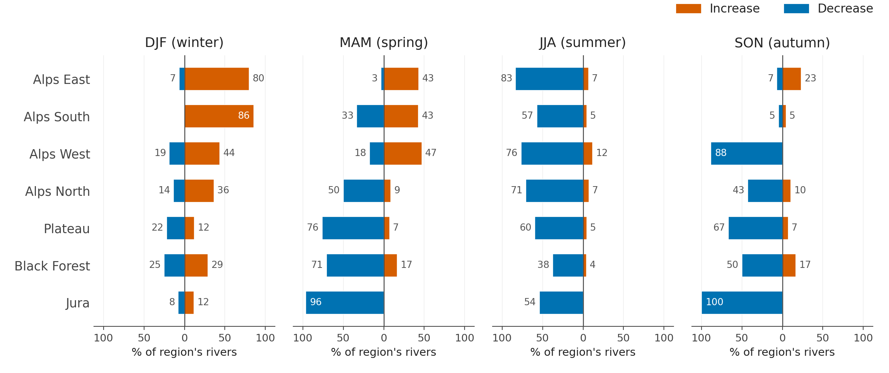
<p class="caption">(\#fig:hyd-direction-region)Direction of the emerged signal by 2100, split by season and bio-geographic region: share of emerged rivers with rising (red) versus falling (blue) flow.</p>
</div>

Finally, the season-by-region heatmap (Fig. \@ref(fig:hyd-heatmap)) gives the fine structure of emergence extent by 2100. In winter, emergence climbs with elevation, from 19 % in the Jura to 86–87 % in Alps South and East. Spring is almost the mirror image, strongest in the low regions (Jura 96 %, Black Forest 88 %, Plateau 83 %) and weakest in Alps East (47 %). Summer peaks in the Alps (Alps East 90 %, Alps West 88 %, Alps North 78 %), and autumn is the most uneven row (Jura 100 %, Alps West 88 %, but Alps South only 10 %). Every region has at least one season with high emergence — but *which* season differs systematically.

<div class="figure" style="text-align: center">
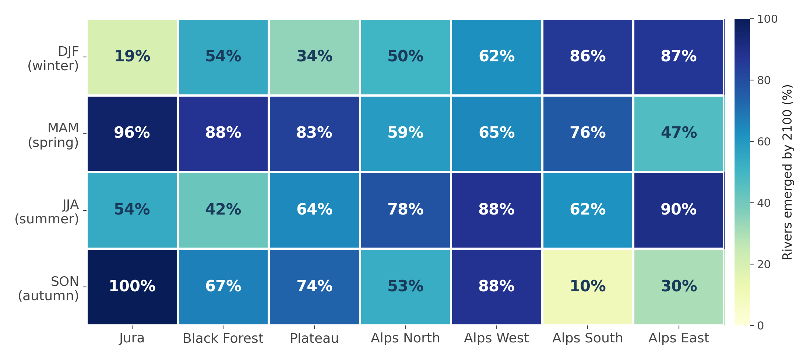
<p class="caption">(\#fig:hyd-heatmap)Season-by-region heatmap: share of rivers whose signal emerges by 2100 at the lenient threshold, in either direction.</p>
</div>

## Conclusion

Five points summarise this chapter. **Method**: the signal is the STL trend relative to the 1981–2000 baseline, scaled by baseline noise; emergence is the first lasting crossing of an SNR threshold. **Timing**: of 209 rivers, only 19 have emerged by 2020 at the lenient threshold; the median projected emergence year is around 2046, and 73 rivers never emerge by 2100. **Geography**: the Jura and Plateau lead (62–78 % emerged by 2050), while the high Alpine regions are slower in the annual analysis. **Season**: spring and summer are the sentinel seasons, each reaching about 70 % of rivers emerged by 2100. **Direction**: winter up, summer down — winter is the only season where rises dominate (39 % of rivers), while summer declines most (64 % falling).

The strength of this analysis lies in the direction, the spatial and seasonal pattern, and the *relative* timing of change — which regions and seasons emerge earlier than others. The specific emergence years are estimates with substantial error bars; their value is comparative, not predictive. A useful monitoring strategy for Swiss rivers should therefore be seasonal and regional, not only national and annual.

<!--chapter:end:03-hydrology_cc.Rmd-->

# Neural Hydrology {#nh-neural-hydrology}

*Author: Yuxin Qiu*  
*Supervisor: Henri Funk*  
*Degree: Bachelor*

## Abstract {#nh-abstract}

Hydrological prediction under climate variability is a central challenge in environmental
statistics, especially when regional observations are limited and hydro-climatic
conditions deviate from historical norms. This chapter presents a detailed investigation
of neural hydrology, with emphasis on recurrent deep learning architectures and transfer
learning strategies for streamflow forecasting. We first position neural methods in
relation to classical process-based models, then formalize sequence-learning principles
that allow Long Short-Term Memory (LSTM) networks to represent delayed catchment memory
effects. We further examine physically informed variants, including mass-conserving
architectures, as mechanisms to improve structural plausibility under distributional
shift.

The empirical component uses CAMELS-US data and a three-way comparison framework across
local-from-scratch training, global pretraining, and global-to-local fine-tuning over
18 geographic groups. Results are analyzed with basin-weighted NSE and KGE, group-level
contrasts, basin-level distributional diagnostics, and architecture cross-checks. Across
evaluation views, fine-tuning provides consistent gains over local-only baselines and
additional improvement over zero-shot global inference in this benchmark setting.
Interpretation is framed through bias-variance trade-offs, representation reuse, and
regional adaptation dynamics.

Overall, the chapter argues that neural hydrology should be understood not merely as a
high-performance forecasting tool, but as a statistical modeling framework where
data-driven representation learning, physical constraints, and transfer protocols can be
jointly optimized for robust prediction under non-stationary climate conditions.

## Introduction {#nh-introduction}

Streamflow prediction, that is, estimating river discharge from meteorological forcings,
is one of the oldest and most consequential tasks in hydrology. Accurate forecasts are
critical for flood early-warning systems, reservoir operation, drought monitoring, and
hydropower planning. Under climate change, this task becomes harder because forcing
regimes are increasingly non-stationary: precipitation intensity distributions,
temperature seasonality, and snowmelt timing all shift over time [@ipcc2021].

This chapter reviews the emergence of deep learning as the leading paradigm for
data-driven streamflow modelling, introduces the **NeuralHydrology** Python library,
discusses architectures that embed physical constraints into neural networks, and
explores strategies for transfer learning in a non-stationary climate.

From a statistical perspective, the central object is a conditional forecasting function
$f_\theta$ that maps a multivariate hydro-meteorological history and static basin
descriptors to a discharge distribution:

$$
\hat{q}_{t+\tau} \sim f_\theta\Big(\mathbf{x}_{1:t}, \mathbf{z}, \tau\Big),
$$

where $\mathbf{x}_{1:t}$ denotes dynamic forcings up to time $t$, $\mathbf{z}$ denotes
time-invariant basin attributes, and $\tau$ is the lead-time index. In deterministic
setups, one models the conditional mean $\mathbb{E}[q_{t+\tau}\mid\mathbf{x}_{1:t},\mathbf{z}]$;
in probabilistic setups, one models the full predictive density
$p(q_{t+\tau}\mid\mathbf{x}_{1:t},\mathbf{z})$.

The hydrological difficulty is that this map is high-dimensional, nonlinear, delayed,
and non-stationary. Hence, the chapter emphasizes three scientific questions:

1. How can sequence models approximate memory-dependent rainfall-runoff dynamics?
2. How can physical constraints improve plausibility under extrapolation?
3. How can transfer learning reduce estimation variance in data-scarce regions?

---

## Background: From Process-Based to Data-Driven Models {#nh-background}

### Traditional Process-Based Models

Classical hydrological models describe catchment behaviour through systems of differential
equations representing physical processes: precipitation infiltration, evapotranspiration,
soil moisture routing, and channel flow. Well-known examples include:

- **HBV** (Hydrologiska Byrans Vattenbalansavdelning)  -  a bucket-type conceptual model
- **VIC** (Variable Infiltration Capacity)  -  a distributed land-surface model
- **SAC-SMA** (Sacramento Soil Moisture Accounting)  -  used operationally by NOAA

These models are physically interpretable and operate well in data-sparse settings.
However, they suffer from three fundamental limitations:

1. **Parameter estimation**  -  many parameters (soil depth, hydraulic conductivity,
   recession coefficients) cannot be measured directly and must be calibrated
   separately for each catchment.
2. **Spatial heterogeneity**  -  parameter sets calibrated for one catchment cannot be
   directly transferred to ungauged basins.
3. **Non-stationarity**  -  parameters calibrated under historical climate conditions may
  not hold under future climate forcing [@milly2008].

### Process-Based Formulation and Structural Error

For a conceptual catchment model, storage dynamics can be represented generically as:

$$
S_{t+1} = S_t + P_t - ET_t - Q_t - L_t,
$$

where $S_t$ is catchment storage, $P_t$ precipitation input, $ET_t$ evapotranspiration,
$Q_t$ discharge, and $L_t$ unobserved losses (deep percolation, abstraction, or closure
error). Practical model implementations replace these terms with parameterized
constitutive relationships, for example:

$$
Q_t = g_\phi(S_t, \mathbf{u}_t), \quad ET_t = h_\psi(S_t, T_t, R_t, V_t),
$$

with calibration parameters $(\phi,\psi)$ and meteorological covariates $\mathbf{u}_t$.
Calibration thus solves an inverse problem that is often ill-posed: multiple parameter
sets can yield similar hydrographs (equifinality), while parameter meaning can vary with
the chosen process simplifications.

This generates two conceptually different errors:

1. **Parametric uncertainty**: insufficient data to identify parameters uniquely.
2. **Structural uncertainty**: omitted or misspecified process mechanisms.

Deep learning approaches primarily target structural flexibility by reducing the need to
prescribe low-dimensional process forms a priori.

### The Deep Learning Breakthrough

The pivotal step came in 2018 when @kratzert2018 demonstrated that a standard
Long Short-Term Memory (LSTM) network, trained on the
**CAMELS-US** dataset [@addor2017] of 241 catchments, outperformed all
individually calibrated conceptual models - without any catchment-specific calibration.
The LSTM's ability to learn temporal dependencies, coupled with its capacity to exploit
information from hundreds of basins simultaneously, created a step change in the field.

---

## LSTM-Based Methods for Streamflow Modelling {#nh-lstm-methods}

### The LSTM Architecture {#nh-lstm-arch}

The LSTM [@hochreiter1997] maintains a **cell state** $\mathbf{c}_t$ as an internal
memory and uses three gating mechanisms to regulate information flow:

$$\mathbf{i}_t = \sigma(\mathbf{W}_i [\mathbf{h}_{t-1}, \mathbf{x}_t] + \mathbf{b}_i)$$
$$\mathbf{f}_t = \sigma(\mathbf{W}_f [\mathbf{h}_{t-1}, \mathbf{x}_t] + \mathbf{b}_f)$$
$$\mathbf{g}_t = \tanh(\mathbf{W}_g [\mathbf{h}_{t-1}, \mathbf{x}_t] + \mathbf{b}_g)$$
$$\mathbf{o}_t = \sigma(\mathbf{W}_o [\mathbf{h}_{t-1}, \mathbf{x}_t] + \mathbf{b}_o)$$
$$\mathbf{c}_t = \mathbf{f}_t \odot \mathbf{c}_{t-1} + \mathbf{i}_t \odot \mathbf{g}_t$$
$$\mathbf{h}_t = \mathbf{o}_t \odot \tanh(\mathbf{c}_t)$$

where $\mathbf{i}_t$, $\mathbf{f}_t$, $\mathbf{o}_t$ are the input, forget, and output
gates respectively; $\sigma$ is the sigmoid function; and $\odot$ denotes element-wise
multiplication. At each time step the model receives a vector of dynamic inputs
(precipitation, temperature, solar radiation) as $\mathbf{x}_t$ and the previous
hidden state $\mathbf{h}_{t-1}$.

Crucially, the **forget gate** $\mathbf{f}_t$ allows the network to selectively retain
long-term memory  -  enabling it to capture multi-month hydrological memory effects such
as groundwater recharge and snowpack accumulation, which are notoriously difficult to
represent in conceptual models.

### Optimization Objective and Gradient Flow

Given a training sample $\mathcal{D}=\{(\mathbf{x}^{(n)}_{1:T}, q^{(n)}_{1:T})\}_{n=1}^N$,
LSTM training minimizes an empirical risk:

$$
\min_\theta \; \frac{1}{N}\sum_{n=1}^N \mathcal{L}\big(q^{(n)}_{1:T}, f_\theta(\mathbf{x}^{(n)}_{1:T})\big) + \lambda\,\Omega(\theta),
$$

where $\mathcal{L}$ may be MSE/NSE-related and $\Omega$ denotes regularization
(e.g., dropout-induced stochastic regularization and implicit optimizer bias). The LSTM
cell-state pathway improves gradient transport because
$\partial \mathbf{c}_t / \partial \mathbf{c}_{t-1} = \mathbf{f}_t$, allowing long-range
credit assignment when forget-gate activations remain away from zero. In hydrology,
this is directly relevant for delayed runoff generation and snow-storage dynamics.

From a system-identification viewpoint, the recurrent state acts as a latent storage
vector whose components are not physically named but can encode multi-timescale memory.
This latent-state interpretation is one reason LSTMs outperform short-memory models in
daily rainfall-runoff tasks.

### From Single-Basin to Multi-Basin: EA-LSTM {#nh-ea-lstm}

@kratzert2019 extended the single-basin LSTM to **simultaneous multi-basin training**
using the Entity-Aware LSTM (EA-LSTM). The key modification is that the **input gate**
is conditioned on *static* catchment attributes $\mathbf{x}_s$ (soil type, terrain
slope, land cover, climate indices) rather than the dynamic sequence:

$$\mathbf{i}_t = \sigma(\mathbf{W}_i \mathbf{x}_s + \mathbf{b}_i)$$

This allows the same model to adapt its memory behaviour to each catchment's physical
characteristics, effectively learning a *regional* function that maps catchment
attributes to hydrological response. In the benchmark on 531 CAMELS-US basins, the
EA-LSTM substantially outperformed the best process-based baseline
(SAC-SMA), indicating a clear performance advantage in this benchmark setting.

### Hierarchical Interpretation of EA-LSTM

EA-LSTM can be interpreted as a hierarchical model with partial pooling across basins.
Dynamic parameters are globally shared, while the static-attribute-conditioned gate
induces basin-specific modulation. In that sense, EA-LSTM approximates a data-driven
random-effects structure:

$$
f_{\theta}(\mathbf{x}_{1:t}, \mathbf{z}) = f_{\theta_g,\theta_b(\mathbf{z})}(\mathbf{x}_{1:t}),
$$

where $\theta_g$ are global sequence parameters and $\theta_b(\mathbf{z})$ are
attribute-conditioned adjustments. This architecture balances bias and variance more
effectively than independent local calibration in low-sample basins.

### Evaluation Metrics: NSE and KGE

We evaluate predictive skill using two complementary metrics. The
**Nash-Sutcliffe Efficiency** (NSE) is defined as:

$$
  \text{NSE} = 1 - \frac{\sum_{t=1}^{T}(\hat{q}_t - q_t)^2}{\sum_{t=1}^{T}(\bar{q} - q_t)^2}.
$$

An NSE of 1 indicates a perfect model; NSE = 0 means the model is no better than the
climatological mean; negative NSE indicates the model is worse than the mean.

To complement NSE, we report the **Kling-Gupta Efficiency** (KGE):

$$
  \text{KGE} = 1 - \sqrt{(r-1)^2 + (\alpha-1)^2 + (\beta-1)^2},
$$

where

$$
r = \mathrm{corr}(\hat{q}, q), \qquad
\alpha = \frac{\sigma_{\hat{q}}}{\sigma_q}, \qquad
\beta = \frac{\mu_{\hat{q}}}{\mu_q}.
$$

Using both NSE and KGE reduces the risk of over-interpreting a single metric and helps
separate timing, variability, and bias effects.

---

## NeuralHydrology: A Python Library for Deep Learning in Hydrology {#nh-lib}

**NeuralHydrology** [@kratzert2022joss] is an open-source Python library developed at
the Institute for Machine Learning, Johannes Kepler University Linz, built on top of
PyTorch. Its design philosophy emphasises *modularity*: new datasets, model
architectures, loss functions, and training strategies can be added without modifying
the core framework.

### Key Features

- **Configuration-file driven**  -  experiments are fully specified in `.yml` files,
  enabling reproducibility without touching source code.
- **Model zoo**  -  a diverse set of pre-implemented architectures (see Section \@ref(nh-modelzoo)).
- **Dataset zoo**  -  native support for CAMELS-US, CAMELS-GB, CAMELS-DE, CAMELS-AUS,
  CAMELS-CL, LamaH, Caravan, and a generic interface for custom datasets.
- **Evaluation**  -  built-in NSE, KGE, MSE, RMSE and signature-based metrics.
- **Probabilistic heads**  -  GMM, CMAL, UMAL for uncertainty quantification.

From a computational reproducibility standpoint, the configuration-driven interface is
scientifically important: it creates explicit, versionable experiment declarations.
This improves methodological traceability and reduces hidden researcher degrees of
freedom during iterative experimentation.

### Model Zoo {#nh-modelzoo}

| Model | Architecture | Key Idea |
|-------|-------------|----------|
| **CudaLSTM** | Standard LSTM | Baseline; uses CUDA-optimised PyTorch implementation |
| **EA-LSTM** | Entity-Aware LSTM | Static features condition input gate [@kratzert2019] |
| **MC-LSTM** | Mass-Conserving LSTM | Precipitation mass budget enforced [@hoedt2021] |
| **MTS-LSTM** | Multi-Timescale LSTM | Joint training at daily and hourly resolution [@gauch2021] |
| **ODE-LSTM** | ODE-based LSTM | Continuous-time dynamics for irregular sampling |
| **Transformer** | Self-attention | Captures global temporal dependencies |
| **Mamba** | State-space model | Linear-time sequence modelling [@gu2023] |
| **xLSTM** | Extended LSTM | Exponential gating [@beck2024] |
| **HybridModel** | LSTM + conceptual | Neural parameterisation of process models |

A minimal training configuration looks as follows:

```yaml
# config.yml  -  single basin LSTM example
experiment_name: camels_us_lstm_demo
model: cudalstm
hidden_size: 256
initial_forget_bias: 3
output_dropout: 0.4
loss: NSE
optimizer: Adam
learning_rate:
  0: 1e-3
  10: 5e-4
epochs: 30
seq_length: 365
dataset: camels_us
dynamic_inputs:
  - PRCP(mm/day)_nldas
  - tmax(C)_daymet
  - tmin(C)_daymet
  - srad(W/m2)_daymet
  - vp(Pa)_daymet
target_variables:
  - QObs(mm/d)
```

Training is launched from the command line:

```bash
uv run nh-run train --config-file config.yml
```

In reproducible workflows, this CLI-level specification should be complemented with
fixed random seeds, logged software versions, and immutable run directories. Together,
these reduce procedural variance when comparing architectures or transfer settings.

---

## Transfer Learning in a Changing Climate {#nh-transfer}

### Motivation

Under climate change, hydrological systems are subject to **non-stationarity**: the
statistical relationship between climate forcing and streamflow may shift due to
changing land cover, permafrost thaw, or altered precipitation seasonality
[@milly2008]. A model trained on historical data may fail under future conditions if it
has over-fitted to the historical distribution.

Transfer learning offers a principled solution: pre-train a model on a large, diverse
dataset, then adapt it to a target domain or future scenario with limited additional
data.

### Transfer Learning as Risk Decomposition

Let $\mathcal{R}_T(\theta)$ be expected target-domain risk. Transfer learning seeks a
parameter initialization $\theta_0$ from source-domain training such that fine-tuned
optimization reaches a low-risk basin for $\mathcal{R}_T$ with fewer target samples.
Intuitively, pretraining reduces estimation variance by starting from a representation
already aligned with hydrological structure (seasonality, recession behavior, storage
memory), while fine-tuning reduces target-domain bias.

This yields a practical bias-variance trade-off:

1. local-from-scratch: low transfer bias potential, high variance;
2. global zero-shot: low variance, possibly higher target bias;
3. global + fine-tune: compromise with lower variance and reduced target bias.

### Pre-Train on Large-Sample Data {#nh-pretrain}

The first step is training on the full CAMELS dataset (531 basins across the
continental United States, or multi-country datasets like Caravan [@kratzert2023caravan]
with >6000 basins). This exposes the model to a wide range of climates, soils, and
land covers, building a general-purpose hydrological encoder.

### Fine-Tuning Strategies {#nh-finetune}

NeuralHydrology supports fine-tuning via the configuration:

```yaml
finetune_modules:
  - head
finetune_epoch: 30
base_run_dir: /path/to/pretrained/run
```

Three strategies are commonly used:

1. **Head-only fine-tuning**  -  freeze the LSTM body, retrain only the linear output head on target-basin data. Fast; suitable for small data budgets.
2. **Full fine-tuning**  -  unfreeze all layers, fine-tune with a small learning rate. Higher capacity; risk of catastrophic forgetting.
3. **Layer-wise fine-tuning**  -  unfreeze layers progressively from output to input. Balances adaptation and retention of general features.

In small-sample hydrology, catastrophic forgetting is a concrete concern. If learning
rates are too high or too many layers are unfrozen immediately, basin-specific updates
can overwrite globally useful runoff representations. Layer-wise schedules and reduced
fine-tuning rates are therefore not just engineering heuristics, but stability controls
for representation retention.

@frame2022 showed that LSTMs pre-trained on multi-basin data and fine-tuned on a single
target basin significantly outperform models trained from scratch on the target basin
alone, even when the target basin lies in a climate zone absent from pre-training data.

### Climate Change Scenarios {#nh-climate-scenarios}

For future projections, one strategy is **delta-change forcing**: apply projected
changes from a GCM (e.g., CMIP6 precipitation and temperature anomalies) on top of
historical forcing before feeding into the pre-trained neural model. The key challenge
is that the model may extrapolate poorly to precipitation intensities or temperature
regimes outside its training distribution.

@hoedt2021 argue that **physically consistent architectures** (such as MC-LSTM) are
inherently more robust to distributional shift, because the mass conservation
constraint prevents unphysical predictions even under novel forcing conditions.

A useful formal perspective is covariate shift:

$$
p_{\text{train}}(\mathbf{x}) \neq p_{\text{test}}(\mathbf{x}), \quad p(q\mid\mathbf{x}) \approx \text{partially shifted},
$$

where climate change modifies forcing distributions (extremes, seasonality,
co-occurrence structure). Architectures with structural priors can reduce error growth
under such shifts by preventing implausible state transitions.

---

## Empirical Study: Regional Transfer Learning Under Data Scarcity {#nh-case-study}

### Study Design and Data

To move beyond conceptual discussion, we evaluate transfer learning in a controlled,
three-way comparison benchmark built on CAMELS-US and implemented with NeuralHydrology.

The design intentionally separates three distinct learning regimes:

1. **Local (from scratch)**: train only on target-group basins with random
   initialization.
2. **Global (zero-shot)**: evaluate the globally pre-trained model directly on each
   target group.
3. **Global + Fine-tune**: initialize from global weights and adapt on target-group
   basins.

The benchmark covers **18 geographic groups** and **531 basins** in total. Dynamic
inputs are Daymet forcing variables and the target is daily streamflow.

Temporal splitting follows a non-contiguous design to stress out-of-distribution
generalization:

- Train: 1999-10-01 to 2008-09-30
- Validation: 1980-10-01 to 1989-09-30
- Test: 1989-10-01 to 1999-09-30

This split choice is important. It avoids a trivial near-contiguous interpolation
setting and creates a more realistic temporal domain shift scenario for climate-impact
applications.

### Statistical Framing of the Three-Way Comparison

Define basin-weighted group means $\bar{m}_{\text{Local}}$,
$\bar{m}_{\text{Global}}$, and $\bar{m}_{\text{FT}}$ for metric $m$ (NSE or KGE):

$$
\bar{m}_{\cdot} = \frac{\sum_{g=1}^{G} n_g m_{g,\cdot}}{\sum_{g=1}^{G} n_g},
$$

where $n_g$ is basin count in group $g$. The principal contrasts are:

$$
\Delta_{\text{FT-Local}} = \bar{m}_{\text{FT}} - \bar{m}_{\text{Local}}, \qquad
\Delta_{\text{FT-Global}} = \bar{m}_{\text{FT}} - \bar{m}_{\text{Global}}.
$$

Positive values for both contrasts indicate that fine-tuning adds value relative to
both local-only learning and zero-shot transfer.

### Reproducible Analysis Setup

This section uses pre-computed experiment outputs rather than re-training models inside
the document build. The rationale is methodological separation: model fitting is
performed in the dedicated experiment pipeline, while this chapter performs transparent
secondary analysis of frozen outputs. This improves reproducibility because the exact
result tables are versioned and can be re-audited independently of the prose.

The training protocol behind these result files is summarized as follows:

1. **Global pretraining** on 531 CAMELS-US basins to learn transferable runoff
  representations.
2. **Local baseline training** per group from random initialization using only group
  basins.
3. **Fine-tuning** initialized from the global checkpoint with lower learning rate and
  group-specific adaptation.

All three arms are evaluated on the same temporal test period and reported with unified
NSE/KGE metrics. Therefore, between-arm differences can be interpreted as training
strategy effects rather than differences in data split or metric definition.


### Aggregate Performance

Table \@ref(tab:nh-transfer-overall-table) reports basin-weighted overall metrics.


Table: (\#tab:nh-transfer-overall-table)Basin-weighted overall performance for the EA-LSTM transfer-learning benchmark.

|Scope                         | Basins| NSE Local| NSE Global| NSE Fine-tune| Delta NSE FT-Local| Delta NSE FT-Global| KGE Local| KGE Global| KGE Fine-tune|
|:-----------------------------|------:|---------:|----------:|-------------:|------------------:|-------------------:|---------:|----------:|-------------:|
|Basin-weighted over 18 groups |    531|     0.281|      0.565|         0.589|              0.308|               0.023|     0.191|      0.485|         0.535|

At aggregate scale, Fine-tune ranks first for both NSE and KGE. In practical terms,
the model benefits from both broad hydrological priors (global pretraining) and
region-specific adaptation (local fine-tuning).

From an inferential perspective, the aggregate table establishes effect direction but
not effect homogeneity. Therefore, all subsequent figures are designed to answer a
second question: are gains concentrated in a few groups/basins, or distributed broadly
across the sample?

### Group-Wise Structure of Improvement

The next two figures move from overall averages to group-level contrasts. The first
shows absolute performance per group and model arm; the second shows paired deltas,
which are easier to interpret as treatment effects of adaptation.

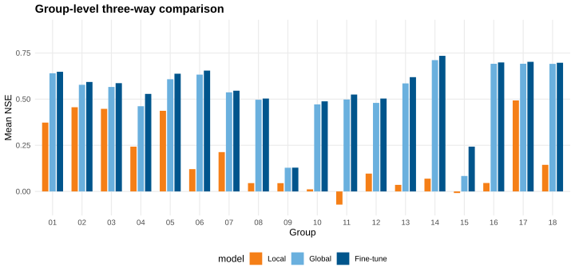

In this plot, the key visual test is rank stability within each group. If fine-tuning
is consistently useful, the fine-tune bar should dominate local and usually global bars
for most groups. This is exactly what is observed in the present run.

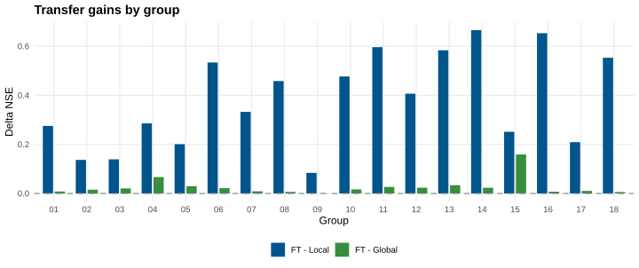

The dashed zero line is the decision boundary. Bars above zero imply positive transfer
effect relative to the chosen comparator. The persistence of positive values across
groups indicates that gains are structural rather than isolated accidents.

The group-level signal is clear: Fine-tune exceeds Local for all groups on NSE, and
also exceeds Global at group mean level in all groups in this run. This pattern is
consistent with a transfer-learning interpretation rather than isolated outliers.

### Basin-Level Distributional Evidence

Group means can hide within-group variance. The next figures therefore analyze basin-
level distributions to test whether improvements are broad-based at the individual basin
scale.

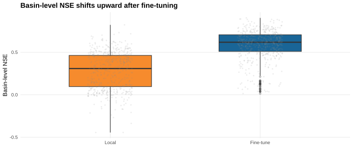

The boxplot compares medians, interquartile ranges, and tails between Local and
Fine-tune. A simultaneous upward shift in median and upper quartiles supports a genuine
distributional improvement rather than a change driven by few extreme basins.

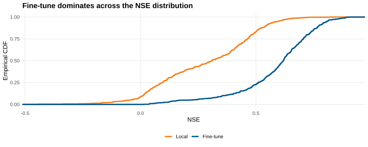

The ECDF provides a stricter dominance check: if the fine-tune curve is shifted toward
higher NSE across most quantiles, then improvement is robust across weak, medium, and
strong basins simultaneously.

Distributional diagnostics show that the benefit is broad-based: performance shifts
are observed across quantiles rather than being concentrated in a few extreme basins.

### Internal Validity Checks

To strengthen internal validity, this chapter uses concordant evidence across multiple
diagnostic views:

1. aggregate weighted means (global effect size);
2. group-level contrasts (regional consistency);
3. basin-level distributions (heterogeneity and outlier sensitivity);
4. architecture cross-check (EA-LSTM vs CudaLSTM directional agreement).

Agreement across these views reduces the probability that conclusions arise from a
single aggregation artifact.

### Interpretation and Scientific Implications

The empirical results support three claims.

First, **transfer learning is robustly beneficial** under regional data limitations.
The Fine-tune arm consistently improves upon purely local training.

Second, **global pretraining alone is strong but not sufficient**. Zero-shot Global
already outperforms Local on average, but additional local adaptation yields further
improvements in most practical settings.

Third, **benefits are heterogeneous but systematic**. Groups with weaker local baselines
tend to show larger transfer gains, which is consistent with the hypothesis that shared
cross-basin representations are especially valuable in information-scarce regimes.

This pattern is theoretically plausible: when local sample size is limited, local
estimators have high variance and under-constrained dynamics. Global pretraining
provides a regularized prior over runoff behavior, and fine-tuning then performs
targeted correction toward regional specifics.

### Spatial Coverage and Group Heterogeneity

Before interpreting transfer gains as generalizable, one must verify spatial and sample
coverage. The following figures therefore document where basins are located and how
unevenly groups are represented.

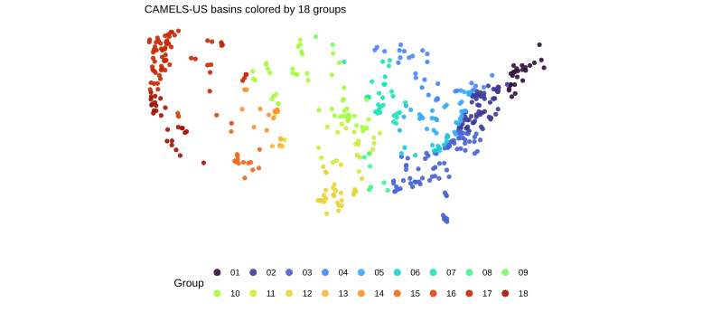

This map shows that groups are geographically dispersed rather than confined to a single
hydro-climatic regime. Consequently, the transfer-learning conclusions are evaluated
under substantial regional heterogeneity.

The basin map confirms broad spatial representation and substantial hydro-climatic
heterogeneity, which is a prerequisite for meaningful transfer-learning evaluation.

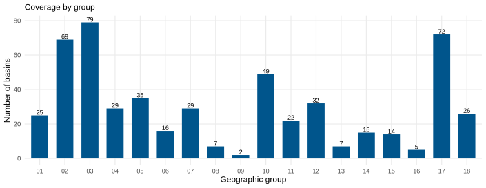

Coverage imbalance is important for interpretation. Groups with fewer basins generally
have higher estimation variance, and thus are expected to benefit more from pretraining.
This expectation is later cross-checked against observed gain patterns.

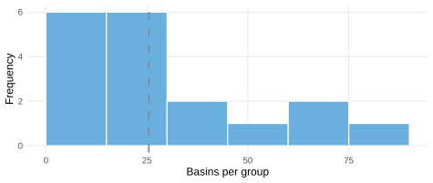

The histogram confirms non-uniform group sizes, which motivates basin-weighted
aggregation in all headline statistics.

### Additional Diagnostic Plots

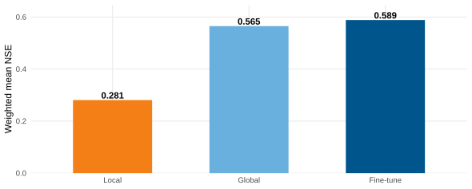

This bar chart restates Table \@ref(tab:nh-transfer-overall-table) in visual form and makes
the between-strategy NSE gaps easier to compare.

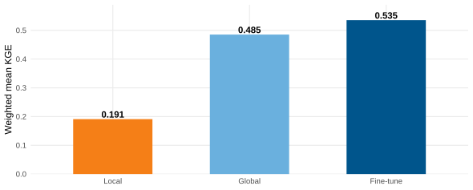

Consistent ordering under KGE supports the same conclusion as NSE and strengthens
cross-metric robustness.

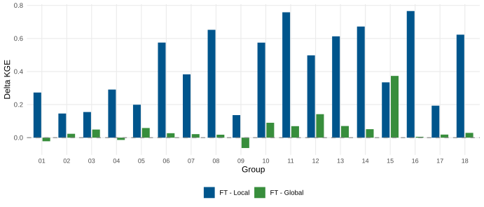

Group-level KGE deltas show whether transfer gains persist once correlation,
variability, and bias are considered jointly.

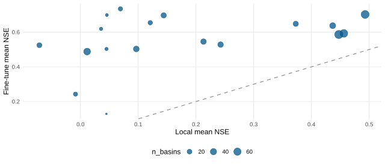

Points above the 1:1 line indicate groups where fine-tuning beats local training;
bubble size indicates how many basins each group contains.

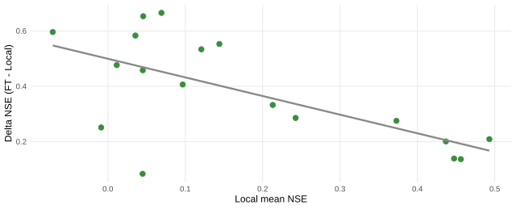

The negative slope indicates diminishing headroom: groups with stronger local baselines
typically show smaller fine-tuning gains.

### Architecture Comparison: EA-LSTM vs CudaLSTM

This comparison addresses model dependence of conclusions. If transfer benefits only
appear in one architecture, practical recommendations should be narrowed. If the effect
direction is stable across architectures, conclusions are more robust.

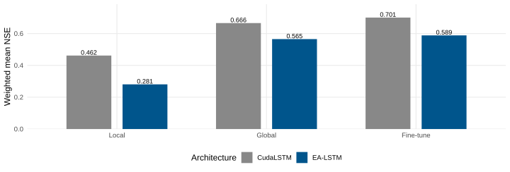

While absolute performance differs between architectures, the ordering by training
strategy remains consistent, supporting a strategy-level interpretation rather than an
architecture-specific anomaly.

Across both architectures, transfer-learning ranking remains stable. EA-LSTM and
CudaLSTM differ in absolute values, but both support the same directional conclusion:
fine-tuning dominates local-only training.

### Group 05 Diagnostic Snapshot (EA-LSTM)

This subsection provides a concrete group-level case study. Group 05 is used as an
illustrative diagnostic example because it exhibits clear but non-extreme transfer
effects, making it suitable for discussing both mean-level and basin-level behavior.


Table: (\#tab:nh-transfer-group05-table-book)Group 05 mean NSE under the EA-LSTM three-way comparison framework

|Setting             | Mean_NSE|
|:-------------------|--------:|
|Global (EA-LSTM)    |    0.608|
|Local (EA-LSTM)     |    0.437|
|Fine-tune (EA-LSTM) |    0.638|


Fine-tune minus Local = 0.201; Fine-tune minus Global = 0.030.

The table summarizes central tendency. However, mean effects can still mask local
heterogeneity; therefore a basin-level bar decomposition is provided next.

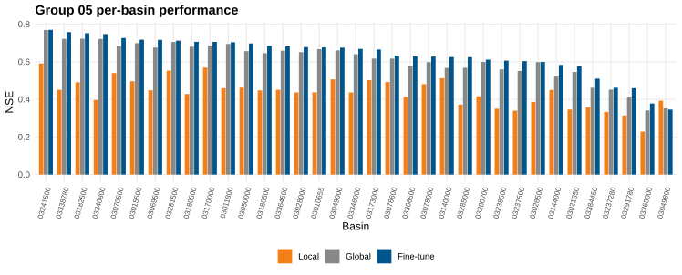

Sorting basins by fine-tuned NSE highlights whether gains are widespread or restricted
to selected stations. The observed pattern supports broad within-group benefit.

### Practical Synthesis

From an operational perspective, the extended slide-derived analyses reinforce a clear
deployment rule: pre-train globally, then fine-tune locally. This recommendation is
supported by aggregate metrics, group-level consistency, and basin-level distributional
evidence.

For scientific reporting, this recommendation should be stated with scope conditions:
it is supported for daily CAMELS-US settings, the examined feature space, and the
current training budgets. Extrapolation to other hydro-climatic domains should be
treated as a hypothesis to be tested rather than assumed.

---

## Discussion and Outlook {#nh-discussion}

This case study confirms that pretrain-and-adapt pipelines are a strong default for
regional streamflow prediction. Nevertheless, several methodological limits remain.

1. **Single-seed uncertainty**: the current benchmark is seed-fixed and should be
   extended with multi-seed confidence intervals.
2. **Geographic scope**: evidence is currently from CAMELS-US; external validity should
   be tested on broader multi-region datasets such as Caravan.
3. **Metric scope**: NSE and KGE summarize predictive skill but do not fully capture
   hydrograph signatures (e.g., peak timing and recession behavior).
4. **Climate extrapolation**: transfer robustness under stronger future forcing shifts
   remains an open challenge.

Methodologically, the next step is a factorial sensitivity design varying pretraining
budget, fine-tuning depth (head-only vs full), and climate-region holdout strategy.
Scientifically, integrating physical constraints (e.g., MC-LSTM style mass-consistency)
with transfer adaptation is a promising direction for robust climate-stress scenarios.

### Toward Publication-Grade Extensions

To meet stronger inferential standards, future work should include:

1. **multi-seed uncertainty quantification** (bootstrap or hierarchical intervals for
  $\Delta_{\text{FT-Local}}$ and $\Delta_{\text{FT-Global}}$);
2. **extreme-event conditioned evaluation** (high-flow quantiles and event timing
  metrics);
3. **domain-shift protocols** (climate-region holdout and synthetic forcing perturbation);
4. **ablation on adaptation depth** (head-only vs partial vs full fine-tuning);
5. **physics-transfer interaction tests** (EA-LSTM vs MC-LSTM transfer robustness).

These steps would convert the current strong empirical pattern into a more comprehensive
causal argument about why and when transfer learning works in hydrology.

---

## Summary {#nh-summary}

Neural hydrology has evolved from proof-of-concept LSTM experiments to a mature
experimental ecosystem where physically informed design and transfer learning can be
tested at scale. In this chapter, the transfer-learning benchmark provides direct empirical evidence
that global pretraining followed by regional fine-tuning improves predictive skill in
both aggregate and distributional views. The practical implication is straightforward:
when local observations are limited, transfer learning should be treated as a default
baseline rather than an optional enhancement.

At the same time, the chapter emphasizes that scientific robustness requires both
predictive accuracy and structural credibility. The long-term research opportunity is
therefore not a binary choice between process-based and data-driven paradigms, but a
principled integration: physically informed sequence models trained with explicit
cross-domain transfer objectives under non-stationary climate conditions.


<!--chapter:end:04-neural_hyd.Rmd-->

---
output:
  pdf_document: default
  html_document: default
---


# Riverine Heatwaves {#rh}

*Author: *

*Supervisor: Henri Funk*

*Degree: Bachelor*

## Abstract

Lorem ipsum dolor sit amet, consectetur adipiscing elit. Sed do eiusmod tempor incididunt ut labore et dolore magna aliqua. Ut enim ad minim veniam, quis nostrud exercitation ullamco laboris nisi ut aliquip ex ea commodo consequat. Duis aute irure dolor in reprehenderit in voluptate velit esse cillum dolore eu fugiat nulla pariatur. Excepteur sint occaecat cupidatat non proident, sunt in culpa qui officia deserunt mollit anim id est laborum.

## Introduction

<!--chapter:end:05-riverine_heat.Rmd-->

---
output:
  pdf_document: default
  html_document: default
---


# Interpretable Riverine Heatwaves {#irh}

*Author: *

*Supervisor: Henri Funk*

*Degree: Bachelor/Master*

## Abstract

Lorem ipsum dolor sit amet, consectetur adipiscing elit. Sed do eiusmod tempor incididunt ut labore et dolore magna aliqua. Ut enim ad minim veniam, quis nostrud exercitation ullamco laboris nisi ut aliquip ex ea commodo consequat. Duis aute irure dolor in reprehenderit in voluptate velit esse cillum dolore eu fugiat nulla pariatur. Excepteur sint occaecat cupidatat non proident, sunt in culpa qui officia deserunt mollit anim id est laborum.

## Introduction

<!--chapter:end:06-interpretable_heat.Rmd-->

---
output:
  pdf_document: default
  html_document: default
---


# Changepoint analysis is statistics {#cs}

*Author: *

*Supervisor: Helmut Küchenhoff*

*Degree: Bachelor/Master*

## Abstract

Lorem ipsum dolor sit amet, consectetur adipiscing elit. Sed do eiusmod tempor incididunt ut labore et dolore magna aliqua. Ut enim ad minim veniam, quis nostrud exercitation ullamco laboris nisi ut aliquip ex ea commodo consequat. Duis aute irure dolor in reprehenderit in voluptate velit esse cillum dolore eu fugiat nulla pariatur. Excepteur sint occaecat cupidatat non proident, sunt in culpa qui officia deserunt mollit anim id est laborum.

## Introduction

<!--chapter:end:07-change_stats.Rmd-->

---
output:
  pdf_document: default
  html_document: default
---


# Uncertainty of tipping points in climate research {#utp}

*Author: *

*Supervisor: Helmut Küchenhoff*

*Degree: Bachelor/Master*

## Abstract

Lorem ipsum dolor sit amet, consectetur adipiscing elit. Sed do eiusmod tempor incididunt ut labore et dolore magna aliqua. Ut enim ad minim veniam, quis nostrud exercitation ullamco laboris nisi ut aliquip ex ea commodo consequat. Duis aute irure dolor in reprehenderit in voluptate velit esse cillum dolore eu fugiat nulla pariatur. Excepteur sint occaecat cupidatat non proident, sunt in culpa qui officia deserunt mollit anim id est laborum.

## Introduction

<!--chapter:end:08-uncertainty_tp.Rmd-->

---
output:
  pdf_document: default
  html_document: default
---


# The case of permafrost {#pf}

*Author: *

*Supervisor: Helmut Küchenhoff*

*Degree: Bachelor/Master*

## Abstract

Lorem ipsum dolor sit amet, consectetur adipiscing elit. Sed do eiusmod tempor incididunt ut labore et dolore magna aliqua. Ut enim ad minim veniam, quis nostrud exercitation ullamco laboris nisi ut aliquip ex ea commodo consequat. Duis aute irure dolor in reprehenderit in voluptate velit esse cillum dolore eu fugiat nulla pariatur. Excepteur sint occaecat cupidatat non proident, sunt in culpa qui officia deserunt mollit anim id est laborum.

## Introduction

<!--chapter:end:09-permafrost.Rmd-->

---
output:
  pdf_document: default
  html_document: default
---


# Atlantic Meridional Overturning Circulation {#amoc}

*Author: *

*Supervisor: Helmut Küchenhoff*

*Degree: Bachelor/Master*

## Abstract

Lorem ipsum dolor sit amet, consectetur adipiscing elit. Sed do eiusmod tempor incididunt ut labore et dolore magna aliqua. Ut enim ad minim veniam, quis nostrud exercitation ullamco laboris nisi ut aliquip ex ea commodo consequat. Duis aute irure dolor in reprehenderit in voluptate velit esse cillum dolore eu fugiat nulla pariatur. Excepteur sint occaecat cupidatat non proident, sunt in culpa qui officia deserunt mollit anim id est laborum.

## Introduction

<!--chapter:end:10-amoc.Rmd-->

---
output:
  pdf_document: default
  html_document: default
---


# Positive tipping points {#ptp}

*Author: *

*Supervisor: Helmut Küchenhoff*

*Degree: Bachelor/Master*

## Abstract

Lorem ipsum dolor sit amet, consectetur adipiscing elit. Sed do eiusmod tempor incididunt ut labore et dolore magna aliqua. Ut enim ad minim veniam, quis nostrud exercitation ullamco laboris nisi ut aliquip ex ea commodo consequat. Duis aute irure dolor in reprehenderit in voluptate velit esse cillum dolore eu fugiat nulla pariatur. Excepteur sint occaecat cupidatat non proident, sunt in culpa qui officia deserunt mollit anim id est laborum.

## Introduction

<!--chapter:end:11-positive_tp.Rmd-->

---
output:
  pdf_document: default
  html_document: default
---


# Graphics and communication of risks by tipping points {#ctp}

*Author: *

*Supervisor: Helmut Küchenhoff*

*Degree: Bachelor/Master*

## Abstract

Lorem ipsum dolor sit amet, consectetur adipiscing elit. Sed do eiusmod tempor incididunt ut labore et dolore magna aliqua. Ut enim ad minim veniam, quis nostrud exercitation ullamco laboris nisi ut aliquip ex ea commodo consequat. Duis aute irure dolor in reprehenderit in voluptate velit esse cillum dolore eu fugiat nulla pariatur. Excepteur sint occaecat cupidatat non proident, sunt in culpa qui officia deserunt mollit anim id est laborum.

## Introduction

<!--chapter:end:12-communicating_tp.Rmd-->

# References {-}


<!--chapter:end:99-references.Rmd-->

